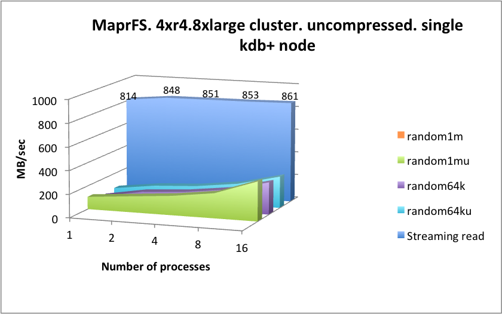
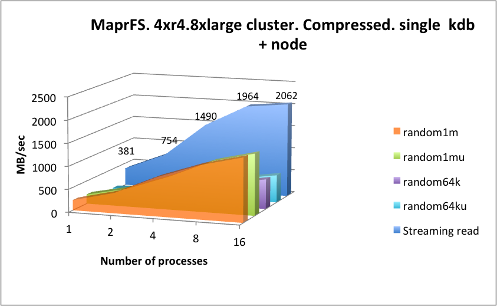
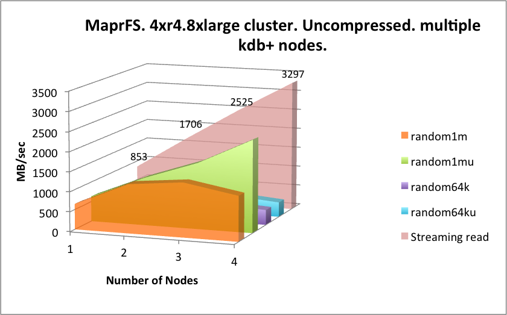
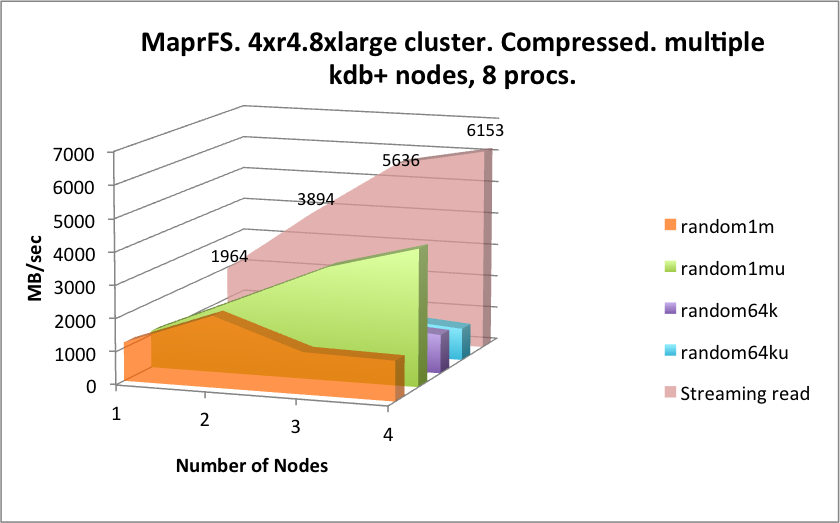

# Appendix D – MapR-FS

!!! info "MapR is qualified with kdb+"

    It offers the full POSIX semantics, including through the NFS interface.

MapR is a commercial implementation of the Apache Hadoop open-source stack. Solutions such as MapR-FS were originally driven by the need to support Hadoop clusters alongside high-performance file-system capabilities. In this regard, MapR improved on the original HDFS implementation found in Hadoop distributions. MapR-FS is a core component of their stack. MapR AMIs are freely available on the Amazon marketplace.

We installed version 6.0a1 of MapR, using the cloud formation templates published in EC2. We used the BYOL licensing model, using an evaluation enterprise license. We tested just the enterprise version of the NFS service for this test, as we were not able to test the POSIX fuse client at the time we went to press.

The reasons for considering something like MapR include:

1.  Already being familiar with and using MapR in your enterprise, so
    this may already be a candidate or use case when considering AWS.

2.  You would like to read and write HDB structured data into the same
    file-system service as is used to store unstructured data
    written/read using the HDFS RESTful APIs. This may offer the ability
    to consolidate or run Hadoop and kdb+ analytics independently of
    each other in your organization while sharing the
    same file-system infrastructure.

Locking semantics on files passed muster during testing, although thorough testing of region or file locking on shared files across multiple hosts was not fully tested for the purposes of this report.

function       | latency (mSec) | function   | latency (mSec) 
---------------|----------------|------------|---------------
`hclose hopen` | 0.447          | `();,;2 3` | 6.77
`hcount`       | 0.484          | `read1`    | 0.768

<small>_Metadata operational latencies - mSecs (headlines)_</small>

## Summary

The operational latency of this solution is significantly lower than seen with EFS and Storage Gateway, which is good for an underlying NFS protocol, but is beaten by WekaIO Matrix. 

By way of contrast however, this solution scales very well horizontally and vertically when looking at the accumulated throughput numbers. It also appears to do very well with random reads, however there we are likely to be hitting server-side caches in a significant way, so mileage will vary. 

We plan to look at the POSIX MapR client in the future.

