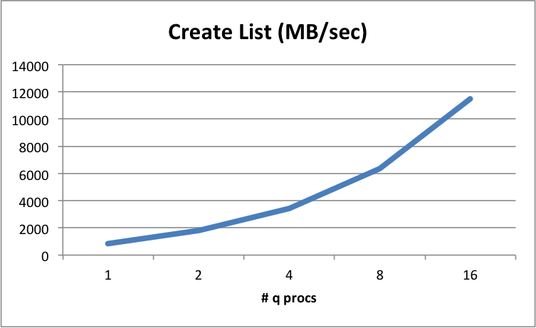
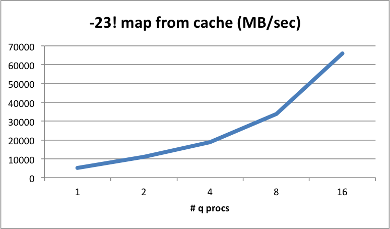
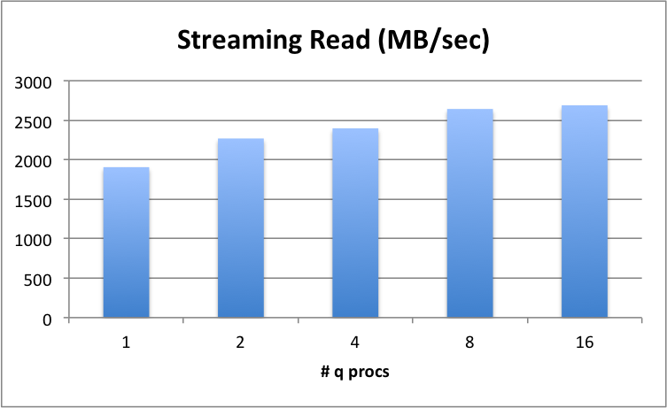
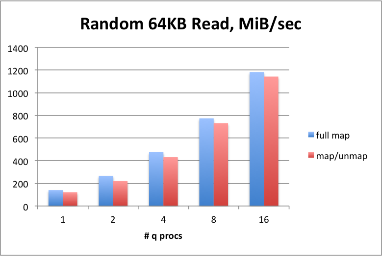

hero: <i class="fa fa-cloud"></i> Cloud

# Benchmarking methodology

For testing raw storage performance, we used a
lightweight test script developed by Kx, called `nano`, based on
the script `io.q` written by Kx’s Chief Customer Officer, Simon Garland. 
The scripts used for this benchmarking are freely available
for use and are published here:

<i class="fa fa-github"></i> [KxSystems/nano](https://github.com/KxSystems/nano)

These sets of scripts are designed to focus on the relative performance of distinct I/O functions typically expected by a HDB. The measurements are taken from the perspective of the primitive IO operations, namely:

test | what happens
-----|-------------------------------------------------------------------
Streaming reads | One list (e.g. one column) is read sequentially into memory. We read the entire space of the list into RAM, and the list is memory-mapped into the address space of kdb+.                                                
Large&nbsp;Random&nbsp;Reads (one mapped read and map/unmapped) | 100 random-region reads of 1&nbsp;MB of a single column of data are indexed and fetched into memory. Both single mappings into memory, and individual map/fetch/unmap sequences. Mapped reads are triggered by a page fault from the kernel into `mmap`’d user space of kdb+. This is representative of a query that requires to read through 100 large regions of a column of data for one or more dates (partitions). 
Small Random Reads (mapped/unmapped sequences) | 1600 random-region reads of 64&nbsp;KB of a single column of data are indexed and fetched into memory. Both single mappings into memory, and individual map/fetch/unmap sequences. Reads are triggered by a page fault from the kernel into `mmap`’d user space of kdb+. We run both fully-mapped tests and tests with map/unmap sequences for each read.
Write | Write rate is of less interest for this testing, but is reported nonetheless.
Metadata: (`hclose` `hopen`) | Average time for a typical open/seek to end/close loop. Used by TP log as an “append to” and whenever the database is being checked. Can be used to append data to an existing HDB column.
Metadata: `(();,;2 3)` | Append data to a modest list of 128&nbsp;KB, will open/stat/seek/write/close. Similar to ticker plant write down.
Metadata: `(();:;2 3)` | Assign bytes to a list of 128&nbsp;KB, stat/seek/write/link. Similar to initial creation of a column.
Metadata: (`hcount`) | Typical open/stat/close sequence on a modest list of 128&nbsp;KB. Determine size. e.g. included in `read1`.
Metadata: (`read1`) | An atomic mapped map/read/unmap sequence open/stat/seek/read/close sequence. Test on a modest list of 128&nbsp;KB.

This test suite ensures we cover several of the operational tasks undertaken during an HDB lifecycle.

For example, one broad comparison between direct-attached storage
and a networked/shared file system is that the networked file-system
timings might reflect higher operational overheads vs. a Linux kernel
block-based direct file system. Note that a shared file system will
scale up in-line with the implementation of horizontally distributed
compute, which the block file systems will not easily do, if at all.
Also note the networked file system may be able to leverage 100s or
1000s of storage targets, meaning it can sustain high levels of
throughput even for a single reader thread.

## Baseline result – using a physical server

All the appendices refer to tests on AWS.

To see how EC2 nodes compare to a physical server, we show the results of running the same set of benchmarks on a server running natively, bare metal, instead of on a virtualized server on the Cloud.

For the physical server, we benchmarked a two-socket Broadwell E5-2620 v4 @ 2.10&nbsp;GHz; 128&nbsp;GB DDR4 2133&nbsp;MHz. This used one Micron PCIe NVMe drive, with CentOS 7.3. For the block device settings, we set the device read-ahead settings to 32&nbsp;KB and the queue depths to 64. It is important to note this is just a reference point and not a full solution for a typical HDB. This is because the number of target drives at your disposal here will limited by the number of slots in the server.

Highlights:

### Creating a memory list

The MB/sec that can be laid out in a simple
list allocation/creation in kdb+. Here we create a list of longs of
approximately half the size of available RAM in the server.

Shows the capability of the server when laying out
lists in memory; reflects the combination of memory speeds
alongside the CPU. 

### Re-read from cache

The MB/sec that can be re-read when the data
is already held by the kernel buffer cache (or file-system cache, if
kernel buffer not used). It includes the time to map the pages back into
the memory space of kdb+ as we effectively restart the instance here
without flushing the buffer cache or file system cache.

Shows if there are any unexpected glitches with the file-system caching subsystem. This may not affect your product kdb+ code per-se, but may be of interest in your research.

### Streaming reads

Where complex queries demand wide time periods or symbol ranges. An
example of this might be a VWAP trading calculation. These types of
queries are most impacted by the throughput rate i.e., the slower the
rate, the higher the query wait time.

Shows that a single q process can ingest at 1900&nbsp;MB/sec with data
hosted on a single drive, into kdb+’s memory space, mapped.
Theoretical maximum for the device is approximately 2800&nbsp;MB/sec and we
achieve 2689&nbsp;MB/sec. Note that with 16 reader processes, this
throughput continues to scale up to the device limit, meaning kdb+ can
drive the device harder, as more processes are added. 

### Random reads

We compare the throughputs for random 1&nbsp;MB-sized reads. This simulates
more precise data queries spanning smaller periods of time or symbol
ranges.

In all random-read benchmarks, the term _full map_ refers to reading
pages from the storage target straight into regions of memory that are
pre-mapped.

Simulates queries that are searching around broadly different times or symbol regions. This shows that a typical NVMe device under kdb+ trends very well when we are reading smaller/random regions one or more columns at the same time. This shows that the device actually gets similar throughput when under high parallel load as threads increase, meaning more requests are queuing to the device and the latency per request sustains. 

### Metadata function response times

We also look at metadata function response times for the file system. In the baseline results below, you can see what a theoretical lowest figure might be. 

We deliberately did not run metadata tests using very large data sets/files, so that they better represent just the overhead of the file system, the Linux kernel and target device.

function       | latency (mSec) | function   | latency (mSec) 
---------------|----------------|------------|---------------
`hclose hopen` | 0.006          | `();,;2 3` | 0.01
`hcount`       | 0.003          | `read1`    | 0.022

<small>_Physical server, metadata operational latencies - mSecs (headlines)_</small>

This appears to be sustained for multiple q processes, and on the
whole is below the multiple μSecs range. Kdb+ sustains good metrics. 

## AWS instance local SSD/NVMe

We separate this specific test from other storage tests,
as these devices are contained within the EC2 instance itself, unlike
every other solution reviewed in [Appendix A](app-a-ebs). Note that some of the
solutions reviewed in the appendixes do actually leverage instances
containing these devices.

An instance-local store provides temporary block-level storage for your
instance. This storage is located on disks that are physically attached
to the host computer.

This is available in a few predefined regions (e.g. US-East-1), and for
a selected list of specific instances. In each case, the instance local
storage is provisioned for you when created and started. The size and
quantity of drives is preordained and fixed in both size and quantity.
This differs from EBS, where you can select your own.

For this test we selected the `i3.8xlarge` as the instance under test<!--  (==see References FIXME Specifically?== ) -->. 
`i3` instance definitions will provision local NVMe or SATA
SSD drives for local attached storage, without the need for networked
EBS.

Locally provisioned SSD and NVMe are supported by kdb+. The results from
these two represent the highest performance per device available for
read rates from any non-volatile storage in EC2.

However, note that this data is ephemeral. That is,
whenever you stop an instance, EC2 is at liberty to reassign that space
to another instance and it will scrub the original data. When the
instance is restarted, the storage will be available but scrubbed. This
is because the instance is physically associated with the drives, and
you do not know where the physical instance will be assigned at start
time. The only exception to this is if the instance crashes or reboots
without an operational stop of the instance, then the same storage will
recur on the same instance.

The cost of instance-local SSD is embedded in the fixed price of the
instance, so this pricing model needs to be considered. By contrast, the
cost of EBS is fixed per GB per month, pro-rated. The data held on
instance local SSD is not natively sharable. If this needs to be shared,
this will require a shared file-system to be layered on top, i.e.
demoting this node to be a file system server node. For the above
reasons, these storage types have been used by solutions such as [WekaIO](#appendix-i-wekaio-matrix), for their local instance of the erasure coded data cache.

function                     | instance-local NVMe (4 × 1.9 TB) | physical node (1 NVMe)
-----------------------------|:---------------------------:|:------------:
streaming read (MB/sec)      | 7006                        | 2624
random 1-MB read (MB/sec)    | 6422                        | 2750
random 64-KB read (MB/sec)   | 1493                        | 1182
metadata (`hclose`, `hopen`) | 0.0038 mSec                 | 0.0068 mSec

The variation of absolute streaming rates is reflective of the device itself. These results are equivalent to the results seen on physical servers. What is interesting is that at high parallelism, the targets work quicker with random reads and for metadata service times than the physical server. These instances can be deployed as a high-performance persistent cache for some of the AWS-based file system solutions, such as used in ObjectiveFS and WekaIO Matrix and Quobyte.

