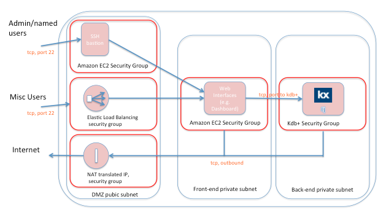

hero: Count

# Security of your data and secure access

By the very nature of the EC2 application machine image model (AMI),
there are tight security models put in place, and you would have to work
very hard in order to remove these.

The following diagram is a typical scenario for authenticating access to
kdb+ and restricting networking access. The frontend and backend private
subnets are provisioned by default with one Virtual Private Cloud (VPC)
managed by EC2. Typically, this allocates an entire class-C subnet. You
may provision up to 200 class-C subnets in EC2. The public access may be
direct to either of these domains, or you may prefer to setup a classic
‘demilitarized zone’:

Amazon has spent a lot of time developing [security features for EC2](https://aws.amazon.com/security/).
Some key security attributes to consider are:

-   A newly provisioned node comes from a tried and trusted build image, for example, one found in the AWS Marketplace
-   The Amazon Linux AMI Security Center provides patch and fix lists, and these can be automatically inlaid by the AMI. The Amazon Linux AMI is a supported and maintained Linux image provided by AWS for use on EC2.
-   Encryption at rest is offered by many of the storage interfaces covered in this report.

<i class="fa fa-hand-o-right"></i> [Amazon Security](https://aws.amazon.com/blogs/security/)

