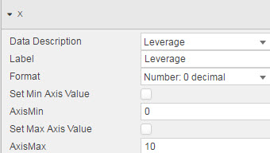
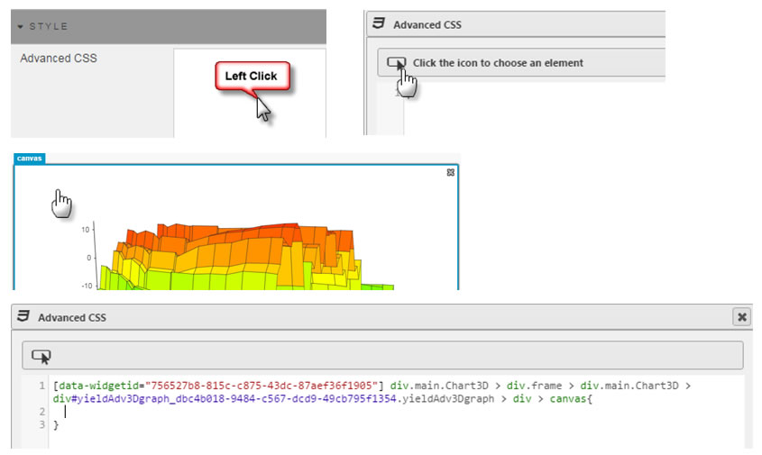

Charts data in 3 dimenions

## Basics

Set up _Data Source_ and chart type:

_Data Source_
: <i class="fa fa-hand-o-right"></i> [Defining a query](introduction/#defining-a-query) and [Analytics](introduction/#analytics) in _Introduction_

_Focus_
: Used for [linking components](introduction/#linking-components). Requires a [View State Parameter](introduction/#view-state-parameters).

_Type_
: Selects the type of chart  

_Selected Value_
: Used to map a chart (query) data point to a View State Parameter when a chart bar is clicked by the user: 

1. Create a View State Parameter and assign to _Selected Value_   
  
2. Use _Selected Value Attribute_ to select a query variable to store in the _Selected Value_ View State Parameter.

_Selected Value Attribute_
: This comes from the _Data Source_ and is the variable paired with the _Selected Value_ View State Parameter:  

!!! warning "Data types"
    When mapping _Selected Values_ to _Selected Value Attribute_, ensure the data type of the View State Parameter matches the data type of the _Data Source_; e.g. integer for numbered data.

## Axis controls

Configure data for (each of) the X-, Y- and Z-axes

_Data Description_
: Select the _Data Source_ variable to be plotted against the axis

_Label_ 
: Descriptive label for the axis

_Format_
:   
: Select the numeric or date format to use

_Set Min Axis Value_
: Check to use _AxisMin_

_AxisMin_
: Minimum axis value when *Set Min Axis Value* is checked

_Set Max Axis Value_
: Check to use _AxisMax_

_AxisMax_
: Maximum axis value when _Set Max Axis Value_ is checked

## Volume

_Data_
:   
Select the data-source variable to use for plot size

## Position

:   
Use the sliders to adjust the orientation of the chart

!!! tip "Do it in Preview"
    Alternatively, go into Preview mode and rotate the chart. 
    Use the mouse scroll wheel to zoom in and out.

## Style

### Advanced CSS

Configure chart CSS:  

### Custom tooltip

Set roll-over tooltip information  

### Format and margins

<i class="fa fa-hand-o-right"></i> [Component style](style/#component-style) and [Margins](style/#margins) in _Styling dashboards_