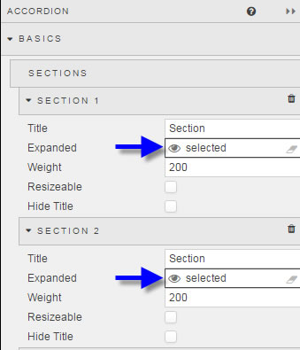

## Basics

Like [Tab Control](tabcontrol), it supports multiple views in a single component. The Accordion component is divided into sections. Each section can hold a single component or [Layout Panel](layout). If a [Layout Panel](layout) panel is used then multiple components can be displayed inside a single Accordion section.

To create a section, click  

!!! warning "Layout panel behaviour on resize"
    Single components added to the Accordion component will resize on changes to expanded, full or custom. 
    
    However, if a Layout panel is used inside an Accordion, components added to the Layout panel will not resize for interactions with the Accordion unless _Fill Height_ is checked. 

    In addition, _Advanced Layout_ should also be checked in the Layout panel when used inside an Accordion Panel.

   
_Accordion interaction_

## Sections

Drag and drop a component or [Layout panel](layout) into an Accordion Section:

_Title_
: Give the Section a name

_Expanded_
: When checked the Accordion will load in its expanded state

_Weight_
: This is a relative sizing measure to determine the viewable area for each section inside the Accordion. 
: For example, two sections of _Weight_ `200` will each take up half of the viewable area (200/(200+200)).  A section with _Weight_ of `400` and another of `200` will occupy 66% (400/(400+200)) of the viewable area.

!!! warning "Section behaviour on resize"
    If Resizable is enabled, the values of _Weight_  will change on interaction.

_Resizeable_
: If checked, the user will be able to manually adjust the section size  

_Hide Title_
: Suppresses the Section title when checked

## Margins

<i class="fa fa-hand-o-right"></i> Styling dashboards: [Margins](style/#margins)

## Format

<i class="fa fa-hand-o-right"></i> Styling dashboards: [Component style](style/#component-style)

## Advanced CSS

1. Left-click inside _Advanced CSS_.  

2. Click the icon , then click on the Accordion element. (A blue highlight will appear around the component.)  

3. Add the required CSS.

## Linking two Accordion behaviours

 

Two or more Accordion components can be linked so an interaction in one will pass to another. 

To do this, assign a [View State Parameter](introduction/#view-state-parameters) to the _Expanded_ property. Unlike for linked Tabs, each shared Accordion expand/contract behaviour will use the same View State Parameter.
 
More than two sections in a single Accordion component can share a behaviour if they use the same View State Parameter:

