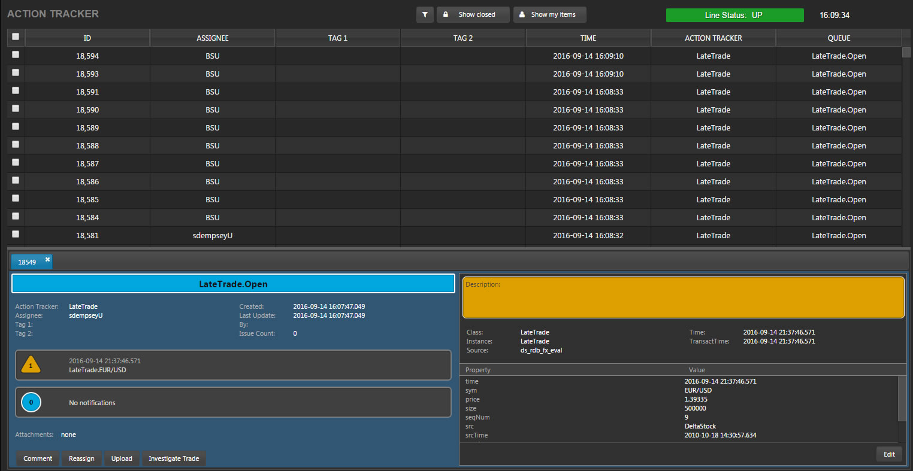
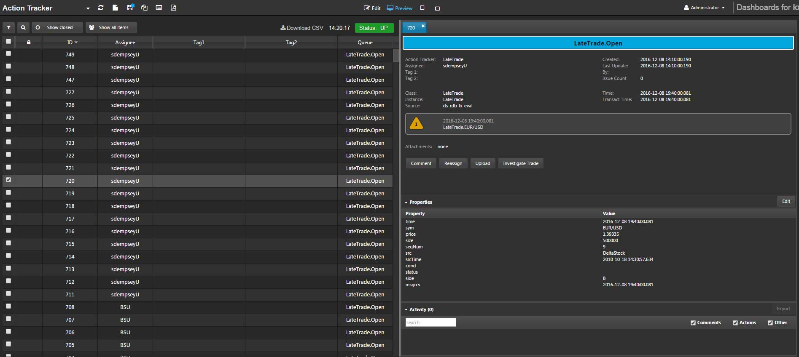
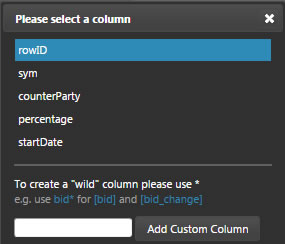
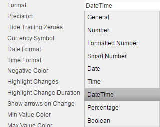
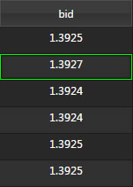
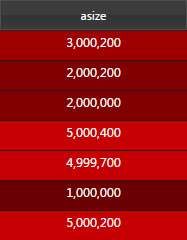
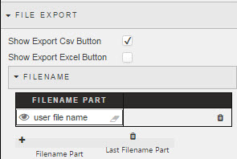
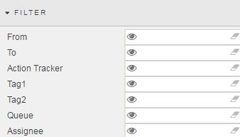

 

_Alternative Vertical Layout_

Action Tracker is a self-contained alerting application. Further information on Action Tracker can be found in _Stream for Kx_.
 
## Basics
 

**Data Connection**

Click on Data Connection to pop-up the Connection menu. Select the required connection from the dropdown menu.

**Layout split**

Toggles between a Vertical and Horizontal layout

**Item ID**

Create [view state parameter](introduction.md#view-state-parameters) to use as Item ID
 
**Alert ID**

Create [view state parameter](introduction.md#view-state-parameters) to use as Alert ID

**Allow Payload Editing**

Toggle control. When enabled, Users will be able to edit the details of the Alert.

### Columns

**User Defined**

When checked, the selected column will remain in the Data Grid if the selected column variable is removed from the query. A User Defined query is effectively a 'lock' on the column

!!! Tip "If the User Defined column variable is missing in the query, the User Defined column will show as an empty column in the Data Grid"

**Data Field Name**

Data Field Name

When using a wildcard, all dynamic columns derived from a query will use the wildcard column format.  The wildcard can be used in conjunction with text headers; e.g. bid* for bid, and bid_update

The Data Field Name is selected from data columns in the Data Source query. 

Additional columns can be added, including wildcard columns. If wildcard is used, any non-defined columns will adopt the column specifications of the wildcard column; e.g. data alignment, decimal precision etc.

**Display Name**

Display Name

The name assigned for the column in the Data Grid. This is case sensitive.

**Width (relative)**

Relative Width
  

Relative measure to the width of the Data Grid. The scale is contigent on the values of each column; for example, columns with a relative width of 20,10,5,1 will scale at a column width of 55% (i.e. 20/(20+10+5+1)), 28%, 14% and 3%.  

Relative columns will scale according to the browser size.

**Minimum Width (pixels)**

This is the pixel minimum width for a column. Columns will never be smaller than the minimum width, but can be wider. 

Columns using minimum width will scale according to browser size

**Text Align**

Alignment of values inside Data Grid. 

**Sortable**

Sorting Columns

When checked, users clicking on column header will toggle between ascending and descending sort. 

**Format**

Sample formats: General, DateTime, General, Formatted Number, Formatted Number, Formatted Number, Formatted Number, DateTime, General, Smart Number
  

  
Select formatting for data type in column
  

**Precision**

Where numeric data is used, Precision sets the number of decimal places used.

**Hide Trailing Zeroes**

Removes the display of zeroes from end digits after the decimal point.

**Currency Symbol**
 
Currencies

 
Adds a currency symbol prefix to column data
  

**Date Format**

Combination Date and Time Format. Ensure Date or DataTime Format is selected.
  

  

  
Select date format

  
**Time Format**
  
Select time format. Ensure Time or DataTime Format is selected
  

  
**Min Value Color**
  
Min Value Color

  
Selection will place a color border highlight around lowest value in column
  

To Remove, again click on the color and select _No Color_ from the palette tool.

!!! Tip "Min Color can be a viewstate parameter. To assign a viewstate parameter, rollover end of input bar until  appears, click to assign."

**Max Value Color**

Max Value Color

  
Selection will place a color border highlight around highest value in column
  

Click the color bar again and then click _No Color_ to remove the Max color setting 

!!! Tip "Max Color can be a viewstate parameter. To assign a viewstate parameter, rollover end of input bar until  appears, click to assign."

**Range Color**

Range Color

  
Applies a selected colour gradient across all cells in a column. Assigning a color will automatically apply the Range Color. 
  

Click the color bar and then _No Color_ to remove the Range color from column data

!!! Tip "Range Color can be a viewstate parameter. To assign a viewstate parameter, rollover end of input bar until  appears, click to assign."

**Percentage Color**

Percentage Color

Adds a mini-bar in Percentage formatted data. The proportion of the bar filled runs from 0 to 100%

To enable set Format to _Percentage_ 

Select a colour to use for the bar 

!!! Tip "Percentage Color can be a viewstate parameter. To assign a viewstate parameter, rollover end of input bar until  appears, click to assign"

**Read Only**

Columns which are checked Read Only cannot be edited

**Template**

Template Help 

Template allows for richer customisation of columns. In this example, information from two columns ('URL' and 'Name') is merged together to form an active link:

**Hidden**

Hide display of column in Action Tracker grid.

## File Export

**Show Export CSV Button**

Check control to support export of Action Tracker content by CSV

**Show Export Excel Button**

Check control to support export of Action Tracker content by Excel

### Filename

Add Filename details to export of CSV/Excel files

## Filter

Assigns [view state parameter](introduction.md#view-state-parameters) for each of the listed filters

## Highlight Rules

Used to apply color updates to notify users of changes in Data Grid values

**Name**

The name of the rule

**Target**

From the dropdown menu, select the target Data Grid column on which the rule will act 

The Target column can be any column in the Data Grid.  It does not have to be the data grid column which is using the operator.

**Condition Source**

The data series on which the trigger is measured

**Condition Operator**

Dropdown menu of rule operations, including greater and less than, not equal to, exactly equal to, and text contains alerts

**Condition Value**

What value threshold will trigger the alert.  Default is _previous value_

**Color**

The text color change when rule is true

**Backround Color**

Background cell color change when rule is true. 

**Border Color**

Cell border color change when rule is true

**Icon**

Select an icon to appear when rule is true

**Icon Color**

Select the color for the icon (if used) when rule is true

## Format

**Alert Title Template**

Included CSS for Alert Title

**Alert Details Template**

Included CSS for Alert Details Panel

**Alert Dialog Template**

Included CSS for Alert Dialog Panel

See [Format](introduction.md#format) in Introduction for more on component Title and Border configuration.

## Virus Scanning

Files uploaded via the File Upload dashboard component or attachments uploaded via the ActionTracker may be screened for viruses.

There are two prerequisites for enabling virus scanning:

[1] ClamAV must be installed on the appserver box with up to date definitions.

[2] In delta.profile, enable virus scanning as follows: _DELTAAPPSERVER_VIRUS_SCAN_ENABLED=true_

!!! Tip "The appserver must be restarted in order to pick up any changes to the above environment variable."

To verify whether virus scanning has been enabled, check the running tomcat process _(using ps -ef | grep tomcat)_ and look for  _-DdeltaAppServerVirusScanEnabled=true_ or _-DdeltaAppServerVirusScanEnabled=false._ With virus scanning enabled, uploaded files will automatically be scanned and if they don't pass the virus check the upload is aborted and an error will be reported on the dashboard.