## Basics

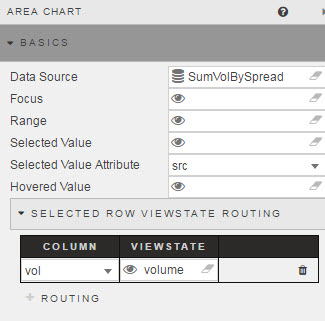

### _Data Source_

<i class="fa fa-hand-o-right"></i> [Defining a Query](introduction/#defining-a-query) and [Analytics](introduction/#analytics) for more on data sources.

### _Focus_

Used for [linking components](introduction/#linking-components). Requires a [View State Parameter](introduction/#view-state-parameters).

### _Range_

Similar to _Focus_, instead the assigned View State Parameter is used to link a [range slider](rangeslider) to the chart.

### _Selected Value_

Used to map a chart (query) data point to a View State Parameter when a chart bar is clicked by the user.

1. Create a Selected Value and assign to _Selected Value_  
[screenshot](img/selectedvaluecharthtmllight.jpg)
2. Go to _Selected Value Attribute_ to select a query variable to store in the _Selected Value_ View State Parameter.


### _Selected Value Attribute_

This comes from the data source and is the variable paired with the _Selected Value_ View State Parameter. 

  

When mapping _Selected Values_ to _Selected Value Attribute_, ensure the data type of the View State Parameter matches the data type of the data source; e.g. integer for numbered data 


### _Selected Row Viewstate Routing_

The aforementioned _Selected Value_ and _Selected Value Attribute_ handles a single data map. _Selected Row Viewstate Routing_ supports multiple mappings between _Selected Values_ and _Selected Value Attributes_. 

 

To add a row, click 


### _Hovered Value_

Assign a View State Parameter. Stores the value of the X-axis (usually date or time).

 
## X Axis

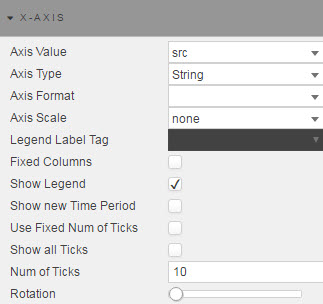


### _X Axis Value_

The query column variable to be used as the X-axis chart label 


### _Type_

The data type for the X-axis variable. The controls in the dialog will adjust to this selection. 


!!! tip "Parameters look wrong?"
    If X-axis labels look inappropriate, try selecting a different _Type_


### _Format_

Where _Type_ is Date, _Format_ will show a list of display options 


### _Legend Label Tag_

==Coming soon==


### _Fixed Columns_

Check to toggle chart between standard chart scale and fixed (transposed) chart view 

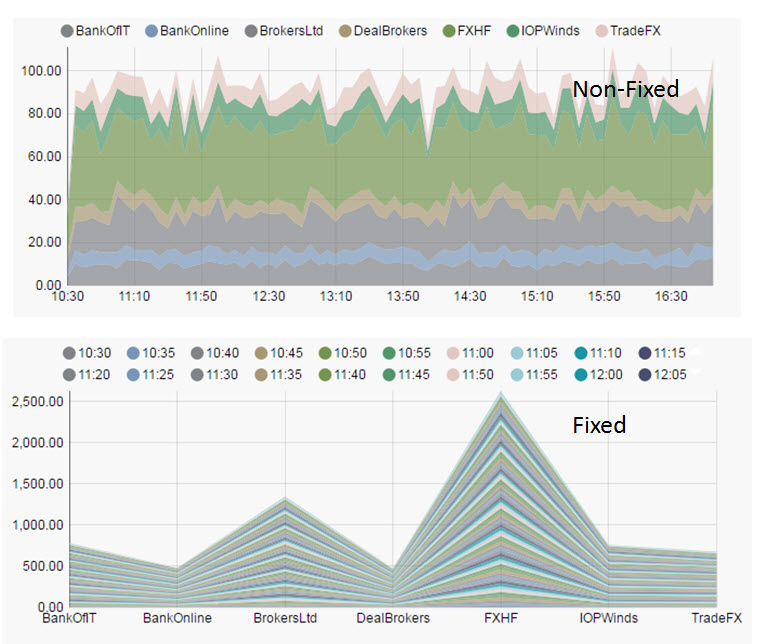


### _Show Legend_ 

Toggles display of chart legend


### _Show new Time Period_

Ensures the latest data point of a time sequence is displayed

### _Use Fixed Num of Ticks_

Toggles control to use _Num of Ticks_


### _Show All Ticks_

Displays every charted data point in the X-axis


### _Num of Ticks_

The number of ticks to display in the X-axis if _Use Fixed Num of Ticks_ is checked


### _Axis Rotation_

Rotate X-axis label 

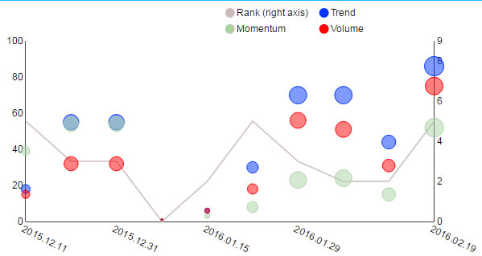


## Columns

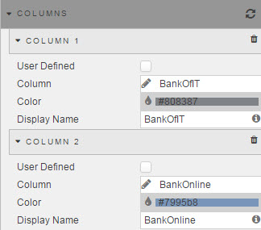

To add a column, select 


### _User Defined_

A ‘read only’ lock of the column 

!!! tip "Working with ultiple copies"
    Helps if you are working with multiple copies of a chart and are changing _Data Sources_.  Locking the column will preserve formatting even if the listed column source isn’t referenced in a changed data source

### _Column_

The charted value from the _Data Source_ 

### _Color_

Select from color palette or use Hex color reference. (If charting Pivot/OLAP data, charting colors will be selected from _Style_ menu.)


### _Display Name_

The charted variable name to display in the Y-axis


## Zoom/Pan 

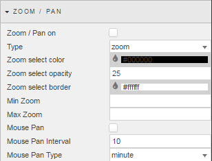

### _Pan On_

Check to switch Zoom and Pan functionality on 

 


### _Type_

Choose drag-to-select _Zoom_ or _Pan_ control


### _Zoom Select Color, Opacity and Border_

Selects the background color, background color, opacity, and the border for the selected area

### _Min Zoom_ and _Max Zoom_

 

Set View State Parameters for the range values for _Min Zoom_ and _Max Zoom_

### _Mouse Pan_

Check to select mouse pan control; best used on real-time time series data 


### _Mouse Pan Interval and Type_

Set time pan control for chart; chart will move in timed sections. 


## Style

Configure Pivot line colors, CSS and Custom Toolbar

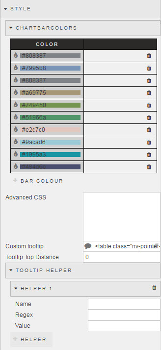

### _ChartBarColors_

Sets bars color and order for Pivot/OLAP chart. Use Hex reference orclick on the color bar to select from the pop-up palette. 


### _Advanced CSS_

Click inside the Advanced CSS editor. Click the selector icon, then Click inside the chart component to bring up the relevant CSS code. Edit your CSS. 


### _Custom Tooltip_

1. Create View States for items in tooltip  

2. Add a HTML tag for View States, using [Handlebars](http://handlebarsjs.com)  

3. Chartview  


Tooltips can use View State Parameters which have been mapped to Data Source variables:


In the Configure Tooltip template, add HTML tags for the View State Parameters to display, again using Handlebars.

If the View State Parameter is (say) `param1`, then add a table cell with `param1` viewstate to tooltip with the tag  `{{obj.param1}}`


Tool tip will appear as:


### _Tooltip Top distance_

Sets distance from mouse in pixels at which tooltip appears


## Tooltip Helper


Apply Tooltip Helper Variable to Tooltip reference


Tooltips use [Handlebars.js](http://handlebarsjs.com) so variables can be added dynamically to tooltip.

For example:
```
{{fx}} : {{volume}}
```
could appear as `EUR/USD: 250000`. To format `250000` so it will appear as `$250,000` use Tooltip Helper

### _Name_

Give the function a name. This name will be used inside the tooltip. For example:


```q
{{fx}} : {{fd volume}}
```

_Regex_
: The regular expression used to find the required pattern. In this example:  
```
(\d{3})(?=\d)
```

_Value_
: The value to replace the text with. In this case, comma-delimited currency values:  
```
$1,
```

## Format

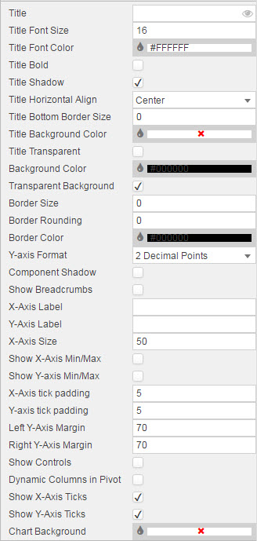

<i class="fa fa-hand-o-right"></i> [Styling dashboards](style) for more on shared formatting options. Additional formatting, specific to horizontal bar, charts is detailed below.

### _Y-Axis Format_

Configures the number of decimal places used in a numeric X-axis.

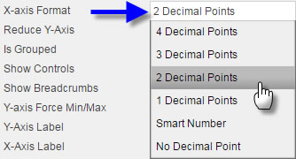


### _Is Grouped_

When checked, data will be independently charted across the Y-axis. If unchecked, Y-axis categories will be stacked.


### _Show Controls_

When checked, users will have the ability to toggle between Grouped and Stacked Chart views with a menu option in the top-left of the chart.


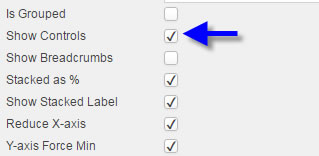

!!! tip "Individual control toggles"
    In addition to user-controlled group and stack controls are individual toggles for charted data points. Click inside the chart legend icon to switch selected data chart view on or off.

    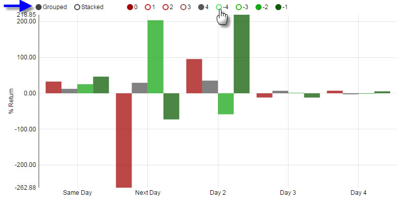


### _Stacked as %_

  
_on_

  
_off_


<!-- !!! warning 
    When viewing a Stacked Chart; i.e. when _Is Grouped_ is unchecked or a user uses the charting controls to select Stacked View, the stacked chart view will change. 
 --><!-- WTF? what does this mean? -->


### _Show Stacked Labels_

When checked, displays stacked values in chart as configured in _Data Source_. If _Stacked as %_ is checked, then values displayed will be percentile values. 


### _Y-Axis Force Min_

The default chart best-fits data to the axis to maximise visual differnces. It sets the lowest value in your data to the baseline. 


Checking _Y-Axis Force Min_ will set the Y-axis to use the value entered _Y-Axis Min_.


### _Y-Axis Force Max_

As with _Y-Axis Force Min_ will set Y-axis maximum to use _Y-Axis Max_ value. 

!!! warning "Cropping"
    Using _Y-axis Force Max_ may crop chart if Y-axis values exceed _Y-Axis Max_


### _Y-Axis Min_

The defined value will be used if _Y-Axis Force Min_ is checked.


### _Y-Axis Max_

The defined value will be used if _Y-Axis Force Max_ is checked.

!!! tip "Comparisons across components"
    Use _Y-Axis Max_ to standardize the appearance of neighboring chart components where relative comparisons are important


### _Y-Axis Ticks (best fit)_

Chart will best fit number of displayed Y-axis ticks to the set value


### X- and Y-Axis Labels
  
Text labels for X- and Y-axes


### _X-Axis Size_

Sets the distance between the X-axis and the border of the component. 


Distance between X-axis and line chart


### _Show X-axis Min/Max_

Display in the X-axis the min/max values.


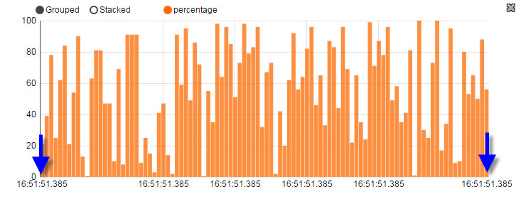


### _Show Y-axis Min/Max_
 
Display in the Y-axis the min/max values.


!!! tip
    If Y-axis min/max values are used, these will be displayed


### _X/Y-axis tick padding_


Defines spacing between X- and Y-axis labels to chart X- and Y-axis.


### _Left/Right Y-Axis Margin_

Distance between Y-axis and chart component edge


### _Y-axis min/max range scale_

Defines the range between min and max values of Y-axis


If defined range is greater than data range a negative Y-axis will be applied


### _Dynamic Columns in Pivot_

Marks if dynamic colums are used for a [pivot query](introduction/#pivot-query)


### _Show X- Y-Axis Ticks_

Toggles the display of chart tick labels


### _Auto-New Column_

When a query adds a new column of data, the chart will update to add the new column of data. 


### _Chart Background_

Change background color of chart


## Margins

<i class="fa fa-hand-o-right"></i> [Margins](style/#margins) in _Styling dashboards_
