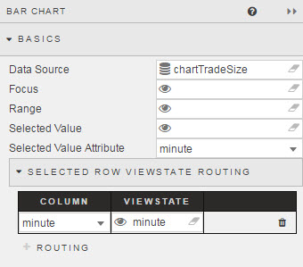
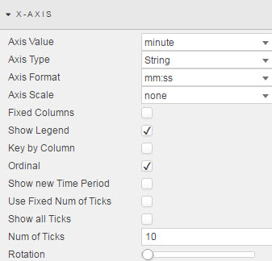
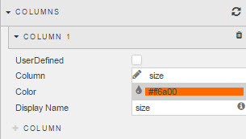
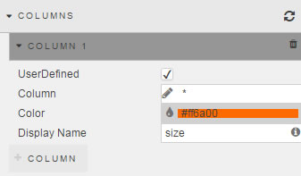
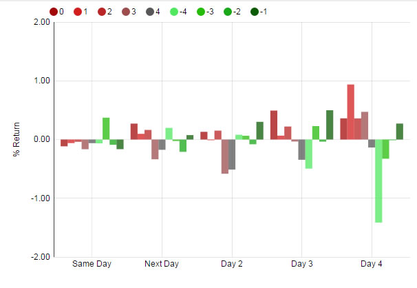
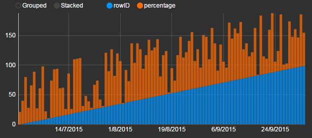
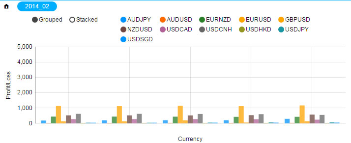
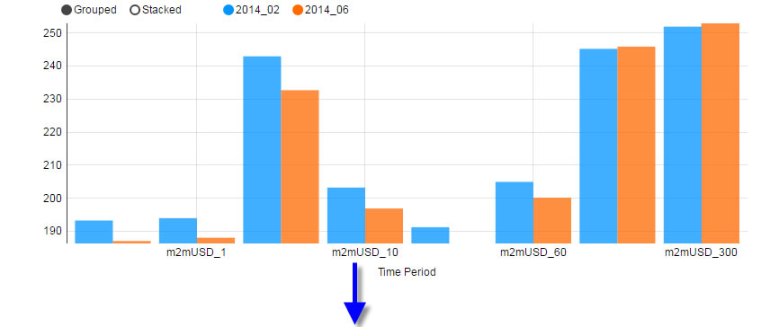
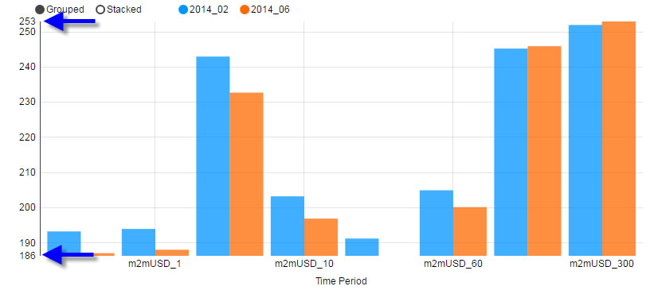

## Basics

Defines data source, [component linking](introduction#linking-components), and [View State Parameters](introduction#view-state-parameters) populated when a chart bar is clicked




### _Data Source_

See [Defining a Query](introduction#defining-a-query) and [Analytics](introduction#analytics) for more on data sourcing.


### _Focus_

Used for linking components. Requires a View State Parameter.


### _Range_

Used for linking to a [Range Slider](rangeslider). Requires a View State Parameter.


### _Selected Value_

Used to store the clicked-on chart data point to a View State Parameter.  

1. Create a View State Parameter and assign to _Selected Value_   

2. Go to _Selected Value Attribute_ to select a query variable to store in the _Selected Value_ View State Parameter.


### _Selected Value Attribute_

This comes from the data source and is the variable paired with the _Selected Value_ View State Parameter.  When the user clicks on the chart, the associated query variable will be mapped to the _Selected Value_ view state.  


!!! Warning "Data type match"
    When mapping _Selected Values_ to _Selected Value Attribute_, ensure the _Data Type_ of the View State Parameter matches the _Data Type_ of the _Data Source_; e.g. integer for numbered data.


### _Selected Row ViewState Routing_

The aforementioned _Selected Value_ and _Selected Value Attribute_ handles a single data map. _Selected Row Viewstate Routing_ supports multiple mappings between _Selected Values_ and _Selected Value Attributes_.


To add a row, click 


## X Axis

Define appearance of the chart X axis.




### _Axis Value_

Sets which query column variable will be used as the X-axis chart label


### _Axis Type_

Sets the data type for the label used for _X-Axis Value_


!!! tip "X-axis labels look wrong?"
    If X-axis labels look incorrect, try selecting a different _Type_


### _Axis Format_

Used for when _X-Axis Type_ is of type _Date_.


### _Axis Scale_


Select _none_, or use numeric or time scaling depending according to the selected _Axis Type_. 


### _Fixed Columns_

Check to toggle chart between standard chart scale and fixed (transposed) chart view.  


### _Show Legend_

Toggles display of chart legend


### _Key by Column_

Simliar visual to _Fixed Columns_ except uses X-axis labels for legend labels. 


### _Ordinal_

When checked, the X axis will scale by time or numeric sequence


!!! Tip
    Best used when _Axis Scale_ is set to _scale_.


### _Show New Time Period_

Ensures the latest data point of a time sequence is displayed


### _Use Fixed Num of Ticks_

Toggles control to use _Num of Ticks_


### _Show All Ticks_

Displays every charted data point in the X aaxis


### _Num of Ticks_

The number of ticks to display in the X axis. (Requires a check for _Use fixed num of ticks_ to enable.)


### _Axis Rotation_

Rotate X-axis label


## Columns

Define which data columns from the data source to plot 

 

To refresh the chart to its default (prior saved) state, click the _Refresh_ button


To add a column, click 


### _User Defined_

This is equivalent of a 'read-only' lock and protects against overwrite.


### _Column_

To select a data column, click inside the _Column_ input box. This will display a list of available data to choose.
 


### _Wildcard query_



Use the wildcard to group select data. The wildcard can also be used to select partial data sets.

For example, wildcard selection charted the three available data series:


If a wildcard is used in column name, all matching columns for the wildcard (e.g: size* matches to `sizeminute`, `sizeprice`, `sizesize`) will share formatting (e.g. color, highlight rules etc.). 


### _Color_

Select from color palette or use Hex color reference

!!! Note "Pivot Data Charts"
    If charting Pivot/OLAP data, charting colors will be selected from the _Style_ menu.


### _Display Name_

Defines the name used in the chart legend


!!! Tip "Wildcard in Display Name"
    If wildcard is used for _Column_ name, dashboards will instead use the Display Name from the database.


## Zoom / Pan 


### _Zoom / Pan On_

Toggle Zoom and Pan functionality


### _Type_

Select between drag-to-select _Zoom_, or _Pan_ control


### _Zoom Select Color, Opacity and Border_

Selects the background color, background color opacity and the border for the selected area. 


### _Min Zoom_ and _Max Zoom_


Set View State Parameter for to store the range value for _Min and Max Zoom_


### _Mouse Pan_

Check to select mouse pan control; best used on real-time time-series data 


### _Mouse Pan Interval and Type_

Set time pan control for chart; chart will move in timed sections.


## Highlight Rules


Used to color-code bar charts. Best used with real-time streaming or polling data. 

Click on  to include additional highlight rules.


### _Condition Source_

The dependent variable from the data source defining the trigger.


### _Condition Operator_

Dropdown menu of rule operations, including greater-than, less-than, not-equal-to, exactly-equal-to, and text contains alerts


### _Condition Value_

What value threshold will trigger the alert. Typically, this is "previous value" but can be numeric or text (depending on the source data)


### _Color_

What color the bar will be when the highlight rule is true. 


## Style

OLAP Bar Color


### _ChartBarColors_

Sets bars color and order for Pivot/OLAP chart. 

Colors can be set using Hex reference or by clicking on the color bar and selecting from the pop-up palette. 


### _Advanced CSS_

Click inside the Advanced CSS editor. Click the selector icon, then click inside the chart component to bring up the relevant CSS code to edit. 


### _Custom Tooltip_

1. Create View States for items in tooltip  

2. Add a HTML tag for View States, using [Handlebars](http://handlebarsjs.com)  

3. Chartview  


Tooltips can use View State Parameters which have been mapped to data-source variables


In the _Configure Tooltip_ template, add HTML tags for the View State Parameters to display (using Handlebars) 

If the viewstate parameter is `param1`, add a table cell with `param1` viewstate to tooltip with the tag:  `<td>{{obj.param1}}</td>`


Tool tip will appear as: 


### _Tooltip Top distance_

Sets distance from mouse in pixels at which tooltip appears

### _Tooltip Helper_

Tooltip Helper


Apply Tooltip Helper Variable to Tooltip reference


Tooltips use <a href="http://handlebarsjs.com/">Handlebars.js</a> so variables can be added dynamically to tooltip.

For example:
 
```
{{fx}} : {{volume}}
```

could appear as
EUR/USD: 250000

To format "250000" so it will appear as "$250,000" use Tooltip Helper


### _Name_

Give the function a name.  This name will be used inside the tooltip.

For example:


```
{{fx}} : {{fd volume}}
```


### _Regex_

The regular expression used to find the required pattern

In this example:

```
(\d{3})(?=\d)
```


### _Value_

The value to replace the text with. In this case, comma-delimited currency values: 

```
$1,
```

## Format


See [Format](introduction#format) in Introduction for more on shared formatting options. Additional formatting specific to bar charts is detailed below


### _Y-Axis Format_

Configures the number of decimal places used in a numeric X-Axis.





### _Is Grouped_

When checked, data will be independently charted across the Y axis. If unchecked, Y-axis categories will be stacked


### _Show Controls_

When checked, Users will have the ability to toggle between Grouped and Stacked Chart views with a menu option in the top-left of the chart


!!! Tip
    In addition to user-controlled group and stack controls, are individual toggles for charted data points. Click inside the chart legend icon to switch selected data chart view on or off.
    


### _Stacked as %_

Stacked as Percentage Checked On
 


Stacked as a Percentage Checked off




### _Show Stacked Labels_

When checked, displays stacked values in chart as configured in _Data Source_. If _Stacked as a %_ is checked, values displayed will be percentile values. 


**Y-Axis Force Min**

The default chart best-fits data to the axis to maximise visual differnces. It sets the lowest value in your data to the baseline. 


Checking _Y-Axis Force Min_ will set the Y-axis to use the value entered _Y-Axis Min_.


### _Y-Axis Force Max_

As with _Y-Axis Force Min_ will set y-axis maximum to use <a href="y-axis-max">Y-Axis Max</a> value. 

!!! Warning "_Max_ set to less than highest value in Y-axis"
    Using _Y-Axis Force Max_ may crop chart if y-axis values exceed _Y-Axis max_


### _Y-Axis Min_

The defined value will be used if _Y-Axis Force Min_ is checked.


### _Y-Axis Max_

The defined value will be used if _Y-Axis Force Max_ is checked.

!!! Tip
    Use _Y-Axis Max_ to standardize the appearance of neighboring chart components where relative comparisons are important.


### _Y-Axis Ticks (best fit)_

Chart will best fit number of displayed y-axis ticks to value set


### _X/Y Axis Labels_
  
Adds text labels for x- and y-axis





### _X-Axis Size_

Sets the distance between the X-axis and the border of the component. 




Distance between X axis and line chart


### _Show X-axis Min/Max_

Display in the X axis the min/max values.


### _Show Y-Axis Min/Max_
 
Display in the Y axis the min/max values.




!!! Note "Use of Min/Max"
    Charts will best fit the y-axis, setting the minimum value to the lowest value in the charted y-range. To force zero the Y-axis, use _Y Axis Min_


### _X/Y Axis Tick Padding_


Defines spacing between X- and Y-axis labels to chart X- and Y-axis.


### _Left/Right Y-Axis Margin_

Distance between Y-axis and chart component edge


### _Y-Axis min/max range scale_

Defines the range between min and max values of the Y axis


!!! Warning "Out of Range Values"
    If defined range is greater than data range a negative Y axis will be applied


### _Dynamic Columns in Pivot_

Marks if dynamic colums are used for a [pivot query](introduction#pivot-query)


### _Show X- Y-Axis Ticks_

Toggles the display of chart tick labels


### _Auto-New Column_

When a query adds a new column of data, the chart will update to add the new column of data. 


### _Chart Background_

Change background color of chart


### _Bar Spacing_


  
_Low Bar Spacing_


  
_High Bar Spacing_

Use the slider control to change the spacing between bars in the Bar Chart.


## Margins

See [Margins](style/#margins) in _Styling dashboards_