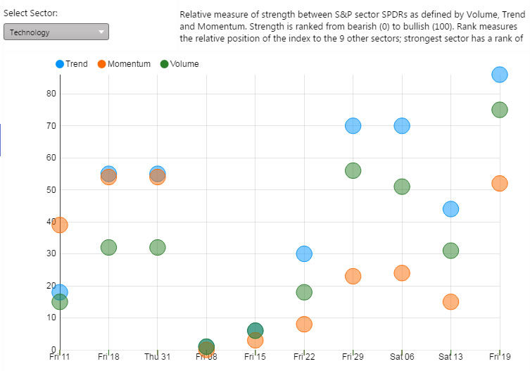

## _Basics_

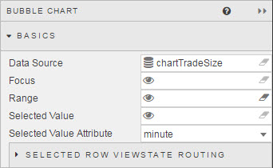

### _Data Source_

See [Defining a Query](introduction#defining-a-query) and [Analytics](introduction#analytics) for more on data sourcing.

### _Focus_

Used for [linking components](introduction#linking-components). Requires a [View State Parameter](introduction#view-state-parameters).

### _Range_

Used for linking to a [Range Slider](rangeslider). Requires a View State Parameter to pair with the Range Slider. 


### _Selected Value_ 

Stores the clicked-on chart data point to a View State Parameter.  

1. Create a View State Parameter and assign to _Selected Value_
 
    

2. Go to _Selected Value Attribute_ to select a query variable to store in the _Selected Value_ View State Parameter.


### _Selected Value Attribute_

This comes from the data source and is the variable paired with the _Selected Value_ View State Parameter.  When the user clicks on the chart, the associated query variable will be mapped to the _Selected Value_ view state.  


!!! warning "Data type"
    When mapping _Selected Values_ to _Selected Value Attribute_, ensure the _Data Type_ of the View State Parameter matches the _Data Type_ of the _Data Source_; e.g. integer for numbered data.


### _Selected Row ViewState Routing_

The aforementioned _Selected Value_ and _Selected Value Attribute_ handles a single data map. _Selected Row Viewstate Routing_ supports multiple mappings between _Selected Values_ and _Selected Value Attributes_.

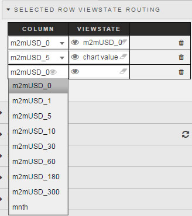

To add a row, click 


## X Axis

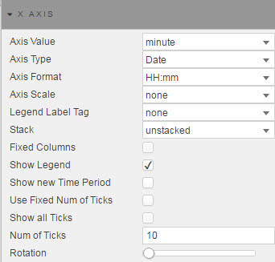

  

### _Axis Value_

The query column variable to be used as the X-axis chart label

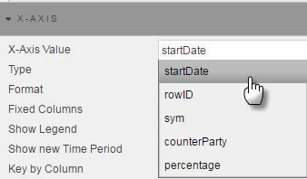


### _Axis Type_

The data type for the label used for _Axis Value_


!!! tip "Wong control labels?"
    If X-axis labels look incorrect, try selecting a different _Axis Type_


### _Axis Format_

Used for when _X-Axis Type_ is _Date_.


### _Axis Scale_

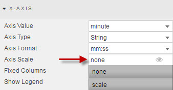

Select _none_, or use numeric or time scaling depending on _Axis Type_. 


### _Legend Label Tag_

(Coming soon.)


### _Stack_

Overlays data from _Data Source_ on existing plot.

For example, displaying bid price on top of bid plotted bubbles: 

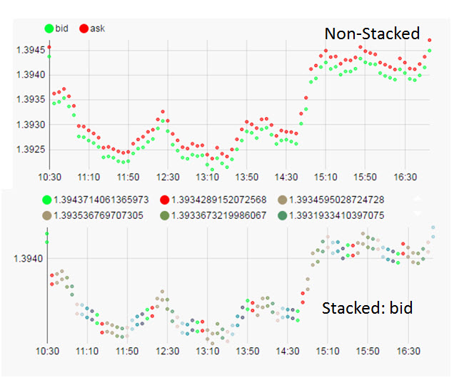 


### _Fixed Columns_

Toggles chart between standard chart scale and fixed (transposed) chart view.  


### _Show Legend_

Toggles display of chart legend


### _Show New Time Period_

Ensures the latest data point of a time sequence is displayed

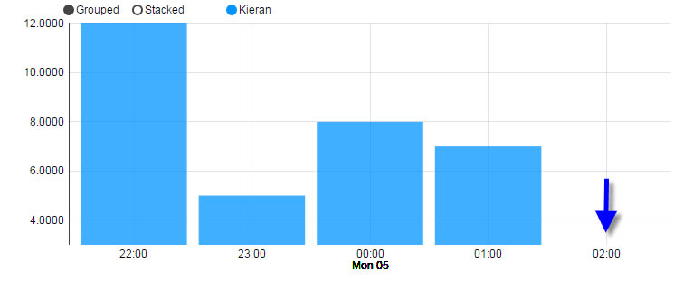


### _Use Fixed Num of Ticks_

Toggles use of _Num of Ticks_


### _Show All Ticks_

Displays every charted data point in the X axis


### _Num of Ticks_

The number of ticks to display in the X axis. (Use _Use Fixed Num of Ticks_ to enable.)


### _Axis Rotation_

Rotate X-axis label


## Columns

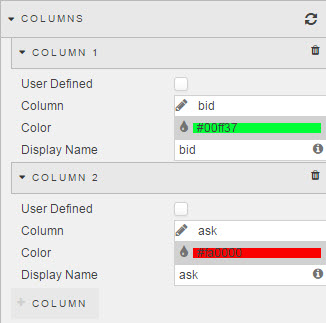

To refresh the chart to its default (prior saved) state, click the Refresh button


To add a column, click 


### _User Defined_

Check to make the column read-only.


### _Column_

Select the data-source variable to plot


### _Color_

Select a line color from the color palette


### _Display Name_

Create a display name to use in the chart Legend key 


## Zoom / Pan 


_Zoom / Pan On_

: Toggles functionality 

    

    


_Type_

: Select between drag-to-select _Zoom_, or _Pan_ control


_Zoom Select Color, Opacity and Border_

: Background color, background color opacity and the border for the selected area. 


_Min and Max Zoom_

: 

    View State Parameter to store the range value for _Min and Max Zoom_


_Mouse Pan_

: Toggle mouse pan control; best used on real-time time series data 


_Mouse Pan Interval_ and _Mouse Pan Type_

: Set time pan control for chart; chart will move in timed sections.

    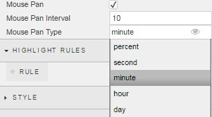


## _Highlight Rules_


Used to color-code bar charts. Best used with real-time streaming or polling data. 

Click on  to include additional highlight rules.


### _Condition Source_

The dependent variable from the data source, defining the trigger.


### _Condition Operator_

Rule operations, including greater-than, less-than, not-equal-to, exactly-equal-to, and text-contains-alerts


### _Condition Value_

The threshold value to trigger the alert. Typically, this is "previous value" but can be numeric or text (depending on the source data)


### _Color_

The color for the bar to be when the highlight rule is true. 


## _Style_

OLAP Bar Color

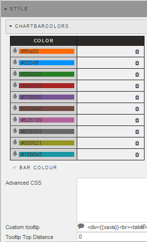


### _ChartBarColors_

Sets bar color and order for Pivot/OLAP chart. 

Set using Hex reference or by clicking on the color bar and selecting from the pop-up palette. 


### _Advanced CSS_

Click inside the _Advanced CSS_ editor. Click the selector icon, then inside the chart component to bring up the relevant CSS code to edit.


### Custom Tooltip

1. Create View States for items in tooltip

    

2. Add an HTML tag for View States, using [Handlebars](*http://handelbarsjs.com*)

    

3. Chartview

    

Tooltips can use View State Parameters that have been mapped to data-source variables


In the _Configure Tooltip template_, add HTML tags for the View State Parameters to display (using Handlebars) 

If viewstate parameter is `param1`, add a table cell with `param1` viewstate to tooltip with the tag:  `<td>{{obj.param1}}</td>`


The tool tip will appear as: 

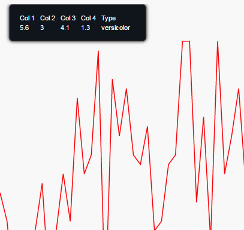


### _Tooltip Top distance_

Distance from mouse in pixels at which tooltip appears


### Tooltip Helper

Tooltip Helper


Apply Tooltip Helper Variable to Tooltip reference


Tooltips use Handlebars, so variables can be added dynamically to tooltip.

For example:
 
```
{{fx}} : {{volume}}
```

could appear as `EUR/USD: 250000`. To format `250000` so it will appear as `$250,000` use Tooltip Helper


### _Name_

Give the function a name.  This name will be used inside the tooltip.

For example:


```
{{fx}} : {{fd volume}}
```


### _Regex_

The regular expression used to find the required pattern

In this example:
```
(\d{3})(?=\d)
```


### _Value_

The value to replace the text with. In this case, comma-delimited currency values: 
```
$1,
```

## Format

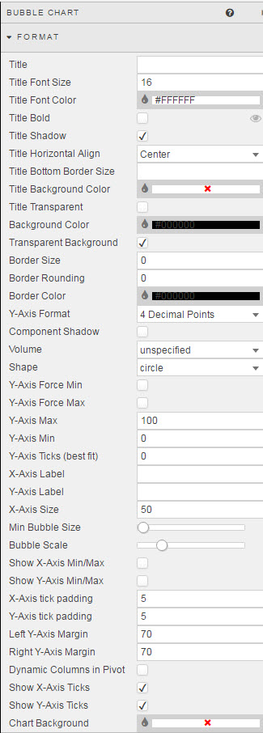

<i class="fa fa-hand-o-right"></i> [Style](style) for common formatting parameters

Formatting specific to bar charts is detailed below:


### _Y-Axis Format_

Configures the number of decimal places used in a numeric X axis.


### _Component Shadow_

Not used


### _Volume_

Sets bubble size to a data-source variable; in the below example bid price is charted against the Y axis and bid volume is bubble size:

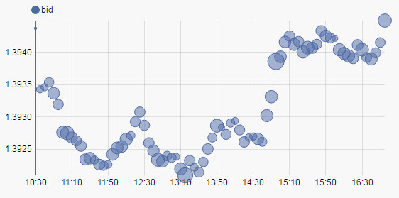

Use _Min Bubble Size_ and _Bubble Scale_ sliders to set the baseline bubble size


### _Shape_

Dropdown menu of different bubble-chart types

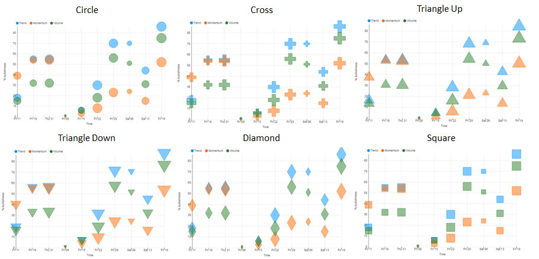


### _Y-axis Force Min_

The default chart best-fits data to the axis to maximise visual differnces. It sets the lowest value in your data to the baseline. 


Checking _Y-axis Force Min_ will set the Y axis to use the value of _Y-axis Min_.


### _Y-axis Force Max_

As with _Y-axis Force Min_ will set Y-axis maximum to use _Y-axis Max_ value. 

!!! warning "Cropping"
    Using _Y-axis Force Max_ may crop chart if Y-axis values exceed _Y-axis Max_


### _Y-axis Min_

The defined value will be used if _Y-axis Force Min_ is checked.


### _Y-axis Max_

The defined value will be used if _Y-axis Force Max_ is checked.

!!! Tip
    Use _Y-axis Max_ to standardize the appearance of neighboring chart components where relative comparisons are important.


### _Y-Axis Ticks (best fit)_

Chart will best-fit number of displayed Y-axis ticks to the value set


### _X/Y Axis Labels_
  
Adds text labels for X- and Y-axes


### _X-axis Size_

Sets the distance between the X-axis and the border of the component. 


Distance between X-axis and line chart


### _Min Bubble Size_

Slider control to define how big the smallest bubble will be. Minimum bubble size is independent of relative difference as measured by _Bubble Scale_


### _Bubble Scale_

Slider control to define the scale of the relative change between bubbles as set by the _Volume_ variable. The further right the slider, the bigger the relative difference between bubbles.  

!!! Note "Using Bubble Scale"
    Bubble size is magnifying the relative difference between the values for _Volume_ as selected from the data source.


### _Show X-axis Min/Max_

Display in the X axis the min/max values.


### _Show Y-axis Min/Max_
 
Display in the Y axis the min/max values.


!!! Note "Use of Min/Max"
    Charts will best fit the Y axis, setting the minimum value to the lowest value in the charted Y range. To force zero onto the Y axis, use _Y Axis Min_


### _X/Y-axis tick padding_


Defines spacing between X- and Y-axis labels to chart the X- and Y-axes.


### _Left/Right Y-Axis Margin_

Distance between Y axis and chart component edge


### _Y-axis min/max range scale_

Defines the range between min and max values of y-axis


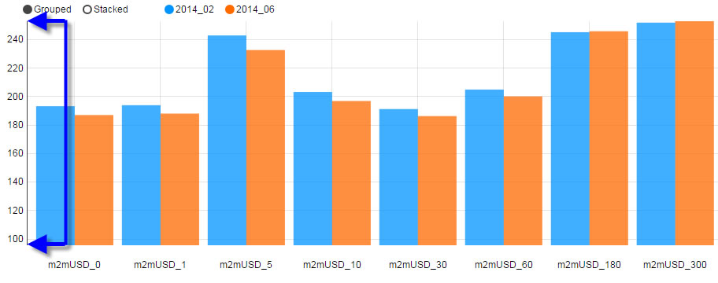

!!! Warning "Out-of-range values"
    If the defined range is greater than the data range a negative Y axis will be applied


### _Dynamic Columns in Pivot_

Marks if dynamic colums are used for a [pivot query](introduction#pivot-query)


### _Show X- Y-Axis Ticks_

Toggles the display of chart tick labels


### _Chart Background_

Change background color of chart

<i class="fa fa-hand-o-right"></i> [Styli.ng dashboards](style)