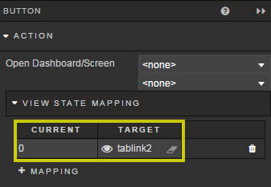

Adds individual button controls for jumps to dashboards and dashboard screens.

## _Action_

Sets a Dashboard and Dashboard Screen to open on button click.

### _Viewstate Mapping_

Mapping a value to a View State Parameter (within a dashboard)

 
_Viewstate Mapping_ allows values of View State Parameters from the source dashboard to be transferred to View State Parameters in the destination Dashboard.

!!! tip 
    Before mapping View State Parameters across dashboards, create the target View State Parameter in the destination dashboard first. _Viewstate Mapping_ can map only to existing View State Parameters; Dashboards will not create them.
 
To add a new mapping element, click 

## Basics

_Label_

: Name to appear on the button

_Font Size_

: Size of font to use the button.

_Horizontal_

: Sets alignment (left, center or right) of button inside the boundaries of the _Button_ component

_Vertical_

: Sets alignment (top, middle, bottom) of button inside the boundaries _Button_ component

_Tooltip_

: Descriptive tooltip to appear on button rollover

_Fixed Width_

: Check box to define width of input box.  If unchecked, button will fill width of _Button_ component box.

_Width_

: When _Fixed Width_ is checked, width will define the button size in pixels. 

## Style

Use _Advanced CSS_ to set styles
 

## Margins

<i class="fa fa-hand-o-right"></i> [Style](style)