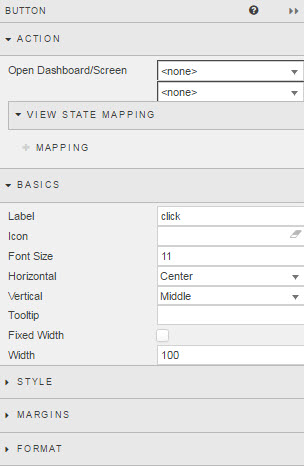
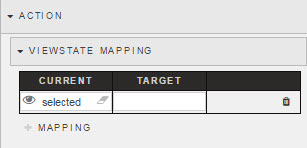

Adds individual button controls for jumps to dashboards and dashboard screens.

## Action

Defines the Dashboard and Dashboard Screen to open on button click.

### View State Mapping

Mapping a value to a View State Parameter (within a dashboard)

 
View State Mapping allows values of View State Parameters from the source dashboard to be transferred to View State Parameters in the destination Dashboard.

<aside class="admonition tip">When mapping View State Parameters across dashboards, it will be necessary to create the Target View State Parameter in the destination dashboard first. Viewstate Mapping can only map to existing View State Parameters; it does not create them</aside>
 
To add a new Mapping element, click 

## Basics

**Label**

Name to appear on the Button

**Font Size**

Size of font to use the button.

**Horizontal**

Sets alignment (left, center or right) of button inside the boundaries *Button* component

**Vertical**

Sets alignment (top, middle, bottom) of button inside the boundaries *Button* component

**Tooltip**

Descriptive tooltip to appear on button rollover

**Fixed Width**

Check box to define width of input box.  If unchecked, button will fill width of **Button** component box.

**Width**

When **Fixed Width** is checked, width will define the button size in pixels. 

## Style

Use Advanced CSS to set styles
 

## Margins

See [Margins](introduction.md#margins) in Introduction for more

## Format

See [Format](introduction.md#format) in Introduction for more.

