## Basics

Covers the data source and end-user controls for the Data Grid, including search, filtering, edit cells, insert and delete rows, grouping and custom column display. Users can also select by which column to autosort on dashboard load, and the direction of the sort order

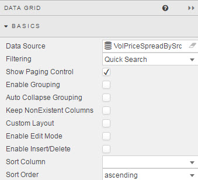

### Data Source

Data Source Example

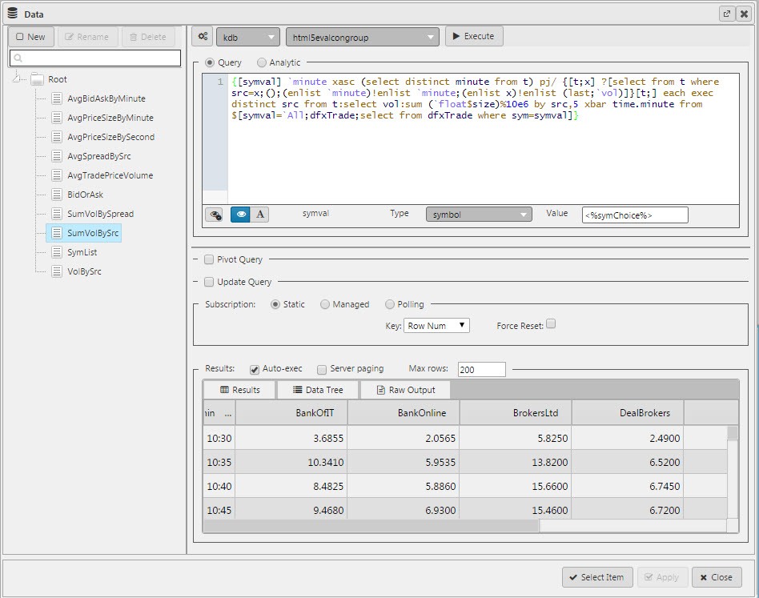

Defines the source data to display in the Data Grid. See [Defining a Query](introduction#defining-a-query) and [Analytics](introduction#analytics) for more on data sourcing.

### Filtering

Three types of filtering are available:

_Quick Search_

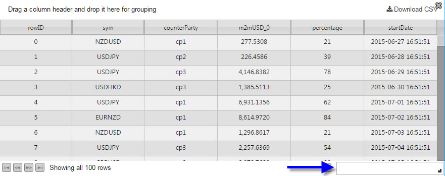

_Column Filters_

_Disabled:_ No filters

### Show Paging Control

Toggle display of pagination controls. Used for large data sets.

### Enable Grouping

Users can group data together. Subtotals can be applied with [Summary Row For Groupings](datagrid#summary-row-for-groupings)

### Auto Collapse Grouping

On loading of dashboard, groupings will be in collapsed form. Grid groupings are configured in [Grouping Columns](datagrid#grouping-columns)

### Keep NonExistent Columns

Use of NonExistent Columns is best employed when working with a large number of queries. This could be during the design process where a dashboard builder can retain column configurations from copied data grids using different queries.

Dynamic queries which have don't have fixed column definitions can check the Keep NonExistent Columns to retain configuration options; e.g. column formatting. In this scenario, the "*" would be used in the Data Field Name      

### Custom Layout

User Configuration menu

!!! Tip "User configuration will pick up all available columns from the query. Users can drag-into the available area, columns from source data; these will be removed from display. Reset reverts to default data view. This functionality is available to users of all permission types."

When checked, a Configuration menu will appear in the Data Grid. 

Users can change the display of columns in the Data Grid
  
'Hidden' columns will in the "Available Columns" list. This may not be desirable if a hidden column is used to store a calculation or is used for a highlight rule opertor not for display to the User. For these Data Grids it may be necessary to disable Custom Layout.

The user configuration on exiting the dashboard should be retained on next login.

### Enable Edit Mode

Enable Edit Mode
  

Used in conjunction with <a href="#update-query">*Update Query*</a>. 

 

 

In Preview mode, click "Edit" to enable. Remember to Submit Changes when done. Cancel to reject changes. 

### Enable Insert/Delete

Enable Insert/Delete
  

Used in conjunction with <a href="#update-query">*Update Query*</a>.

 

In Preview mode, click "Edit" to enable. Remember to Submit Changes when done. Cancel to reject changes.

## Columns

Defines how data is formatted in each column. 

Data Grid Columns

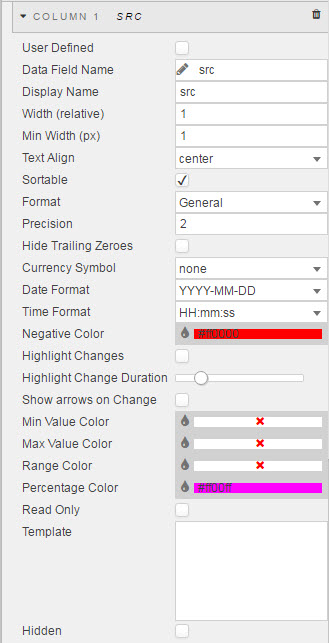
  
In addition to individual column configurations, global settings can be defined from Column Edit.
  

  
Select columns on the left using CTRL + column click, next select properties on the right to be applied across selected columns.
  

  
Columns can be removed from a Data Grid on clicking the trashcan icon
  

**User Defined**

When checked, the selected column will remain in the Data Grid if the selected column variable is removed from the query. A User Defined query is effectively a 'lock' on the column

!!! Tip "If the User Defined column variable is missing in the query, the User Defined column will show as an empty column in the Data Grid."

**Data Field Name**

Data Field Name

When using a wildcard, all dynamic columns derived from a query will use the wildcard column format.  The wildcard can be used in conjunction with text headers; e.g. bid* for bid, and bid_update

The Data Field Name is selected from data columns in the Data Source query. 

Additional columns can be added, including wildcard columns. If wildcard is used, any non-defined columns will adopt the column specifications of the wildcard column; e.g. data alignment, decimal precision etc.

**Display Name**

Display Name

The name assigned for the column in the Data Grid. This is case sensitive.

**Width (relative)**

Relative Width
  

Relative measure to the width of the Data Grid. The scale is contigent on the values of each column; for example, columns with a relative width of 20,10,5,1 will scale at a column width of 55% (i.e. 20/(20+10+5+1)), 28%, 14% and 3%.  

Relative columns will scale according to the browser size.

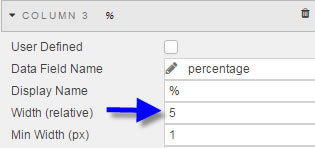

**Minimum Width (pixels)**

This is the pixel minimum width for a column. Columns will never be smaller than the minimum width, but can be wider. 

Columns using minimum width will scale according to browser size

**Text Align**

Alignment of values inside Data Grid. 

**Sortable**

Sorting Columns

When checked, users clicking on column header will toggle between ascending and descending sort. 

**Format**

Sample formats: General, DateTime, General, Formatted Number, Formatted Number, Formatted Number, Formatted Number, DateTime, General, Smart Number
  

  
Select formatting for data type in column
  

**Precision**

Where numeric data is used, Precision sets the number of decimal places used.

**Hide Trailing Zeroes**

Removes the display of zeroes from end digits after the decimal point.

**Currency Symbol**
 
Currencies

 
Adds a currency symbol prefix to column data
  

**Date Format**

Combination Date and Time Format. Ensure Date or DataTime Format is selected.
  

  

  
Select date format

  
**Time Format**
  
Select time format. Ensure Time or DataTime Format is selected
  
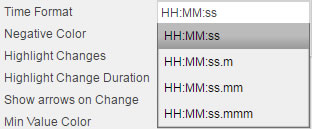
  
**Min Value Color**
  
Min Value Color

  
Selection will place a color border highlight around lowest value in column
  

To Remove, again click on the color and select _No Color_ from the palette tool.

!!! Tip "Min Color can be a viewstate parameter. To assign a viewstate parameter, rollover end of input bar until  appears, click to assign."

**Max Value Color**

Max Value Color

  
Selection will place a color border highlight around highest value in column
  

Click the color bar again and then click _No Color_ to remove the Max color setting 

!!! Tip "Max Color can be a viewstate parameter. To assign a viewstate parameter, rollover end of input bar until  appears, click to assign."

**Range Color**

Range Color

  
Applies a selected colour gradient across all cells in a column. Assigning a color will automatically apply the Range Color. 
  

Click the color bar and then _No Color_ to remove the Range color from column data

!!! Tip "Range Color can be a viewstate parameter. To assign a viewstate parameter, rollover end of input bar until  appears, click to assign."

**Percentage Color**

Percentage Color

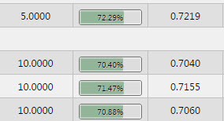

Adds a mini-bar in Percentage formatted data. The proportion of the bar filled runs from 0 to 100%

To enable set Format to _Percentage_ 

Select a colour to use for the bar 

!!! Tip "Percentage Color can be a viewstate parameter. To assign a viewstate parameter, rollover end of input bar until  appears, click to assign."

**Read Only**

Columns which are checked Read Only cannot be edited

**Template**

Template Help 

Template allows for richer customisation of columns. In this example, information from two columns ('URL' and 'Name') is merged together to form an active link:

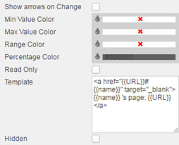

## Selection and Routing

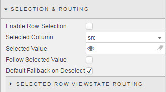

When enabled, a user selecting a data grid row will have data grid variables asigned to [view state parameters](introduction#view-state-parameters). In the example below, _rowID_ from a Data Grid has been mapped to a _rowid_ view state parameter. 

To start, _Enable Row Selection_ must be checked.

If just a single value is to be stored, the _Selected Column_ and _Selected Value_ can be used. If more than one value is to be stored, then <a href="#selected-row-viewstate-routing">Selected Row Viewstate Routing</a> must be used. 

[1] Select the Column of the data you wish to store

[2] Assign a viewstate parameter which will receive and store the selected cell value

!!! Tip "If more than one value from a grid is to be stored, use Selected Row Viewstate Routing."

### Selected Row Viewstate Routing

Where _Selected Column_ and _Selected Value_ store just a single value, _Selected Row Viewstate Routing_ can store multiple values

Click  to set storage for additional values

Add a row for each Data Grid variable to store to a view state parameter. 

**Follow Selected Value**

When checked, row selection highlight will retain view on screen during scroll event. 

**Default Fallback on Deselect**

When checked, default viewstate parameter values will be used (if set) in the absence of a row select.

## File Export

Data from a data grid can be exported to a spreadsheet using the CSV downloader

The filename can be specified, or linked to a view state parameter which can then be defined by the user

## Grouping Columns

On loading, Data Grids can be configured into groups. Subtotals can be added with <a href="#summary-row-for-groupings">Summary Row For Groupings</a>

Click on  to add a Grouping

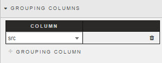

Each additional Grouping level will create subgroups derived from the previous grouping; i.e. the top Grouping is processed before subsequent groups are created. Groupings can be re-organised using a left-click-and-drag. 
 

Dashboard Users can also create groupings on the fly with a left-click-and-drag of a column header into the space directly above the column headers: 

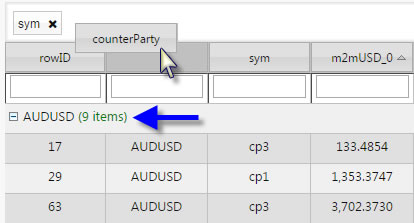

## Highlight Rules

Used to apply color updates to notify users of changes in Data Grid values

**Name**

The name of the rule

**Target**

From the dropdown menu, select the target Data Grid column on which the rule will act 

The Target column can be any column in the Data Grid.  It does not have to be the data grid column which is using the operator

**Condition Source**

The data series on which the trigger is measured

**Condition Operator**

Dropdown menu of rule operations, including greater and less than, not equal to, exactly equal to, and text contains alerts

Trigger | Explanation
--- | ---
search | find Condition Value match; assign [view state parameter](introduction#view-state-parameters) and pair with [Text Input](textinput). 
contains | find all instances with the Condition Value
starts with | find all instancs starting with the Condition Value
ends with | find all instance ending with the Condition Value
== | exact match, e.g. client name
< | less than Condition Value
> | greater than Condition Value
<= | less than or equal to Condition Value
>= | greater than or equal to Condition Value
!= | excludes Condition Value
Fill Left-to-Right | fills cell with color from left-to-right
Fill Right-to-Left | fills cell with color from right-to-left

**Condition Value**

What value threshold will trigger the alert.  Default is _previous value_

**Color**

The text color change when rule is true

**Backround Color**

Background cell color change when rule is true. 

**Border Color**

Cell border color change when rule is true

**Icon**

Select an icon to appear when rule is true

**Icon Color**

Select the color for the icon (if used) when rule is true

## Style

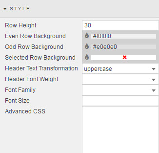

**Row Height**

Defines the height of the Data Grid table rows

**Even & Odd Row Background**

Defines the colour of the even and odd data grid rows. Colors can be selected from the color palette, a view state parameter (of a hex color reference) or a direct hex color reference. 

**Selected Row Background**

If <a href="#selected-row-viewstate-routing">selected view state routing</a> is enabled, then this color will define the background for the selection row. 

**Header Text Transformation**

Sets the text type for Data Grid column header names

**Header Font Weight**

Sets the font type for Data Grid column header names

**Font Family**

Sets the font family for Data Grid column header names

**Font size**

Sets the font size for Data Grid column header names

### Advanced CSS

Used to apply CSS to Data Grid.

[1] Left-click inside the Advanced CSS editor

[2] Click on the  in the pop-up dialog

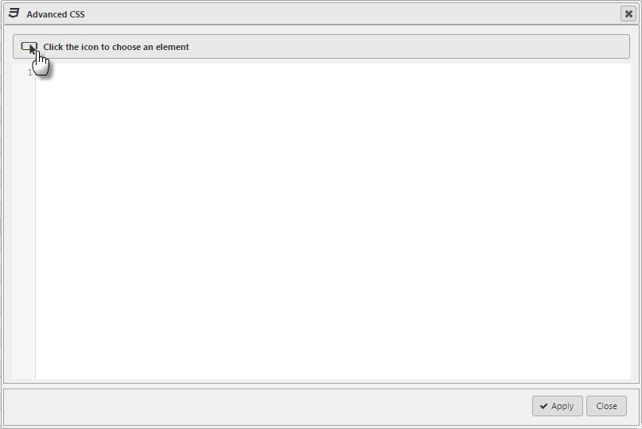

[3] Click on an Data Grid element to view the CSS reference

[4] Add the required CSS

[5] Click [Apply]

## Summary Row for Groupings

Column Grouping will reorganise the Data Grid layout. Summary Row for Groupings will add simple mathematical calculations to these groups.

Click on  to add a new summary row. 

**Column**

This is the data grid column on which the calculations will be made

**Aggregate Function**

The mathematical funtion to apply: average, sum, min or max

**Label**

The text label to use for the calculation

**Color**

The font color for the grouping

Default color is none, so unless a color is selected the grouping calculation will appear 'invisible'

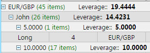

## Margins

See [Margins](introduction#margins) in Introduction for more

## Format

See [Format](introduction#format) in Introduction for more