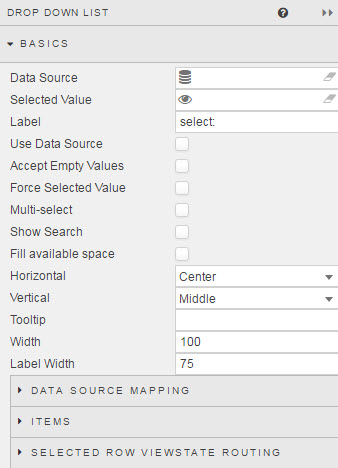
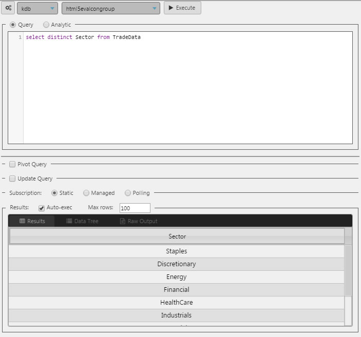
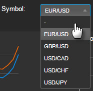
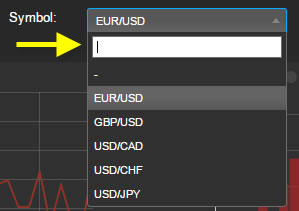

 
## _Basics_

Configure data source and the selection rules

### _Data Source_

<i class="fa fa-hand-o-right"></i> [Defining a Query](introduction#defining-a-query) for creating a _Data Source_. _Data Source_ should include the list of values to pass into the linked [View State Parameter](introduction#view-state-parameters) and (optional) list of value names to display in the dropdown. For example: 

!!! Tip
    When using _Data Source_ to create a dropdown list, ensure <a href="#use-data-source">Use Data Source</a> is checked AND <a href="#data-source-mapping">Data Source Mapping</a> is defined. 

### _Selected Value_

Defines the [View State Parameter](introduction#view-state-parameters) to which the value in the drop down list will be applied.

### _Label_

Defines the label next to the Dropdown

### _Use Data Source_

When checked, _Data Source_ is used to define _Drop Down List_ constituents

!!! Tip
    Important to ensure this box is checked if a **Data Source** is used to create drop-down constituents.

### _Accept Empty Values_

When checked, a null value is available for selection

### _Force Selected Value_

When checked, the value of the _Selected Value_ [View State Parameter](introduction#view-state-parameters) used in the list will be passed into _Data Source_ queries using the parameter.

### _Multi-select_

When checked, multiple inputs can be passed into the assigned Selected Value [View State Parameter](introduction#view-state-parameters)

### _Show Search_

When checked, includes a search box for filtering results

### _Horizontal_

Horizontal alignment of items within the list

### _Vertical_

Vertical alignment of items within the list

### _Tooltip_

Text description to appear when user mouses over the dropdown

### _Width_

Pixel width of menu

### _Label Width_

Pixel width of dropdown _Label_. If the _Label_ description is wider than _Label Width_, it will wrap.

## _Data Source Mapping_

When a _Data Source_ is used to populate the Drop Down List, the elements of the _Data Source_ will represent values. Labels must be assigned using _Data Source Mapping_ – otherwise the list will be empty.

_Value_

: Select the column of the _Data Source_ corresponding to the values to be passed into the _Selected Value_ View State Parameter

_Text_

: Select the column of the _Data Source_ corresponding to the text description for the listed value items.

## _Items_

If _Data Source_ is not used to populate a Drop Down List, individual values can be specified in the _Items_ menu.  

To add a new row, click 
For each item, add a _Value_ and a _Text_ label. 

## _Selected Row Viewstate Routing_

In addition to the _Selected Value_, additional 
View State Parameters can be assigned to data-source variables. Select the _Data Source_ variable and pair it with a View State Parameter. Multiple View State Parameters can be paired.  

## Style

Set Advanced CSS

<i class="fa fa-hand-o-right"></i> [Styling dashboards](style)