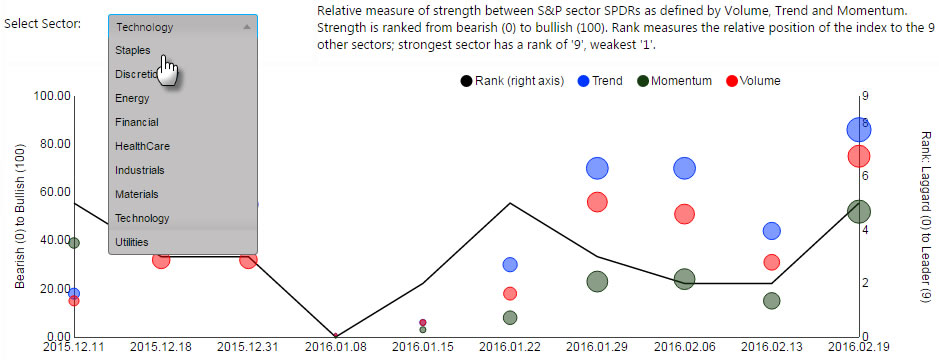
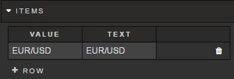
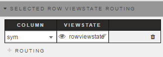
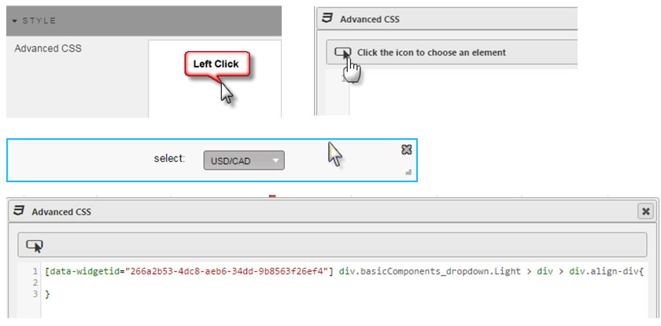

 
### Basics

Configure **Data Source** and selection rules

### Data Source
 
See [Defining a Query](introduction#defining-a-query) for creating a _Data Source_. _Data Source_ should include the list of values to pass into the linked [view state parameter](introduction#view-state-parameters) and (optional) list of value names to display in the dropdown. For example: 

!!! Tip
    When using _Data Source_ to create a dropdown list, ensure <a href="#use-data-source">Use Data Source</a> is checked AND <a href="#data-source-mapping">Data Source Mapping</a> is defined. 

### Selected Value

Defines the [view state parameter](introduction#view-state-parameters) to which the value in the drop down list will be applied.

### Label

Defines the label next to the Dropdown

### Use Data Source

Box Check. Check if _Data Source_ is used to define _Drop Down List_ constituents

!!! Tip
    Important to ensure this box is checked if a **Data Source** is used to create drop-down constituents.

### Accept Empty Values

Box Check. When checked, a null value is available for selection

### Force Selected Value

Box Check. When checked, the value of the **Selected Value** [view state parameter](introduction#view-state-parameters) used in the _Drop Down List_ will be passed into _Data Source_ queries using the parameter.

### Multi-select

When checked, multiple inputs can be passed into the assigned **Selected Value** [view state parameter](introduction#view-state-parameters)

### Show Search

Search Box

Dropdown box includes a search box for filtering results

### Horizontal

Sets alignment (left, center or right) of dropdown menu inside the boundaries _Drop Down List_ component

### Vertical

Sets alignment (top, middle, bottom) of dropdown menu inside the boundaries _Drop Down List_ component

### Tooltip

Text description which appears when User mouses over the dropdown

### Width

Defines pixel width of dropdown

### Label Width

Defines pixel width of dropdown _Label_

!!! Tip "Description greater than Label Width"
    If assigned _Label Width_ is narrower than can fit the _Label_ description, text in the _Label_ will wrap.

### Data Source Mapping

When a _Data Source_ is used to populate the <a href="#drop-down-list">Drop Down List</a>, the elements of the _Data Source_ to represent values and labels must be assigned using _Data Source Mapping_

!!! Warning
    Important to ensure **Data Source Mapping** is complete if a _Data Source_ is used to create drop-down constituents. Otherwise the _Drop Down List_ component will be empty.

### Value

Select the column of the _Data Source_ corresponding to the values to be passed into the **Selected Value** [view state parameter](introduction#view-state-parameters).

### Text 

Select the column of the _Data Source_ corresponding to the text description for the listed value items.

### Items

Manual Dropdown Item Add

If _Data Source_ is not used to populate a **Drop Down List**, then individual values can be done from the Items Menu.  

For each item, add the *Value* and the *Text* label to display in the drop down.  To add a new row, click 

### Selected Row Viewstate Routing

In addition to the **Selected Value**, additional <a href="#view-state-parameters">View State Parameters</a> can be assigned to **Data Source** variables. Select the **Data Source** variable and pair it with a <a href="#view-state-parameters">View State Parameter</a>. More than one <a href="#view-state-parameters">View State Parameter</a> can be paired in this fashion.  

### Style

Set Advanced CSS

## Format

See [Format](introduction.md#format) in Introduction for more.

## Margins

See [Margins](introduction.md#margins) in Introduction for more
