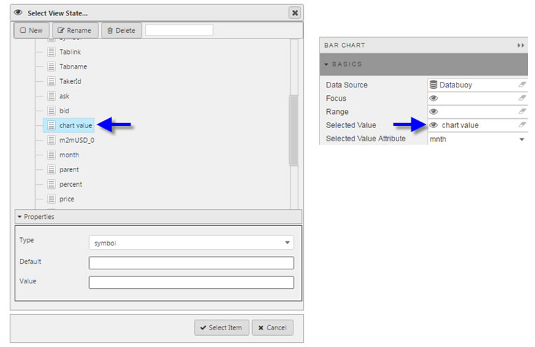
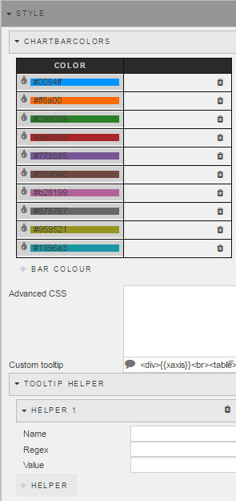
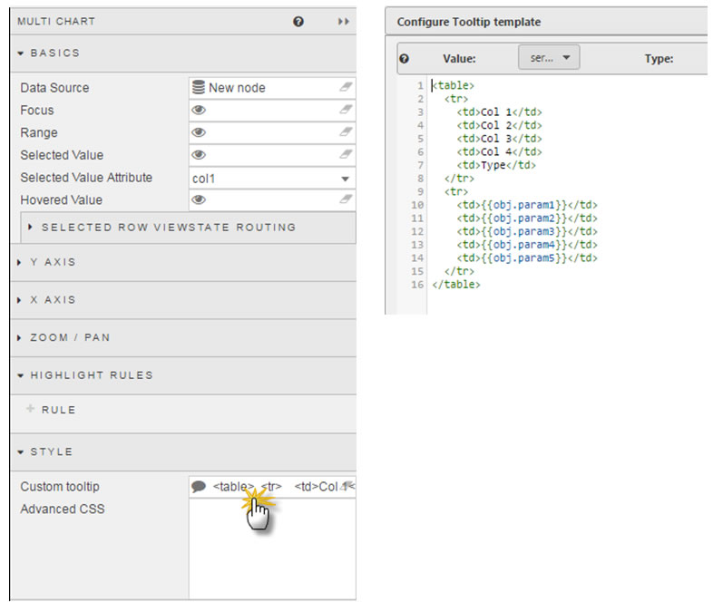
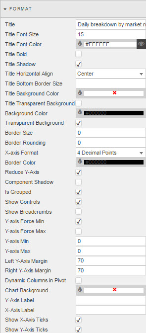
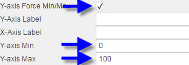

## Basics


### Data Source

See [Defining a Query](introduction.md#defining-a-query) and [Analytics](introduction.md#analytics) for more on data sourcing.

### Focus 

Used for [linking components](introduction.md#linking-components). Requires a [view state parameter](introduction.md#view-state-parameters).

### Range

Similar to **Focus**, instead the assigned [view state parameter](introduction.md#view-state-parameters) is used to link a [range slider](rangeslider.md) to the chart.

### Selected Value 

Used to map a chart (query) data point to a [view state parameter](introduction.md#view-state-parameters) when a chart bar is clicked by the user. 

[1] Create a [view state parameter](introduction.md#view-state-parameters) and assign to <i>Selected Value</i>
 


[2] Go to <a href="#selected-value-attribute">Selected Value Attribute</a> to select a query variable to store in the Selected Value View State Parameter.

### Selected Value Attribute

This comes from the Data Source and is the variable paired with the <a href="#selected-value">selected value</a> [view state parameter](introduction.md#view-state-parameters). 


<aside class="warning">When mapping <i>Selected Values</i> to <i>Selected Value Attribute</i>, ensure the <i>Data Type</i> of the View State Parameter matches the <i>Data Type</i> of the <a href="#data-source">Data Source</a>; e.g. integer for numbered data </aside>

### From / To

Coming Soon


## Columns


To refresh the chart to its default (prior saved) state, click the refresh button


To add a column, click 

**User Defined**

A 'read only' lock of the column.

<aside class="warning">Helps if working with multiple copies of a chart and are changing <a href="#data-sources">Data Sources</a>.  Locking the column will preserve formatting even if the listed <i>Column</i> source isn't referenced in a changed <a href="#data-sources">data source</a>.</aside>

**Column**

The charted value from the **Data Source** 

**Color**

Select from color palette or use Hex color reference

**Display Name**

The charted variable name to display in the Y-axis

## Y-axis


**Axis Value**

Select from the dropdown the category to chart from the <a href="#data-sources">Data Source</a>

**Axis Type**

Select the data type from the dropdown menu.  Choose between String, Date or Number.

<aside class="warning">If selecting <i>Date</i>, set the date type in <b>Axis Format</b></aside>

**Axis Format**

If **Axis Type** is of type <i>Date</i> then choose the date or datetime format for the y-axis. 

**Legend Label Tag**

Coming Soon

**Axis Scale**

Axis order will either be the default order as generated by the <a href="#data-sources">Data Source</a>, or will scale numerically. 

**Rotation**

Rotates y-axis labels

**Fixed Columns**

Toogle control to switch between display of data by inidividual <a href="#data-sources">Data Source</a> columns, or aggregate by Row. 


**Show Legend**

Show legend in chart

**Key by Column**

Transposes chart plot


## Highlight Rules


Used to color code bar charts. Best used with real-time streaming or polling data. 

Click on  to include additional highlight rules.

**Condition Source**

The data series on which the trigger is measured. Selected from the <a href="#data-sources">Data Source</a>

**Condition Operator**

Dropdown menu of rule operations, including greater and less than, not equal to, exactly equal to, and text contains alerts

**Condition Value**

What value threshold will trigger the alert.  Typical is "previous value" but can also be a text trigger

**Color**

What color bar will change on when highlight rule is true. 

## Style

Configure Pivot line colors, CSS and Custom Toolbar



### ChartBarColors

Used for setting colors for a bar chart breakdown in a [pivot query](introduction.md#pivot-query)

[Screenshot](img/barcolorhtmllight.jpg)


### Advanced CSS

Left click inside the Advanced CSS editor. Click the selector icon, then left-click inside the chart component to bring up the relevant CSS code. Add changes to your css as required. 


### Custom Tooltip

Step 1: Create View States for items in tooltip


Step 2: Add a html tag for View States (using handlebars)


Step 3: Chartview


Tooltips can use View State Parameters which have been mapped to Data Source variables


In the Configure Tooltip template, add html tags for the View State Parameters to display (using handlebars) 

If viewstate parameter = *param1*
Add a table cell with *param1* viewstate to tooltip with the tag:  <td>{{obj.param1}}</td>



Tool tip will appear as: 


### Tooltip Helper

Tooltip Helper


Apply Tooltip Helper Variable to Tooltip reference


Tooltips use <a href="http://handlebarsjs.com/">Handlebars.js</a> so variables can be added dynamically to tooltip.

For example:
 
```
{{fx}} : {{volume}}
```

could appear as
EUR/USD: 250000

To format "250000" so it will appear as "$250,000" use Tooltip Helper

**Name**

Give the function a name.  This name will be used inside the tooltip.

For example:


```
{{fx}} : {{fd volume}}
```

**Regex**

The regular expression used to find the required pattern

In this example:

```
(\d{3})(?=\d)
```

**Value**

The value to replace the text with. In this case, comma-delimited currency values: 

```
$1,
```

## Format



See [Format](introduction.md#format) in Introduction for more on shared formatting options. Additional formatting specific to horizontal bar charts is detailed below

**X-Axis Format**

Select the number of decimal places to use for numeric x-axis labels; zero to four places or Smart Number.

**Reduce Y-Axis**

No function

**Component Shadow**

No function

**Is Grouped**

Toggles between individual and stacked bars


**Show Controls**

Displays User control for toggling between Grouped and Stacked chart views.


**Show Breadcrumbs**

Displays breadcrumb control if horizontal chart is plotting a [pivot query](introduction.md#pivot-query)


**Y-Axis Force Min/Max**

If Y-axis is using numeric categories, it will use the range set by **Y-axis Min** and **Y-axis Max**



**Y-Axis Min/Max**

If **Y-axis Force Min/Max** is checked, the Y-axis range (if numeric data) will be set by assigned values

**Left/Right Y-Axis Margin**

Sets pixel width between axis and component border edge. 

**Dynamic Columns in Pivot**

Check control if dynamic columns from a [pivot query](introduction.md#pivot-query) are used. 

**Chart Background**

Sets background color of the chart

**Y-Axis/X-Axis Label**

 Provide chart labels for x- and y-axis

**Show X-/Y-axis Ticks**

Toggle to display ticks for x- and y-axis.

## Margins

See [Margins](introduction.md#margins) in Introduction for more