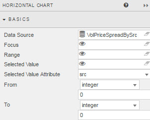
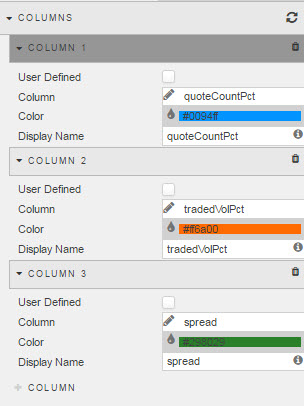
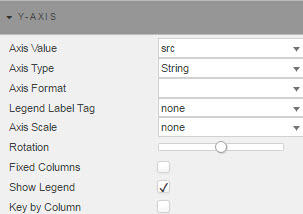
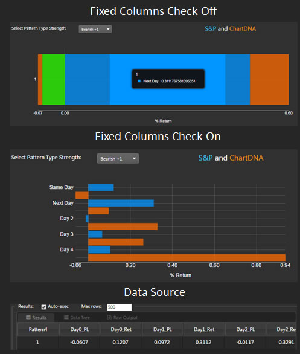
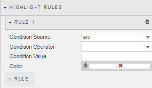
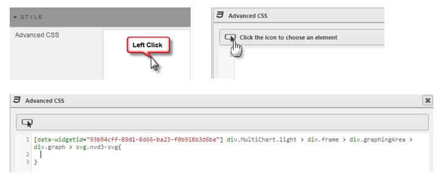
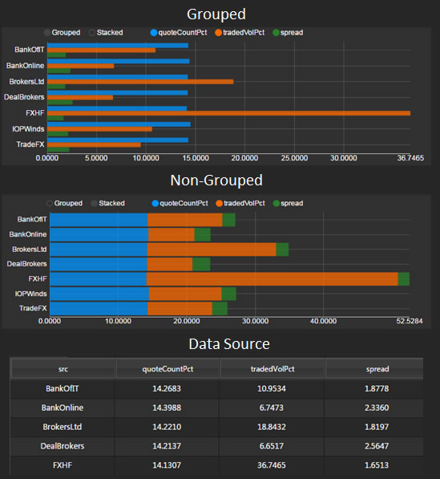

## Basics




_Data Source_

: <i class="fa fa-hand-o-right"></i> [Defining a Query](introduction/#defining-a-query) and [Analytics](introduction/#analytics) for more on data sourcing.


_Focus_

: Used for [linking components](introduction/#linking-components). Requires a [View State Parameter](introduction/#view-state-parameters).


_Range_

: Similar to _Focus_, instead the assigned View State Parameter is used to link a [Range Slider](rangeslider) to the chart.


_Selected Value_

: This is a View State Parameter; used to store the clicked-on chart data point to a View State Parameter.  

    1. Create a View State Parameter and assign to _Selected Value_
        

    2. Use _Selected Value Attribute_ to select a query variable to store in the _Selected Value_ View State Parameter.


_Selected Value Attribute_

: This comes from the _Data Source_ and is the variable paired with the _Selected Value_ View State Parameter.  When the user clicks on the chart, the associated query variable will be mapped to the _Selected Value_ view state.  

    

    !!! Warning "Data type match"
        When mapping _Selected Values_ to _Selected Value Attribute_, ensure the _Data Type_ of the View State Parameter matches the type of the _Data Source_; e.g. integer for numbered data.


_From / To_

: Coming Soon

    


## Columns



To refresh the chart to its default (prior saved) state, click the Refresh button:


To add a column, click 


_User Defined_

: A read-only lock of the column.

    !!! tip
        Helps if working with multiple copies of a chart and changing data sources.  Locking the column will preserve formatting even if the listed column source isn’t referenced in a changed data source.


_Column_

: The charted value from the _Data Source_


_Color_

: Select from palette or use Hex color reference


_Display Name_

: The charted variable name to display in the Y-axis


## Y-Axis




_Axis Value_

: The category to chart from the _Data Source_


_Axis Type_

: Data type: choose _String_, _Date_ or _Number_. If selecting _Date_, set the date type in _Axis Format_.


_Axis Format_

: If _Axis Type_ is _Date_ then choose the Date or DateTime format for the Y axis. 


_Legend Label Tag_

: (Coming Soon)


_Axis Scale_

: Axis order will either be the default order as generated by the _Data Source_, or will scale numerically. 


_Rotation_

: Rotates Y-axis labels


_Fixed Columns_

: Toogle between display of data by inidividual _Data Source_ columns, or aggregated by Row. 

    


_Show Legend_

: Show legend in chart


_Key by Column_

: Transposes chart plot

    


## Highlight Rules



Used to color-code bar charts. Best used with real-time streaming or polling data. 

Click on  to include additional highlight rules.


_Condition Source_

: The data series on which the trigger is measured. Selected from the _Data Source_


_Condition Operator_

: Rule operations, including greater-than, less-than, not-equal-to, exactly-equal-to, and text-contains-alerts


_Condition Value_

: The threshold value to trigger the alert.  Typical is "previous value" but can also be a text trigger


_Color_

: The color the bar will change to when highlight rule is true. 


## Style

Configure Pivot line colors, CSS and Custom Toolbar


### ChartBarColors

Used for setting colors for a bar chart breakdown in a [pivot query](introduction/#pivot-query)


### Advanced CSS

Click inside the Advanced CSS editor. Click the selector icon, then inside the chart component to bring up the relevant CSS code. Add changes to your CSS as required. 




### Custom tooltip

1. Create View States for items in tooltip

    

2. Add an HTML tag for View States, using [Handlebars](http://handlebarsjs.com)

    

3. Chartview

    

Tooltips can use View State Parameters which have been mapped to Data Source variables


In the Configure Tooltip template, add HTML tags for the View State Parameters to display (using Handlebars) 

If viewstate parameter is `param1`, add a table cell with `param1` viewstate to tooltip with the tag:  `{{obj.param1}}`


Tool tip will appear as: 


### Tooltip Helper


Apply Tooltip Helper variable to Tooltip reference


Tooltips use [Handlebars](http://handlebarsjs.com/) so variables can be added dynamically to tooltip. For example:
```js
{{fx}} : {{volume}}
```
could appear as `EUR/USD: 250000`. To format `250000` so it will appear as `$250,000` use Tooltip Helper


_Name_

: Give the function a name: it will be used inside the tooltip. For example:

    

    ```js
    {{fx}} : {{fd volume}}
    ```


_Regex_

: The regular expression used to find the required pattern. In this example: `(\d{3})(?=\d)`


_Value_

: The value to replace the text with. In this case, comma-delimited currency values: `$1,`


### Format


<i class="fa fa-hand-o-right"></i> [Styling dashboards](style) for more on shared formatting options. Additional formatting specific to horizontal bar charts is detailed below.


_X-axis Format_

: Select the number of decimal places to use for numeric X-axis labels; zero to four places or Smart Number.


_Reduce Y-Axis_

: (No function)


_Component Shadow_

: (No function)


_Is Grouped_

: Toggles between individual and stacked bars

    


_Show Controls_

: Displays User control for toggling between Grouped and Stacked chart views.

    


_Show Breadcrumbs_

: Displays breadcrumb control if horizontal chart is plotting a [pivot query](introduction/#pivot-query)

    


_Y-Axis Force Min/Max_

: If Y-axis is using numeric categories, it will use the range set by _Y-axis Min_ and _Y-axis Max_

    


_Y-Axis Min/Max_

: If _Y-axis Force Min/Max_ is checked, the Y-axis range (if numeric data) will be set by assigned values


_Left/Right Y-Axis Margin_

: Sets pixel width between axis and component border edge. 


_Dynamic Columns in Pivot_

: Check control if dynamic columns from a [pivot query](introduction/#pivot-query) are used. 


_Chart Background_

: Sets background color of the chart


_Y-Axis/X-Axis Label_

:  Provide chart labels for x- and y-axis


_Show X-/Y-axis Ticks_

: Toggle to display ticks for x- and y-axis.


### Margins

<i class="fa fa-hand-o-right"></i> [Styling dashboards](style)