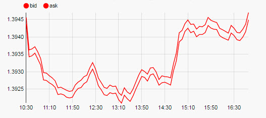
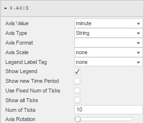
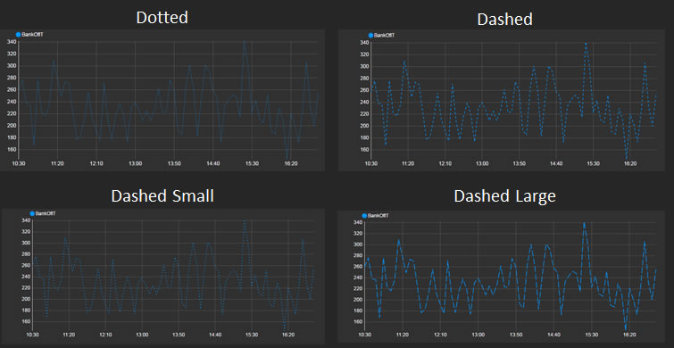
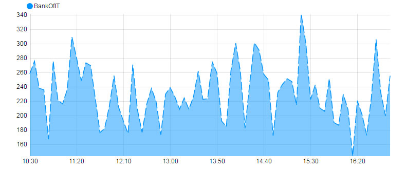
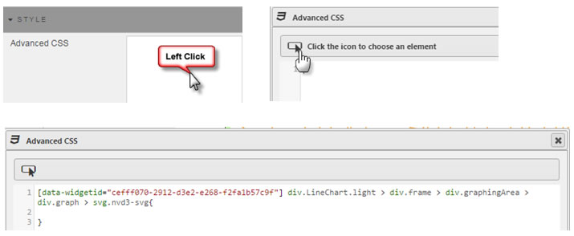
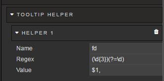
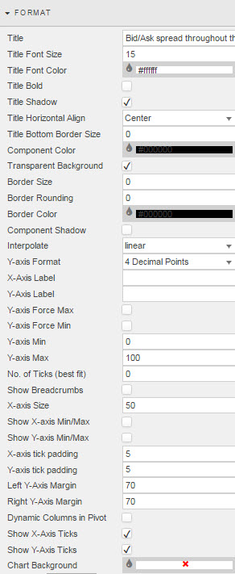
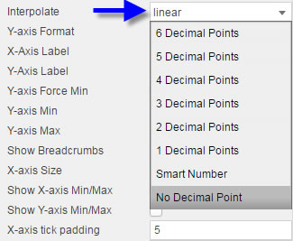
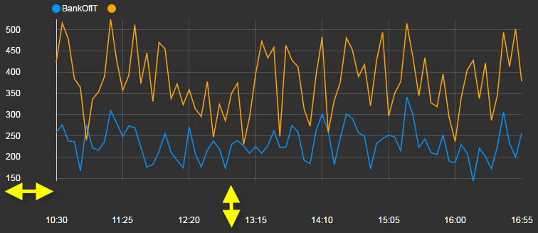

## Basics


### Data Source
 
See [Defining a Query](introduction.md#defining-a-query) and [Analytics](introduction.md#analytics) for more on data sourcing.

### Focus

Used for [linking components](introduction.md#linking-components). Requires a [view state parameter](introduction.md#view-state-parameters).

### Range

Similar to **Focus**, instead the assigned [view state parameter](introduction.md#view-state-parameters) is used to link a [range slider](rangeslider.md) to the chart.

### Selected Value 

This is a [view state parameter](introduction#view-state-parameters). It's used to store the clicked-on chart data point to a view state parameter.  

[1] Create a [view state parameter](introduction#view-state-parameters) and assign to _Selected Value_
 


[2] Go to <a href="#selected-value-attribute">Selected Value Attribute</a> to select a query variable to store in the Selected Value View State Parameter.

### Selected Value Attribute

This comes from the Data Source and is the variable paired with the <a href="#selected-value">selected value</a> [view state parameter](introduction#view-state-parameters).  When the user clicks on the chart, the associated query variable will be mapped to the <a href="#selected-value">Selected Value</a> view state.  


!!! Warning "Data Type Match"
    When mapping _Selected Values_ to _Selected Value Attribute_, ensure the _Data Type_ of the View State Parameter matches the _Data Type_ of the <a href="#data-source">Data Source</a>; e.g. integer for numbered data.

### Selected Row ViewState Routing

The aforementioned <a href="#selected-value">Selected Value</a> and <a href="#selected-value-attribute">Selected Value Attribute</a> handles a single data map. <a href="#selected-row-viewstate-routing">Selected Row Viewstate Routing</a> supports multiple mappings between <a href="#selected-value">Selected Values</a> and <a href="#selected-value-attribute">Selected Value Attributes</a>.


To add a row, click 

### Hovered Value

Assign a [view state parameter](introduction.md#view-state-parameters). Stores the value of the X-Axis (usually date or time).

## X Axis



**Axis Value**

Sets which query column variable will be used as the x-axis chart label


**Axis Type**

Sets the data type for the label used for *Axis Value*


<aside class="admonition caution">If x-axis labels are looking incorrect, try selecting a different <i>Axis Type</i></aside>

**Axis Format**

Where *Axis Type* is set to Date, *Axis Format* dropdown will list available options


**Axis Scale**

Order by number or by default Data Source order. 

**Legend Label Tag**

Can be linked to [view state parameter](introduction.md#view-state-parameters)

**Show legend**

Toggles display of chart legend


**Show new Time Period**

Ensures the latest data point of a time sequence is displayed


**Use Fixed Num of Ticks**

Defines the number of ticks to display along the x-axis


<aside class="admonition caution">The number of ticks to display is set in <i>Num of Ticks</i></aside>

**Show All Ticks**

Displays every charted data point along the x-axis

**Num of Ticks**

The number of ticks to display in the x-axis if *Use Fixed Num of Ticks* is checked

**Axis Rotation**

Rotate x-axis label


## Columns


### Column

Click the  to add a new variable to plot.

<aside class="admonition caution">Color assignment is done from *ChartBarColors* in the **Style** menu</aside>

**User Defined**

Check to make the column 'read only'.  This protects the contents of the column from been replaced. 

**Column**

Select the <a href="#data-source">data source</a> variable to chart.


**Display Name**

Create a display name to use in the chart Legend key

**Line Style**


 
Select the format style for lines

**Fill Area**

When checked, will fill the area under the line chart.



## Zoom/Pan 


Adds user controls for Multi-Chart charting views.

**Zoom/Pan On**

Check control to switch zoom and pan on


**Type**

Select between drag-to-select zoom, or Pan control

**Zoom Select Color, Opacity and Border**

Selects the background color, background color opacity and the border for the selected area. 

**Min and Max Zoom**

Set view state parameters for minimum and maximum zoom

**Mouse Pan**

Check to select mouse pan control; best used on real-time time series data 

**Mouse Pan Interval and Type**

Set time pan control for chart; chart will move in timed sections.


## Style

### ChartBarColors

The color order for a [Pivot Data Source](#introduction.md#pivot-query). 

For non-Pivot data, the order of the columns defines which color on the list is used; i.e. Data Column 1 will use the top color on the list.

To add a color, click 


### Advanced CSS

Select to add CSS elements to Line chart



### Custom tooltip

Step 1: Create View States for items in tooltip


Step 2: Add a html tag for View States (using handlebars)


Step 3: Chartview


Tooltips can use View State Parameters which have been mapped to Data Source variables


In the Configure Tooltip template, add html tags for the View State Parameters to display (using handlebars) 

If viewstate parameter = *param1*
Add a table cell with *param1* viewstate to tooltip with the tag:  <td>{{obj.param1}}</td>


Tool tip will appear as: 


### Tooltip Helper

Tooltip Helper



Apply Tooltip Helper Variable to Tooltip reference


Tooltips use <a href="http://handlebarsjs.com/">Handlebars.js</a> so variables can be added dynamically to tooltip.

For example:
 
```
{{fx}} : {{volume}}
```

could appear as
EUR/USD: 250000

To format "250000" so it will appear as "$250,000" use Tooltip Helper

**Name**

Give the function a name.  This name will be used inside the tooltip.

For example:


```
{{fx}} : {{fd volume}}
```

**Regex**

The regular expression used to find the required pattern

In this example:

```
(\d{3})(?=\d)
```

**Value**

The value to replace the text with. In this case, comma-delimited currency values: 

```
$1,
```

**Tooltip Top Distance**

Sets distance from mouse in pixels at which tooltip appears

## Format


 
See [Format](introduction.md#format) in Introduction for more on shared formatting options. Additional formatting specific to bar charts is detailed below

**Interpolate**

Interpolate selection


Select line type from dropdown. Applies to all lines in chart

**Y-Axis Format**

Select number of decimal places to use in Y-axis



**X-Axis Label**

Define x-axis label

**Y-Axis Label**

Define y-axis label

**Y-axis Force Min**

When checked, will force axis to use **Y-axis Min** value.  If not, the chart will best-fit range with lowest value marking the starting point for the Y-axis. 


**Y-axis Force Max**

When checked, will force axis to use **Y-axis Max** value.  If not, the chart will best-fit range with highest value marking the end point for the Y-axis. 

<aside class="admonition caution">If plotted values exceed y-axis range the chart will crop the missing data.</aside>

**Y-axis Min**

Set starting value for Y-axis. To use this value, check **Y-axis Force Min**


**Y-axis Max**

Set highest value for Y-axis. To use this value, check **Y-axis Force Min**

**No. of Ticks (best fit)**

Will display as close as possible, the number of ticks configured for this input.

**Show Breadcrumbs**

Displays the OLAP/Pivot breakdown for Pivot Queries


**X-axis Size**

X-axis Size


Used to create space between X-Axis and Component border to better accomodate X-axis labels. Best used for rotated x-axis labels

**Show X-Axis Min/Max**

Check to display Min/Max values in X-Axis

**Show Y-Axis Min/Max**
 
Check to display Min/Max values in Y-Axis

**X-axis tick padding**

Axis Padding



Applies padding spacing between x-axis labels and the x-axis

**Y-axis tick padding**

Applies padding spacing between y-axis labels and the y-axis
 


**Left Y-axis Margin**

Sets the distance between left y-axis and border of component

**Right Y-axis Margin**

Sets the distance between right y-axis and border of component

**Dynamic Columns in Pivot**

Check control if dynamic columns from a Pivot **Data Source** are used.

**Show Y- and X-Axis Ticks**

Check control to display tick display in x- and y-axis

**Chart Background**

Sets background color of chart

## Margins

See [Margins](introduction.md#margins) in Introduction for more