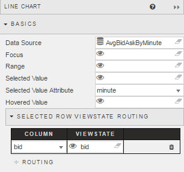
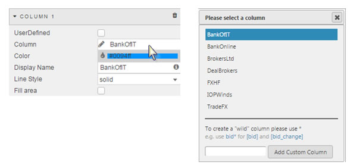
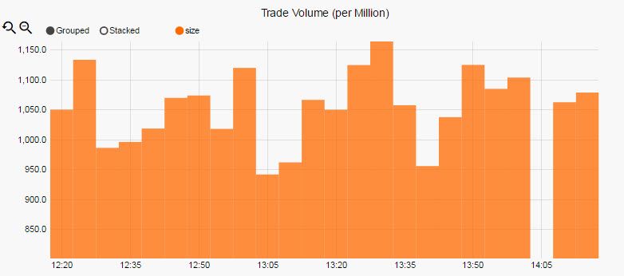
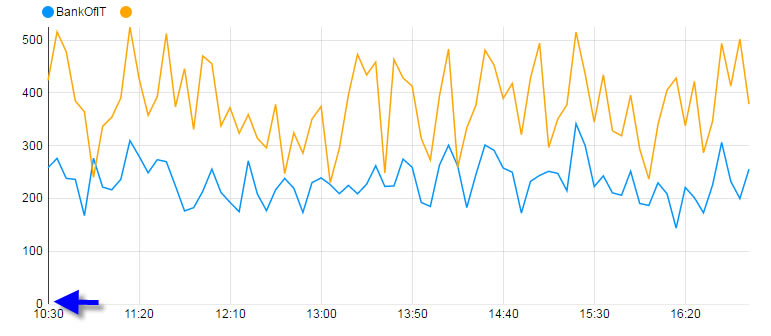
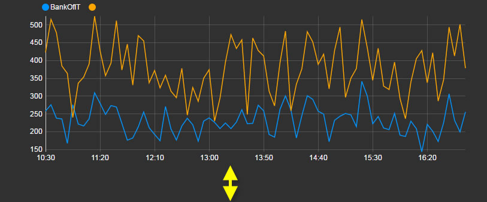

## Basics



_Data Source_

: <i class="fa fa-hand-o-right"></i> [Defining a Query](introduction/#defining-a-query) and [Analytics](introduction/#analytics) for more on data sourcing.


_Focus_

: Used for [linking components](introduction/#linking-components). Requires a [View State Parameter](introduction/#view-state-parameters).


_Range_

: Similar to _Focus_, instead the assigned View State Parameter is used to link a [Range Slider](rangeslider) to the chart.


_Selected Value_

: This is a View State Parameter; used to store the clicked-on chart data point to a View State Parameter.  

    1. Create a View State Parameter and assign to _Selected Value_
        

    2. Use _Selected Value Attribute_ to select a query variable to store in the _Selected Value_ View State Parameter.


_Selected Value Attribute_

: This comes from the _Data Source_ and is the variable paired with the _Selected Value_ View State Parameter.  When the user clicks on the chart, the associated query variable will be mapped to the _Selected Value_ view state.  

    

    !!! Warning "Data type match"
        When mapping _Selected Values_ to _Selected Value Attribute_, ensure the _Data Type_ of the View State Parameter matches the type of the _Data Source_; e.g. integer for numbered data.


_Hovered Value_

: Assign a [View State Parameter](introduction/#view-state-parameters). Stores the value of the X axis (usually date or time).


_Selected Row ViewState Routing_

: The _Selected Value_ and _Selected Value Attribute_ handle a single data map. _Selected Row Viewstate Routing_ supports multiple mappings between _Selected Values_ and _Selected Value Attributes_.

    

    To add a row, click 


## _X Axis_


_Axis Value_

: The query column variable to be used as the X-axis chart label

    


_Axis Type_

: The data type for the label used for _Axis Value_

    

    !!! tip "Wrong X-axis labels?"
        Try selecting a different _Axis Type_.


_Axis Format_

: Format – where _Axis Type_ is _Date_

    


_Axis Scale_

: Order by number or by default Data Source order. 


_Legend Label Tag_

: Can be linked to [View State Parameter](introduction/#view-state-parameters)


_Show legend_

: Toggles display of chart legend

    


_Show new Time Period_

: Ensures the latest data point of a time sequence is displayed

    


_Use Fixed Num of Ticks_

: Check to fix the number of ticks to display along the X axis. (The number is set in _Num of Ticks_.)

    


_Show All Ticks_

: Check to display every charted data point along the X axis


_Num of Ticks_

: The number of ticks to display in the X axis if _Use Fixed Num of Ticks_ is checked


_Axis Rotation_

: Rotate X-axis label

    


## Columns


Click the  to plot a new variable 

!!! tip "Color assignment"
    Color assignment is done from _ChartBarColors_ in the _Style_ menu


_User Defined_

: Check to make the column 'read only'.  This protects the contents of the column from being replaced. 


_Column_

: The data-source variable to chart

    


_Display Name_

: Name to use in the chart _Legend_ key


_Line Style_

: 
 


_Fill Area_

: When checked, the chart will fill the area under the line 

    


## _Zoom / Pan_ 


_Zoom / Pan On_

: Toggles functionality 

    

    


_Type_

: Select between drag-to-select _Zoom_, or _Pan_ control


_Zoom Select Color, Opacity and Border_

: Background color, background color opacity and the border for the selected area. 


_Min and Max Zoom_

: 

    View State Parameter to store the range value for _Min and Max Zoom_


_Mouse Pan_

: Toggle mouse pan control; best used on real-time time series data 


_Mouse Pan Interval_ and _Mouse Pan Type_

: Set time pan control for chart; chart will move in timed sections.

    


## Style

### _ChartBarColors_

The color order for a [Pivot Data Source](introduction/#pivot-query). 

For non-Pivot data, the order of the columns defines which color on the list is used; i.e. Data Column 1 will use the top color on the list.

To add a color, click 


### _Advanced CSS_

Add CSS rules to Line chart


### Custom tooltip

1. Create View States for items in tooltip

    

2. Add an HTML tag for View States, using [Handlebars](http://handlebarsjs.com)

    

3. Chartview

    

Tooltips can use View State Parameters which have been mapped to Data Source variables


In the Configure Tooltip template, add HTML tags for the View State Parameters to display (using Handlebars) 

If viewstate parameter is `param1`, add a table cell with `param1` viewstate to tooltip with the tag:  `{{obj.param1}}`


Tool tip will appear as: 


### _Tooltip Helper_


Apply Tooltip Helper variable to Tooltip reference


Tooltips use [Handlebars](http://handlebarsjs.com/) so variables can be added dynamically to tooltip. For example:
```js
{{fx}} : {{volume}}
```
could appear as `EUR/USD: 250000`. To format `250000` so it will appear as `$250,000` use Tooltip Helper


_Name_

: Give the function a name: it will be used inside the tooltip. For example:

    

    ```js
    {{fx}} : {{fd volume}}
    ```


_Regex_

: The regular expression used to find the required pattern. In this example: `(\d{3})(?=\d)`


_Value_

: The value to replace the text with. In this case, comma-delimited currency values: `$1,`


_Tooltip Top Distance_

: Distance from mouse in pixels at which tooltip appears


### Format


 
<i class="fa fa-hand-o-right"></i> [Style](style). Additional formatting specific to line charts is detailed below. 


_Interpolate_

: Interpolation line type: applies to all lines in chart

    


_Y-Axis Format_

: Number of decimal places to use in Y axis

    


_X-Axis Label_

: Label for the X axis


_Y-Axis Label_

: Label for the Y axis


_Y-axis Force Min_

: When checked, forces axis to use _Y-axis Min_ value. Otherwise the chart will best-fit range with lowest value marking the starting point for the Y axis. 

    


_Y-axis Force Max_

: When checked, will force axis to use **Y-axis Max** value.  If not, the chart will best-fit range with highest value marking the end point for the Y-axis. 

    !!! warning "Cropping"
        If plotted values exceed the Y-axis range, the chart will crop the missing data.


_Y-axis Min_

: Starting value for Y-axis. To use this value, check _Y-axis Force Min_

    


_Y-axis Max_

: Highest value for the Y axis. To use this value, check _Y-axis Force Min_


_No. of Ticks (best fit)_

: Will display as closely as possible, the number of ticks configured for this input.


_Show Breadcrumbs_

: Displays the OLAP/Pivot breakdown for Pivot Queries

    


_X-axis Size_

: X-axis Size



    Space between the X-axis and the component border – to accommodate X-axis labels better. Best used for rotated X-axis labels


_Show X-Axis Min/Max_

: When checked, displays Min/Max values in X axis


_Show Y-Axis Min/Max_

: When checked, displays Min/Max values in Y axis


_X-axis tick padding_

: Axis Padding


    Padding between X-axis labels and the X axis


_Y-axis tick padding_

: Padding between Y-axis labels and the Y axis
 


_Left Y-axis Margin_

: Sets the distance between the left Y axis and the border of the component


_Right Y-axis Margin_

: Distance between right Y axis and border of component


_Dynamic Columns in Pivot_

: Check if dynamic columns from a Pivot _Data Source_ are used.


_Show Y- and X-Axis Ticks_

: When checked displays tick in X and Y axes


_Chart Background_

: Sets background color of chart


### Margins

<i class="fa fa-hand-o-right"></i> [Style](style)