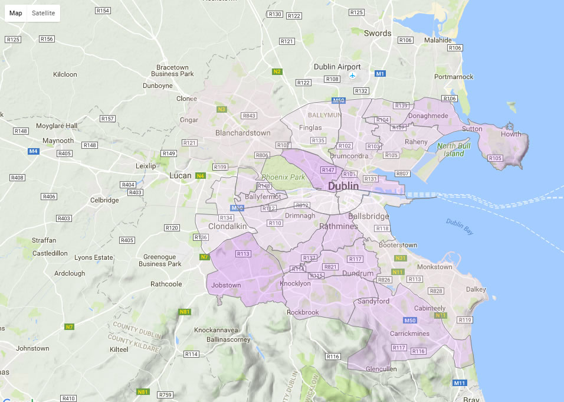
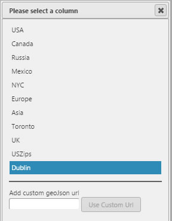
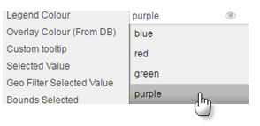
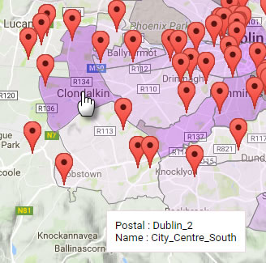
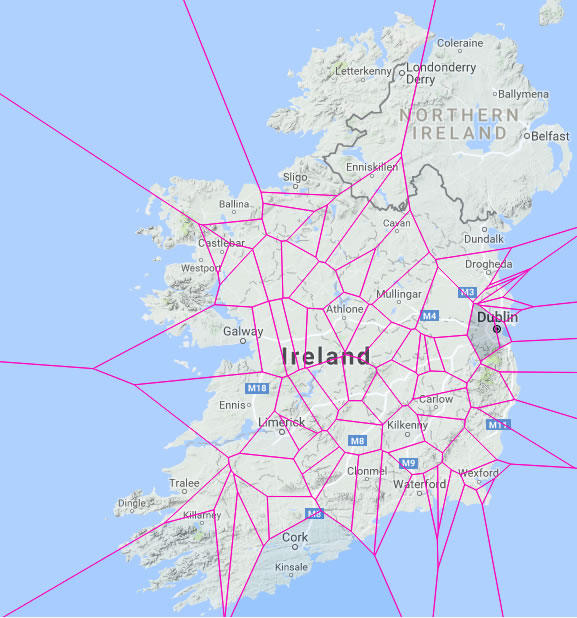
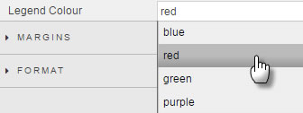

The Map component adds geographical data elements to your dashboards.

## Basics


 Unlike other components, different data sources can be assigned and overlaid by map type.

### Focus 

Used for [linking components](introduction.md#linking-components). Requires a [view state parameter](introduction.md#view-state-parameters).

### Theme

Switches between Light and Dark Theme

### Map

**Map Type**


 
Map Type


 
Selectes the base type map to use:


**Scale**

Determines the zoom level of the map


**Center X/Y**

Sets the co-ordintates to center the map on dashboard load.
 


**Track Changes**

When checked, will update Center X/Y co-ordinates depending on User interaction of map. 


<aside class="warning">Map will open on updated Center X/Y co-ordinates on next dashboard load</aside>

**Bounds**

Create a [view state parameter](introduction.md#view-state-parameters) to store user-map-selected co-ordinates.


**Custom point**


[1] Create a [view state parameter](introduction.md#view-state-parameters) to store custom marker location details. 

[2] Right click on the map to view the *Add Point* option - click to select

[3] The co-ordinates of added point will be stored in the assigned *Custom Point* view state parameter


<aside class="warning">*Custom Point* will only be enabled once a View State Parameter is assigned. To right click on the map in the absence of an assigned View State Parameter will not add a custom point to the map </aside>

## Statistical Overlay

Provide custom map overlay. 



Overlay menu


**Show Overlay**

Toggle control to display statistical overlay

**Data Source**

See [Defining a Query](introduction.md#defining-a-query) and [Analytics](introduction.md#analytics) for more on data sourcing.
 
<aside class="warning">Ensure map coordinates are included in the data source to create boundaries for the overlay</aside> 

**Data Key**

Defines data grouping from the *Data Source* (e.g. Postcode) and can be stored using the *Selected Value* as a [view state parameter](introduction.md#view-state-parameters)

**Data Value**

Defines the measured variable (e.g. 1 Bedroom Cost)

**Geo Data Source**



 Select the underlying country/region map to use (e.g. Dublin)

**Geo Data Column**

Define the Data Column relavent to the Geo Data Source (included in [Defining a Query](introduction.md#defining-a-query) 


**Geo Data Filter**

Selected country, state or county (if used). Value can be stored using the *Geo Filter Selected Value* as a [view state parameter](introduction.md#view-state-parameters)

**Color Scale**

Toggle control for color use in the statistical overlay. 


**Legend Type**

Switch between *Percentage* or *Range* overlay

**Legend Color**

*Legend Color* is used when <a href="#color-scale">Color Scale</a> is employed



**Overlay Colour (From DB)**

Overlay color defined from *Data Source* instead of <a href="#legend-color">Legend Color</a>

**Custom Tooltip**

Custom Tooltip on Overlay



To define the tooltip, click inside the *Custom Tooltip* box


Additional information can be included in the tooltip. First select a data variable from the dropdown


Then click the "+" add button to include:


**Selected Value**
 
Create and assign a [view state parameter](introduction.md#view-state-parameters). Will store the *Data Key* (if used) as a View State Parameter. 

**Geo Filter Selected Value**

Create and assign a [view state parameter](introduction.md#view-state-parameters). Will store the *Geo Data Filter* (if used) as a View State Parameter.


**Bounds Selected**

 Create and assign a <a href="#view-state-parameters">View State Parameter</a>. Will store the boundary co-ordinates for a selected region in the Overlay.

**Image Source**


Uses an URL reference for an image overlaid on the map.  The position of the image relative to the map is defined by *Image North Bound, Image South Bound, Image East Bound* and *Image West Bound*


**Image North Bound**

Map Overlay Coordinates

**Image South Bound**

Map Overlay Coordinates

**Image East Bound**

Map Overlay Coordinates

**Image West Bound**

Map Overlay Coordinates

**Image Opacity**

Sets the opacity for the overlay relative to the underlying map. 

**Selected Point Viewstate Routing**

Map Statistical Overlay *Data Source* variables to [view state parameter](introduction.md#view-state-parameters).

### Sample Statistical Overlay Data

```
tab:flip `Id`Id2`Postal`Name`1_Bed_Apartment_Cost`1_Bed_Apartment_Inc`2_Bed_trc_Cost`2_Bed_trc_Inc
`3_Bed_semi_Cost`3_Bed_semi_Inc`4_Bed_bungalow_Cost`4_Bed_bungalow_Inc`5_Bed_detached_Cost`5_Bed_detached_Inc
`Color!(`13`0`2`10`1`15`9`17`5`3`7`8`12`20`22`24`6.1`6`4`14`16`18`11;
13 0 2 10 1 15 9 17 5 3 7 8 12 20 22 24 61 6 4 14 16 18 11;
`Dublin_13`DLR`Dublin_2`Dublin_10`Dublin_1`Dublin_15`Dublin_9`Dublin_17`Dublin_5`Dublin_3`Dublin_7`Dublin_8
`Dublin_12`Dublin_20`Dublin_22`Dublin_24`Dublin_6W`Dublin_6`Dublin_4`Dublin_14`Dublin_16`Dublin_18`Dublin_11;
`Donaghmede_Sutton_and_Howth`Stillorgan_Dun_Laoghaire_and_Dalkey`City_Centre_South`Ballyfermot_and_Cherry_Orchard
`North_Inner_City`Blanchardstown_Castleknock_and_Clonsilla`Drumcondra_Glasnevin_and_Santry
`Balgriffin_Darndale_and_Priorswood`Artane_Coolock_and_Raheny`Clontarf_East_Wall_and_Fairview
`Cabra_Phibsborough_and_Smithfield`The_Liberties_Inchicore_and_Phoenix_Park`Crumlin_Drimnagh_and_Walkinstown
`Chapelizod_and_Palmerstown`Clondalkin_Rowlagh_and_Liffey_Valley`Tallaght_Firhouse_and_Jobstown
`Harolds_Cross_Templeogue_and_Terenure`Ranelagh_Rathmines_and_Rathgar`Donnybrook_Irishtown_and_Sandymount
`Churchtown_Clonskeagh_and_Dundrum`Ballinteer_Ballyboden_and_Knocklyon`Foxrock_Stepaside_and_Cabinteely
`Ballymun_and_Finglas;
172 133 221 107 163 131 170 116 164 205 167 174 144 150 109 116 225 281 281 218 190 214 126;
-0.05 -5.70 -0.16 0.01 0.10 -0.06 -0.03 -0.02 -0.06 0.04 -0.03 -0.01 -0.04 -0.05 0.00 0.00 
-0.06 -0.08 -0.05 -0.04 -0.10 -0.09 0.00;
217 167 307 135 247 165 214 146 206 289 211 219 181 189 138 146 283 354 399 274 240 270 159;
-0.05 -5.60 -0.06 0.01 0.05 -0.06 -0.03 -0.02 -0.06 0.04 -0.03 -0.01 -0.04 -0.05 0.00 0.00 
-0.05 -0.08 0.02 -0.04 -0.10 -0.09 0.00;
333 271 440 207 344 254 329 224 317 406 324 336 278 291 211 225 435 543 581 421 368 414 244;
0.03 1.98 -0.05 0.09 0.04 0.02 0.05 0.06 0.01 0.04 0.05 0.07 0.04 0.02 0.08 0.08 0.02 -0.01 
0.02 0.03 -0.03 -0.01 0.08;
554 427 672 344 511 422 547 373 527 663 538 559 463 483 352 373 723 903 980 701 612 688 406;
0.09 7.90 0.01 0.16 0.08 0.08 0.11 0.12 0.08 0.07 0.11 0.13 0.10 0.08 0.14 0.14 0.08 0.05 
0.04 0.09 0.03 0.05 0.14;
647 499 760 402 622 494 640 436 615 826 629 654 541 565 411 436 845 1055 1188 819 716 804 474;
0.04 2.90 -0.08 0.10 0.01 0.03 0.06 0.07 0.03 0.07 0.06 0.08 0.05 0.03 0.09 0.09 0.03 0.01 
0.03 0.04 -0.02 0.00 0.09;
`ff0000`ff0000`ff00ff`ffff00`fffff`ff0f00`ff000f`ff000f`fff000`ff0000`ff0000`ff0000`ff0000
`ff0000`ff0000`ff0000`ff0000`ff0000`ff0000`ff0000`ff0000`ff0000`ff0000)
```

## Points


Applies distinct data points to map

**Data Source**

See [Defining a Query](introduction.md#defining-a-query) and [Analytics](introduction.md#analytics) for more on data sourcing.
 
<aside class="warning">Ensure geographic coordinates are included in the data source to create data points for the map</aside> 

**Selected Value**
 
Create and assign a [view state parameter](introduction.md#view-state-parameters).  

**Tracker**

Create and assign a [view state parameter](introduction.md#view-state-parameters).  Stores value set in <a href="#trackeditem">TrackedItem</a>.

**TrackedItem**

Used in combination with *Tracker*,  it takes variable from *Data Source* and maps it to the *Tracker* [view state parameter](introduction.md#view-state-parameters).  The variable is populated when User the chooses a point on the map. 
 

 
<aside class="warning">Additional mapped items can be tracked using <b>Selected Point Viewstate Routing</b></aside>

**Latitude / Longitude Data**

Set Latitude / Longitude from *Data Source*


Defines the columns in the *Data Source* to use for positioning the points on the map


**Shape**

Select Point Shape


Define the map point graphic

**Shape (From DB)**

Select Point Shape using reference to *Data Source*


**Shape Colour**

Choose color from color palette

**Shape Colour (From DB)**

Select Point Colour using reference to *Data Source*

**Shape Size**

Adjust slider to change point size
 


**Shape Colour (Selected)**

Use the Colour palette to select the colour for when a User selects a point

**Shape Opacity (Selected)**

Use the slider to select the opacity when a User selects a point

**Shape Colour (Hovered)**

Use the Colour palette to select the colour for when a User hovers over a point

**Shape Opacity (Hovered)**

Use the slider to select the opacity when a User hovers over a point

**Cluster Size**

Map Clusters


Aggregates points into clusters. The size of the cluster is determined by the dropdown 


**Cluster**

Toggle to use *Cluster* feature. Define *Cluster Size*

<aside class="warning">When checked, it will replace grouped individual points with a numeric cluster icon. Points outside of a cluster will remain displayed as individual points</aside>


**Show Tooltip**

Check to display a tooltip on Point rollover

**Custom Tooltip**


 
Configure the information to display on a tooltip. Available dropdown display options taken from *Data Source*


**Zoom on Select**

When checked, map will zoom when User selects a point

**Single Zoom on Cluster**

When checked, map will zoom on selected cluster


**Open Dashboard on Select**

If User selects a Map Point, the assigned Dashboard will load.


**Points in View**

Points in View


When checked, map will auto-zoom to show all available data points

### Selected Row ViewState Routing

The aforementioned <a href="#selected-value">Selected Value</a> and <a href="#selected-value-attribute">Selected Value Attribute</a> handles a single data map. <a href="#selected-row-viewstate-routing">Selected Row Viewstate Routing</a> supports multiple mappings between <a href="#selected-value">Selected Values</a> and <a href="#selected-value-attribute">Selected Value Attributes</a>.


To add a row, click 

## Heat Map

Traffic Heat Map


Can be used for dynamic overlays; e.g. when linked with [Playback](#playback.md) component. 

**Data Source**

See [Defining a Query](introduction.md#defining-a-query) and [Analytics](introduction.md#analytics) for more on data sourcing.

<aside class="warning">Ensure geographic coordinates are included in the data source to create data points for the map</aside>

**Latitude / Longitude Data**

Defines the columns in the **Data Source** to use for positioning the heat map.


**Weight**

Defines the column in the **Data Source** to use for setting the heat map weight/depth


**Opacity**

Change Opacity


Set the opacity of the heatmap overlay. 

**Gradient**

Sets color gradient for heat map


**Radius**

Adjust slider to set radius for heat map 'spread'

**Show Heatmap**

Check to display heatmap

## Lines

Lines


Lines Menu


**Data Source**

See [Defining a Query](introduction.md#defining-a-query) and [Analytics](introduction.md#analytics) for more on data sourcing.

<aside class="warning">Ensure geographic coordinates are included in the data source to map to Longitude and Latitude inputs</aside> 


**Latitude / Longitude Data**

Defines columns of the *Data Source* to use for setting the lines.

**Colour**

Set the Colour of the line from palette

**Label Colour**

Set background colour of rollover label

**Label Size**

Use slider to adjust the size of the label

**Label Text**

Define the text to use for the label

<aside class="warning"><b>Label Text</b> can also be a [view state parameter](introduction.md#view-state-parameters)</aside>

**Show Label**
 
Check control to display a Label

**Show Tooltip**

Check control to display a Tooltip

### Style

CSS Editor


 
Use Advanced CSS to make changes to Map elements. Left click inside the Advanced CSS editor. Click the selector icon, then left-click inside the map component to bring up the relevant CSS code. 


 
### Sample Lines Query

```
{[ln] tab:flip `Stop`long`lat`Line!(
`Tallaght`Hospital`Cookstown`Belgard`Kingswood`Red_Cow`Kylemore`Bluebell`Blackhorse`Drimnagh`Goldenbridge
`Suir_Road`Rialto`Fatima`Jamess`Heuston`Museum`Smithfield`Four_Courts`Jervis`Abbey_Street`BusAras`Connolly
`St_Stephens_Green`Harcourt`Charlemont`Ranelagh`Beechwood`Cowper`Milltown`Windy_Arbour`Dundrum`Balally
`Kilmacud`Stillorgan`Sandyford`Central_Park`Glencairn`The_Gallops`Leopardstown_Valley`Ballyogan_Wood
`Racecourse`Carrickmines`Brennanstown`Laughanstown`Cherrywood`Brides_Glen`Fettercairn`Cheeverstown
`Citywest_Campus`Fortunestown`Saggart`Georges_Dock`Mayor_Square__NCI`Spencer_Dock`The_Point`Depot;
-6.374588889 -6.37885 -6.384397222 -6.374886111 -6.36525 -6.369872222 -6.343444444 -6.333791667 -6.327394444
 -6.318161111 -6.313569444 -6.307211111 -6.297241667 -6.292547222 -6.293361111 -6.291808333 -6.286713889
  -6.277727778 -6.273436111 -6.265333333 -6.258172222 -6.25145 -6.249941667 -6.261333333 -6.26265 
  -6.258683333 -6.256202778 -6.254652778 -6.253447222 -6.251727778 -6.250708333 -6.245116667 -6.236772222
   -6.223886111 -6.209919444 -6.204677778 -6.203763889 -6.209941667 -6.206022222 -6.198361111 -6.184475
    -6.175161111 -6.169908333 -6.161597222 -6.155005556 -6.145852778 -6.142886111 -6.395553517 -6.4068485
     -6.418914583 -6.42460165 -6.43776255 -6.247575 -6.243394444 -6.237147222 -6.229258333 -6.369958333;
53.28749444 53.28936944 53.29350556 53.29928611 53.30369444 53.31683333 53.32665556 53.32929722 53.33425833
 53.33536111 53.33589167 53.33661667 53.33790833 53.33843889 53.34194167 53.34664722 53.34786667 53.34713333
  53.34686389 53.34768611 53.34858889 53.350075 53.35092222 53.33907222 53.33335833 53.33066944 53.32643333
   53.32082222 53.31646667 53.30991667 53.30155833 53.29235833 53.28610556 53.28300833 53.27931111
    53.27760278 53.27015 53.26633611 53.26116389 53.25824722 53.255047 53.25536667 53.25403333 53.25261944
     53.25060556 53.24533333 53.242075 53.29351885 53.29098242 53.28783255 53.28425063 53.2846788
      53.349528 53.34924722 53.34882222 53.34835 53.31465833;
`Red`Red`Red`Red`Red`Red`Red`Red`Red`Red`Red`Red`Red`Red`Red`Red`Red`Red`Red`Red`Red`Red`Red`Green
`Green`Green`Green`Green`Green`Green`Green`Green`Green`Green`Green`Green`Green`Green`Green`Green
`Green`Green`Green`Green`Green`Green`Green`Red2`Red2`Red2`Red2`Red2`Red`Red`Red`Red`End);
select from tab where Line = ln}
```

## Voronoi

Voronoi Map


 
Voronoi Menu


**Data Source**

See [Defining a Query](introduction.md#defining-a-query) and [Analytics](introduction.md#analytics) for more on data sourcing.

<aside class="warning">Ensure geographic coordinates are included in the data source to map to Longitude and Latitude inputs</aside>

**Data Key**

Select the variable from the **Data Source** on which the Voronoi map will be based


**Description**

Define description variable or assign a [view state parameter](introduction.md#view-state-parameters) offering descriptive details.

**Latitude / Longitude Data**

Defines columns of the *Data Source* to set for Latitude and Longitude


**Average Latitude / Longitude Data**

Typically uses the same column information as for **Latitude / Longitude Data**


**Line Colour**

Set Voronoi line colour from palette

**Show Scale**

 Display key for Voronoi metric scale

**Scale Metric**

Select the Metric from **Data Source** variables. This will add a shading level to the Voronoi map.


**Scale Opacity**

Adjust the slider to change the opacity of the Voronoi map shading.

**Legend Colour**

Set the legend font colour



## Margins

 See <a href="#margins">Margins</a>

## Format


See [Format](introduction.md#format) in Introduction for more.


