## Basics


### Data Source
 
See [Defining a Query](introduction/#defining-a-query) and [Analytics](introduction/#analytics) for more on data sourcing.

### Focus

Used for [linking components](introduction/#linking-components). Requires a [view state parameter](introduction/#view-state-parameters).

### Range

Similar to **Focus**, instead the assigned [view state parameter](introduction/#view-state-parameters) is used to link a [range slider](rangeslider) to the chart.

### Selected Value 

This is a [view state parameter](introduction#view-state-parameters). It's used to store the clicked-on chart data point to a view state parameter.  

[1] Create a [view state parameter](introduction#view-state-parameters) and assign to _Selected Value_
 


[2] Go to <a href="#selected-value-attribute">Selected Value Attribute</a> to select a query variable to store in the Selected Value View State Parameter.

### Selected Value Attribute

This comes from the Data Source and is the variable paired with the <a href="#selected-value">selected value</a> [view state parameter](introduction#view-state-parameters).  When the user clicks on the chart, the associated query variable will be mapped to the <a href="#selected-value">Selected Value</a> view state.  


!!! Warning "Data Type Match"
    When mapping _Selected Values_ to _Selected Value Attribute_, ensure the _Data Type_ of the View State Parameter matches the _Data Type_ of the <a href="#data-source">Data Source</a>; e.g. integer for numbered data.

### Selected Row ViewState Routing

The aforementioned <a href="#selected-value">Selected Value</a> and <a href="#selected-value-attribute">Selected Value Attribute</a> handles a single data map. <a href="#selected-row-viewstate-routing">Selected Row Viewstate Routing</a> supports multiple mappings between <a href="#selected-value">Selected Values</a> and <a href="#selected-value-attribute">Selected Value Attributes</a>.


To add a row, click 

### Hovered Value

Assign a [view state parameter](introduction/#view-state-parameters). Stores the value of the X-Axis (usually date or time).
 
## Y-Axis
 


Add an unlimited number of Lines, Bars and Bubbles overlays to a chart with a single or dual axis. 

### Lines

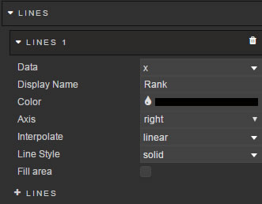

New lines can be added using 

**Data**

Select the **Data Source** variable to plot from the dropdown.

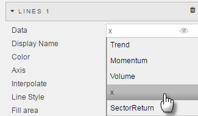

**Display Name**
 
The Legend name for the selected data source


**Color**

Use the colour palette to select a colour to use for the Line. 

**Axis**

Define if line is to be plotted against the Left or Right axis

**Interpolate**

Interpolate Lines


Select the type of Line to use from dropdown selection

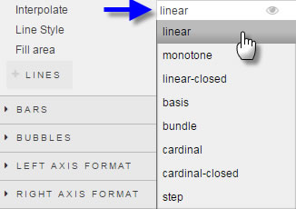

**Line Style**

Apply solid, dashed, or dotted line form


**Fill Area**

Fills the area inside the chart with a gradient of the select line **Color**

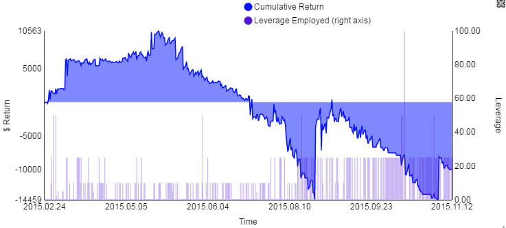

### Bars

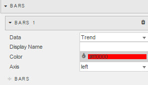

To add a new bar data, click 

**Data**

Select the **Data Source** variable to plot from the dropdown.

**Display Name**

The Legend name for the selected data source

**Color**

Use the colour palette to select a colour to use for the Line

**Axis**

Define if line is to be plotted against the Left or Right axis

### Bubbles


To add a new bubble data point, click  

**Data**

Select the **Data Source** variable to plot from the dropdown.

**Display Name**

The Legend name for the selected data source

**Color**

Use the colour palette to select bubble color

**Bubble Weight**


Bubble weight can be tied to a <a href="#data-source">Data Source</a> variable. This variable is selected with a dropdown menu

**Bubble Scale**

Slider control to scale bubble size.  This is a magnifier for <b>Bubble Weight</b>. 
 


**Axis**

Plot relative to left or right axis

**Hide in Tooltip**

If checked, tooltip for bubble chart will be hidden

**Shape**

Defines shape of the bubble

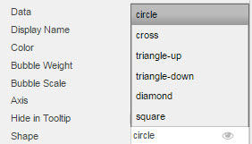

### Candlestick

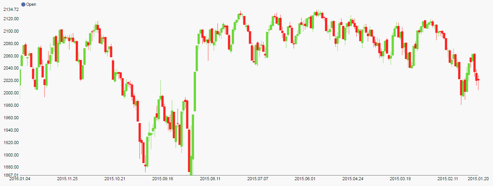


**Name**

Name of the chart as selected by <a href="#data-source">Data Source</a> dropdown.

**Open**

Select the <a href="#data-source">Data Source</a> variable to use for the open price of the candlestick

**Close**

Select the <a href="#data-source">Data Source</a> variable to use for the close price of the candlestick

**High**

Select the <a href="#data-source">Data Source</a> variable to use for the high price of the candlestick

**Low**

Select the <a href="#data-source">Data Source</a> variable to use for the low price of the candlestick

**Display Name**

Display name for the chart

**Open > Close**

Set the color of the candlestick for when open price is greater than close price.  Hex color or selection from palette. 

**Open < Close**

Set the color of the candlestick for when open price is less than close price. Hex color or selection from palette.

**Legend Color**

Set the color of the legend text. Hex color or selection from palette.

### Left/Right Axis Format


Configure left and right axis scale

**Decimal places**

Select number of decimal places to display in each axis from the dropdown option

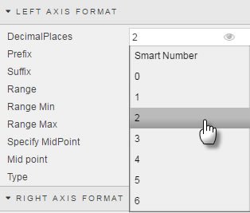

**Prefix**

Select Prefix Label for axis

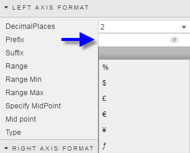

<aside class="admonition caution">Setting Prefix is a visual label and doesn't change the data type of plotted data</aside>

<aside class="admonition caution">Prefix can also be configured as a View State Parameter</a></aside>


**Suffix**

Select Prefix Label for axis

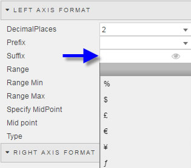

<aside class="admonition caution">Setting Suffix is a visual label and doesn't change the data type of plotted data</aside>

<aside class="admonition caution">Suffix can also be configured as a View State Parameter</a></aside>

**Specify MidPoint**
 
Check to define chart mid-point.  This can also be a [view state parameter](introduction/#view-state-parameters); click the eye icon at the end of the input box to set.

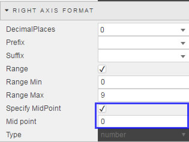

**Use Range Min/Max**
 
Check control to define a range for left and right axis

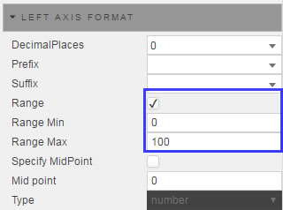

**Range Min/Max**

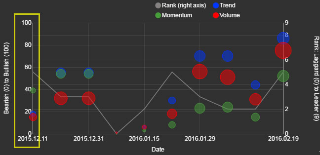

If *Range* is checked, set the high and low value for the range

**No. of Ticks (best fit)**

Define the number of ticks to display in the left/right price axis

## X Axis

X Axis menu


**Axis Value**

Select from the Dropdown the **Data Source** variable to use for Axis Value

**Axis Type**

Define the Data Type for Label. If *Date* is selected for Type, then go to **Format** to select the date format.

**Axis Format**

Use if selected **Type** is date


**Axis Scale**
 
Sets the order by numeric or default *Data Source* ordering

**Show Legend**

Check control to display data labels in chart

**Use Fixed Num of Ticks**

Number of Ticks


Sets the number of divisions along the x-axis to display

**Show All Ticks**

Displays every charted data point in the x-axis 

**Use Ordinal**

When checked, x-axis will scale by time or numeric sequence

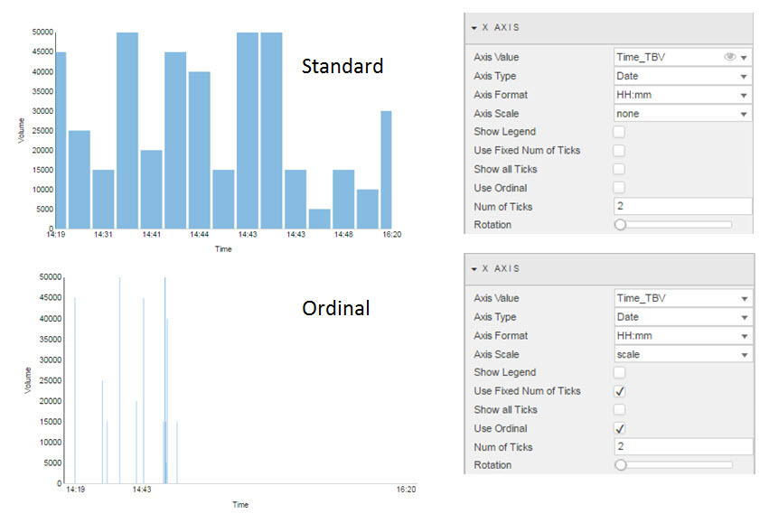

<aside class="admonition caution">Best used when Axis Scale is set to <i>scale</i></aside>

**Num of Ticks**

The number of ticks to display in the x-axis if Use Fixed Num of Ticks is checked

**Rotation**

Rotate x-axis label


## Zoom/Pan 

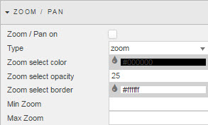

Adds user controls for Multi-Chart charting views.

**Zoom/Pan On**

Check control to switch zoom and pan on


**Type**

Select between drag-to-select zoom, or Pan control

**Zoom Select Color, Opacity and Border**

Selects the background color, background color opacity and the border for the selected area. 

**Min and Max Zoom**

Set view state parameters for minimum and maximum zoom

## Highlight Rules


Used to color code bar charts. Best used with real-time streaming or polling data. 

Click on  to include additional highlight rules.

**Name**

Gives highlight rule a name

**Apply to**

Define which <a href="#data-source">Data Source</a> variable the highlight rule will apply. An option to encompass "All" <a href="#data-source">Data Source</a> variables is included too. 

**Condition Source**

The data series on which the trigger is measured. Selected from the <a href="#data-sources">Data Source</a>

**Condition Operator**

Dropdown menu of rule operations, including greater and less than, not equal to, exactly equal to, and text contains alerts

**Condition Value**

What value threshold will trigger the alert.  Typical is "previous value" but can also be a text trigger

**Color**

What color bar will change on when highlight rule is true. 

## Overlays

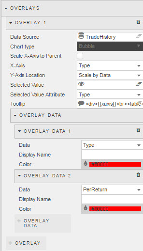

Overlays allow for data from different <a href="#data-source">Data Sources</a> to be applied on to a chart

### Overlay

Each additional Data Source can be added by clicking on the 

**Data Source**

See [Defining a Query](introduction/#defining-a-query) and [Analytics](introduction/#analytics) for more on data sourcing.

**Chart Type**

Select Chart Type to use from dropdown menu. Chart type can be mapped to a [view state parameter](introduction/#view-state-parameters)

**Scale X-Axis to Parent**

Plotted data is made fit to underlying chart scaled to primary <a href="#data-source">Data Sources</a>

**X-Axis**

Select which variable from Overlay Data Source is to be used as the X-axis.

**Y-Axis Location**

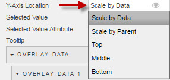

Determine the position of plotted data along the y-axis. 

**Selected Value** 

Assign a [view state parameter](introduction/#view-state-parameters). This *Selected Value* will be mapped to an Overlay's Data Source *Selected Value Attribute*.

**Selected Value Attribute**

Variable selected from Overlay Data Source which is mapped to Overlay's *Selected Value*

**Tooltip**

Configure Tooltip of Overlay data. 

 

### Overlay Data

Adds data from **Overlay** Data Source.

Click the  to add a new overlay plot

**Data**

Dropdown select Overlay Data Source variable to plot

**Display Name**

Add a display name of the overlay data for the chart.

**Color**

Set the color of the Overlay data plot

## Style


### Advanced CSS

Left click inside the Advanced CSS editor. Click the selector icon, then left-click inside the chart component to bring up the relevant CSS code. 


### Custom tooltip

Step 1: Create View States for items in tooltip


Step 2: Add a html tag for View States (using handlebars)

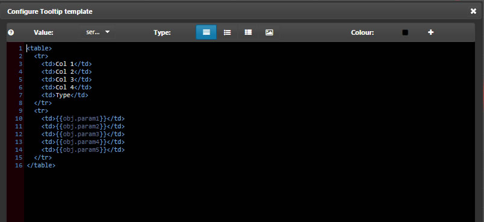

Step 3: Chartview


Tooltips can use View State Parameters which have been mapped to Data Source variables


In the Configure Tooltip template, add html tags for the View State Parameters to display (using handlebars) 

If viewstate parameter = *param1*
Add a table cell with *param1* viewstate to tooltip with the tag:  <td>{{obj.param1}}</td>


Tool tip will appear as: 


**Bar/Line/Bubble/Candletick Opacity**

Sets the color opacity for bar, line, bubble and candlestick. 

### Tooltip Helper

Tooltip Helper


Apply Tooltip Helper Variable to Tooltip reference


Tooltips use <a href="http://handlebarsjs.com/">Handlebars.js</a> so variables can be added dynamically to tooltip.

For example:
 
```
{{fx}} : {{volume}}
```

could appear as
EUR/USD: 250000

To format "250000" so it will appear as "$250,000" use Tooltip Helper

**Name**

Give the function a name.  This name will be used inside the tooltip.

For example:


```
{{fx}} : {{fd volume}}
```

**Regex**

The regular expression used to find the required pattern

In this example:

```
(\d{3})(?=\d)
```

**Value**

The value to replace the text with. In this case, comma-delimited currency values: 

```
$1,
```

## Format

See [Format](introduction/#format) in Introduction for more on shared formatting options. Additional formatting specific to multi-charts is detailed below
 
Align Axis

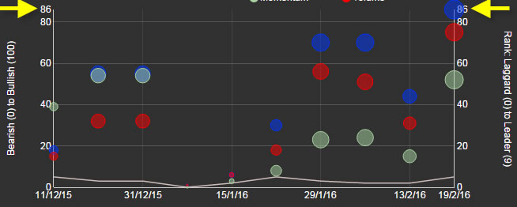

Margin definitions

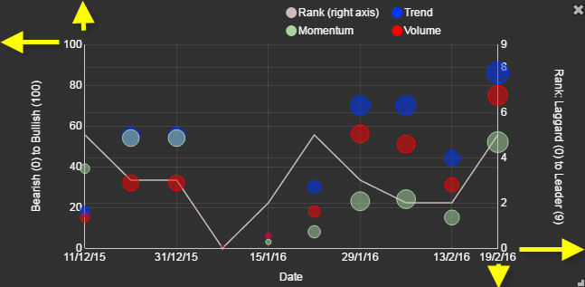

See <a href="#format">Format</a> for configuration of Multichart Title and component Border settings

**Reduce to Zero**

Check control to set left- and right-axis start points to zero

**Align Axis**

Check control to configure right-axis to match the scale of the left-axis

**X-Axis Label**

Label for X-Axis

**Y-Axis Label (Left/Right)**
 
Label for respective left and right Y-Axis

**Margin Top, Bottom, Left and Right**

Chart Margins


Controls margin between chart axis and edge and component

**Hovered Bar Color**

Hovered Bar


Defines the color of the highlight bar on rollover

**Selected Bar Color**

Defines the color of of the highlight bar on selection

**Track hover on exit**

**Chart Background**

Change the color of the background chart

**Bar Spacing**

Sets the spacing between bars. 

## Margins

See [Margins](introduction/#margins) in Introduction for more