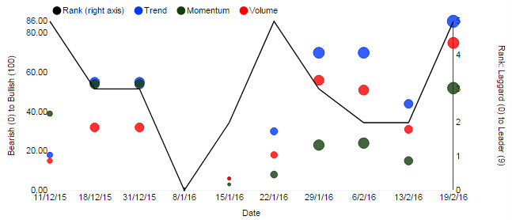
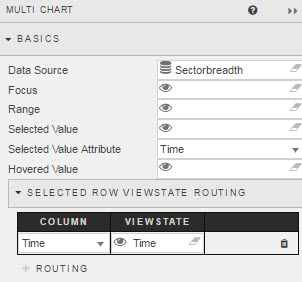
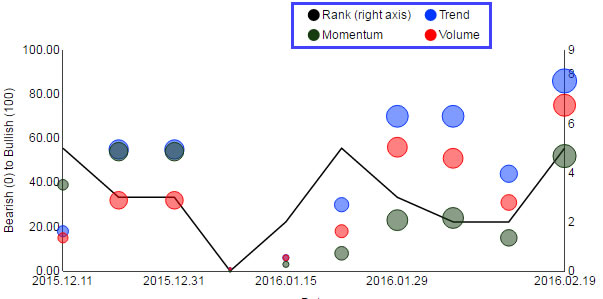
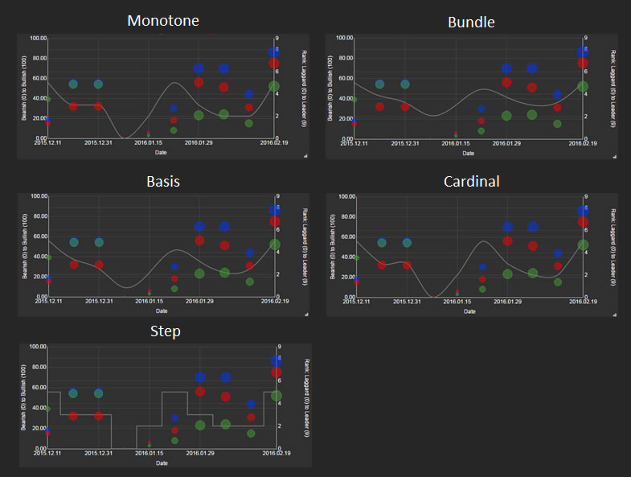
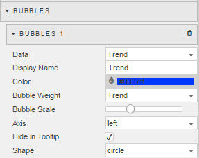
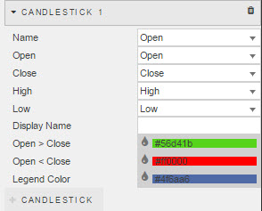
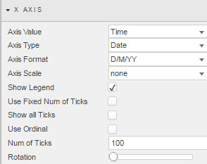
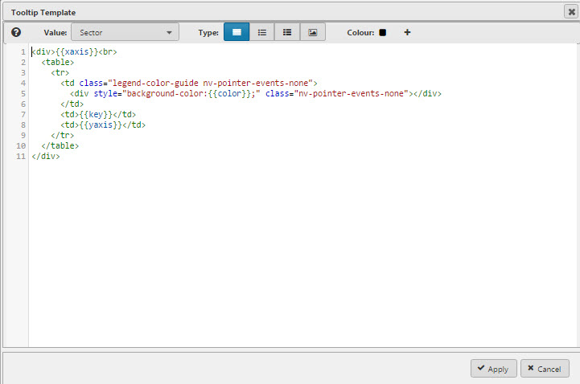
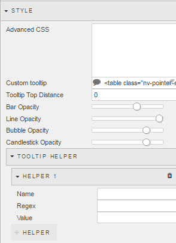

A Multi Chart plots multiple data series together. 

It has a single _Data Source_, from which different data series (columns) can be plotted in a choice of styles. 

It can also contain one or more [Overlays](#overlays). Each Overlay has its own _Data Source_, from which can be plotted multiple data series, each described by an [Overlay Data](#overlay-data) section. 


## Basics




_Data Source_

: <i class="fa fa-hand-o-right"></i> [Defining a Query](introduction/#defining-a-query) and [Analytics](introduction/#analytics)


_Focus_

: Used for [linking components](introduction/#linking-components). Requires a [View State Parameter](introduction/#view-state-parameters).


_Range_

: Similar to _Focus_, instead the assigned View State Parameter is used to link a [Range Slider](rangeslider) to the chart.


_Selected Value_

: This View State Parameter is used to store the clicked-on chart data point.

    1. Create a View State Parameter and assign to _Selected Value_
        

    2. Use _Selected Value Attribute_ to select a query variable to store in the _Selected Value_ View State Parameter.


_Selected Value Attribute_

: This comes from the _Data Source_ and is the variable paired with the _Selected Value_ View State Parameter.  When the user clicks on the chart, the associated query variable will be mapped to the _Selected Value_ view state.  

    

    !!! Warning "Data type match"
        When mapping _Selected Values_ to _Selected Value Attribute_, ensure the _Data Type_ of the View State Parameter matches the type of the _Data Source_; e.g. integer for numbered data.


_Selected Row ViewState Routing_

: The _Selected Value_ and _Selected Value Attribute_ handles a single data map. _Selected Row Viewstate Routing_ supports multiple mappings between _Selected Values_ and _Selected Value Attributes_.


To add a row, click 


_Hovered Value_

: Assign a View State Parameter. Stores the value of the X axis (usually date or time).
 

## Y axis
 
Add multiple Line, Bar and Bubble plots to a chart with a single or dual axis. 


### Lines


_Data_

: The column from _Data Source_ to plot


_Display Name_

: A name for the plotted data series, to appear in the chart legend

    


_Color_

: The color in which to draw the line


_Axis_

: The axis scale (Left or Right) against which to plot the line


_Interpolate_

: The type of Line to plot

    


_Line Style_

: The style of line to plot: solid, dotted, etc


_Fill Area_

: When checked, fills the area inside the chart with a gradient of the line _Color_

    


### Bars


_Data_

: The column from _Data Source_ to plot


_Display Name_

: A name for the plotted data series, to appear in the chart legend


_Color_

: The color in which to draw the bars


_Axis_

: The axis scale (Left or Right) against which to plot the line


### Bubbles




_Color_

: The color in which to draw the bubbles


_Axis_

: The axis scale (Left or Right) against which to plot the bubbles


_Bubble Weight_

: 

    A column from the _Data Source_ to be represented as bubble weight


_Bubble Scale_

: Shrinks or enlarges the default bubble weight
 

_Axis_

: The axis scale (Left or Right) against which to plot the line


_Hide in Tooltip_

: When checked, hides tooltip for this data series


_Shape_

: Shape of the bubbles: circle, cross, etc


### Candlestick

  
_A candlestick plot_




_Name_

: A column from the _Data Source_ <!-- What is this used for – WTF? -->


_Open_

: A column from the _Data Source_ to be plotted as the open price of the candlestick


_Close_

: A column from the _Data Source_ to be plotted as the close price of the candlestick


_High_

: A column from the _Data Source_ to be plotted as the high price of the candlestick


_Low_

: A column from the _Data Source_ to be plotted as the low price of the candlestick


_Display Name_

: Display name for the chart


_Open > Close_

: The color of the candlestick for when open price is greater than close price


_Open < Close_

: The color of the candlestick for when open price is less than close price


_Legend Color_

: The color of the legend text


### Axis-scale formats


Configuration of the left- and right-axis scales. 


_Decimal places_

: The number of decimal places to display


_Prefix_ and _Suffix_

: A prefix and/or a suffix to the values on the axis scale, e.g. `$`, `%`. May alternatively be a View State Parameter. (Does not change the type of the data series.)


_Mid point_

: When _Specify MidPoint_ checked, the chart uses the _Mid point_ value. This value can alternatively be a [View State Parameter](introduction/#view-state-parameters); click the eye icon at the end of the input box to set.


_Range Min_ and _Range Max_

: When _Use Range Min_ or _Use Range Max_ are checked, the high and low values for the range


_No. of Ticks (best fit)_

: The number of ticks to display in the left/right price axis


## X axis




_Axis Value_

: The column from _Data Source_ to use for the X axis 


_Axis Type_ and _Axis Format_

: Data type for the X axis. If `Date`, then specify a Date or DateTime format in _Axis Format_.


_Axis Scale_

: Sets the orderig of the X axis: either numeric or default _Data Source_ ordering


_Show Legend_

: When checked, chart displays a legend


_Use Fixed Num of Ticks_ and _Num of Ticks_

: When _Use Fixed Num of Ticks_ is checked, the number of ticks to display in the X axis

      
    _5 ticks on the X axis_


_Show All Ticks_

: When checked, displays every charted data point in the X axis 


_Use Ordinal_

: When checked, X axis will scale by time or numeric sequence. Best used when _Axis Scale_ is set to `scale`

    


_Rotation_

: Rotation of labels on the X axis

      
    _Rotated X-axis labels_


## Zoom/Pan 


Configures user controls


_Zoom / Pan On_

: When checked, enables zoom and pan

    

    


_Type_

: Either drag-to-select zoom, or Pan control


_Zoom Select Color, Opacity and Border_

: Background color, background color opacity and border for the selected area. 


_Min and Max Zoom_

: View State Parameters for minimum and maximum zoom


## Highlight Rules


Color-coding rules for bar charts: best used with real-time streaming or polling data. 


_Name_

: A name for the highlight rule


_Apply to_

: The column  of the _Data Source_ to which the highlight rule applies. Includes an option to apply to  `All` data series.  


_Condition Source_

: The data series on which the trigger is set


_Condition Operator_

: Rule operator: greater-than, less-than, not-equal-to, etc.


_Condition Value_

: The value that will be tested for the alert: `previous value` is typical, but can also be a text trigger


_Color_

: The color the bar will change to when highlight rule is true. 


## Overlays

Overlays allow you to extend a Multi Chart to include other data sources. 

An Overlay has a single _Data Source_, from which can be plotted multiple data series, each described by an [Overlay Data](#overlay-data) section. 

The Multi Chart can contain multiple Overlays, each with its own _Data Source_. 


_Data Source_

: <i class="fa fa-hand-o-right"></i> [Defining a Query](introduction/#defining-a-query) and [Analytics](introduction/#analytics)


_Chart Type_

: Can be mapped to a [View State Parameter](introduction/#view-state-parameters)


_Scale X-Axis to Parent_

: Plotted data is made fit to underlying chart scaled to primary <a href="#data-source">Data Sources</a>


_X-Axis_

: The column from _Data Source_ to be used as the X axis


_Y-Axis Location_

: The position of plotted data along the Y axis


_Selected Value_

: A [View State Parameter](introduction/#view-state-parameters) to be mapped to the _Selected Value Attribute_.


_Selected Value Attribute_

: column from _Data Source_ to be mapped to _Selected Value_


_Tooltip_

: Tooltip configuration

     


### Overlay Data

Plots onto the chart a single data series from the Overlay’s _Data Source_. 

An Overlay may contain multiple Overlay Data sections. 


_Data_

: The column from _Data Source_ to be plotted


_Display Name_

: A name for the data series 


_Color_

: Color in which to plot the data


## Style




### Advanced CSS

Click inside the _Advanced CSS_ editor. Click the selector icon, then inside the chart component to bring up the relevant CSS code. Add changes to your CSS as required. 


### Custom tooltip

1. Create View States for items in tooltip

    

2. Add an HTML tag for View States, using [Handlebars](http://handlebarsjs.com)

    

3. Chartview

    

Tooltips can use View State Parameters which have been mapped to data series (columns) from the _Data Source_


In the _Configure Tooltip_ template, add HTML tags for the View State Parameters to display (using Handlebars) 

If viewstate parameter is `param1`, add a table cell with `param1` viewstate to tooltip with the tag:  `{{obj.param1}}`


Tool tip will appear as: 


_Bar/Line/Bubble/Candletick Opacity_

: Color opacity for bar, line, bubble and candlestick


### _Tooltip Helper_


Apply Tooltip Helper variable to Tooltip reference


Tooltips use [Handlebars](http://handlebarsjs.com/) so variables can be added dynamically to tooltip. For example:
```js
{{fx}} : {{volume}}
```
could appear as `EUR/USD: 250000`. To format `250000` so it will appear as `$250,000` use Tooltip Helper


_Name_

: Give the function a name: it will be used inside the tooltip. For example:

    

    ```js
    {{fx}} : {{fd volume}}
    ```


_Regex_

: The regular expression used to find the required pattern. In this example: `(\d{3})(?=\d)`


_Value_

: The value to replace the text with. In this case, comma-delimited currency values: `$1,`


_Tooltip Top Distance_

: Distance from mouse in pixels at which tooltip appears


## Format

<i class="fa fa-hand-o-right"></i> [Styling dashboards](style) for common format parameters. Formatting specific to Multi Charts is detailed below. 
 

_Reduce to Zero_

: When checked, left- and right-axis scales start from zero


_Align Axis_

: When checked, right-axis scale is the same as the left-axis

    

_X-Axis Label_

: Label for X axis


_Y-Axis Label (Left/Right)_

: Label for respective left and right Y axis scales


_Margin Top, Bottom, Left and Right_

: Margin between chart axis and edge and component

    


_Hovered Bar Color_

: Color of the highlight bar on rollover

    


_Selected Bar Color_

: Color of of the highlight bar on selection


_Track hover on exit_

: When checked, the tooltip persists after the cursor leaves the chart. (The default behavior is for it to disappear.) 

_Chart Background_

: Color of the chart background 


_Bar Spacing_

: Spacing between bars 


## Margins

<i class="fa fa-hand-o-right"></i> [Styling dashboards](style)
