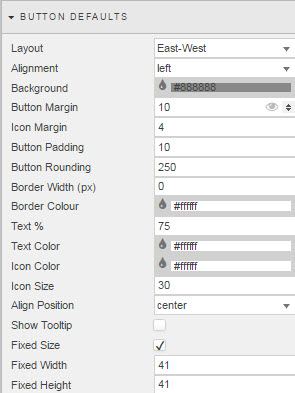
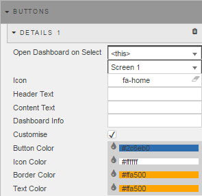

## Navigation

The Navigation component can be used as a menu for navigation between Dashboard screens, or as a landing page to offer a selection of dashboards.

## Basics

_Selected Value_

: A [View State Parameter](introduction.md#view-state-parameters): maps to selected button. 

_Columns_

: 

    The number of columns to use for button layout when buttons do not have _Fixed Size_ checked. Each column represents a button and will autosize according to the width of the navigation component. 

    !!! tip "Fixed-size buttons"
        If buttons have _Fixed Size_ checked, set _Columns_ to 1.

_Overflow_

: Scrollbar behavior for navigation tool bar:

    Choice | Behavior
    --- | ---
    Hidden |  No scroll bar and visible buttons determined by component size.
    Auto | Best fit of Navigation buttons with vertical scroll bar if required.
    Scroll | Best fit of Navigation buttons include two scroll bars for vertical and horizontal axis.
    Overflow | Best fit of Navigation buttons with reordering on rescale.

_Use Data Source_

: When checked, buttons are generated from the _Data Source_ and the _Data Source Mapping_

_Data Source_

: A [query](introduction/#defining-a-query) or [analytic](introduction/#analytics)

_Data Source Mapping_

: All of the following variables must be mapped to columns in the _Data Source_.

    variable | description
    --- | ---
    Icon | URL Reference for icon image
    Header Text | Descriptive header text for Navigation Button
    Contains Text | Main body text for Navigation Button
    Tooltip Text | Text to display on button rollover
    TargetDashboardId | Reference id of Target Dashboard; e.g. 'New Dashboard'
    TargetScreenId | Reference to Screen of Target Dashboard; e.g. 'Screen 1'
    ButtonColor | Hex color reference to background button color; e.g. '#ffffff'
    IconColor | Hex color reference to icon color; e.g. '#ffffff'
    BorderColor | Hex color reference to border color; e.g. '#ffffff'
    TextColor | Hex color reference to text color; e.g. '#ffffff'

## Action

### Viewstate Mapping

 
_Viewstate Mapping_ transfers values of View State Parameters from the source dashboard to View State Parameters in destination dashboards.

!!! tip "Create destination View State Parameters first"
    _Viewstate Mapping_ can only map to existing View State Parameters in the destination dashboard; it does not create them.
 

## Button Defaults

Where buttons are not generated from a _Data Source_, they can be defined individually from the _Buttons_ dialog: _Button Defaults_ are applied across all of them.

  
_Example buttons_

_Layout_

: The orientation order for icons and text. 

    Layout | Position
    --- | ---
    North-South | Icon aligned on top with text beneath
    South-Noth | Icon aligned underneadth text
    East-West | Icon left aligned, text to right
    West-East | Icon right aligned, text to left

    The relative positioning of icons and text depends also on the button size as icon and text are wrapped within the button width.

_Alignment_

: Alignment of buttons inside Navigation component: left, right or center

_Background_

: Background colour of button

_Button Margin_

: Space (in pixels) around outside of button

_Icon Margin_

: Space (in pixels) around icon, within the button

    !!! warning "Disappearing button text"
        Icon margins can put text ‘out-of-view’ in the button. If combining icon and text, keep icon margins small.

_Button Padding_

: Defines space (in pixels) between button icon and text and the border of the button.

_Border Width_, _Border Color_, _Border Rounding_

:   
_Example: Border Width: 1; Colour: #ffffff; Rounding: 10_

    A button’s border appears inside its edges. Its width is set in pixels. Rounding sets in pixels the radius of its corners

_Text %_

: Percentage of the button width allocated to _Content Text_. The default value of `75%` means button text will occupy three quarters of the width of the button. 

_Text Color_

: Text colour for _Content Text_

_Icon Color_

: Icon color

_Icon Size_

: Icon size in pixels

_Align Position_

: Alignment of text and icons inside the button

_Show Tooltip_

: When checked, a tooltip is shown. The tooltip is configured in Navigation in the [Style](#style) dialog.

Fixed size

: When _Fixed Size_ is checked, buttons will have the height and width given (in pixels) _Fixed Width_ and _Fixed Height_.

    If _Fixed Size_ is not checked, the number of buttons will be determined by _Columns_ in [_Basics_](#basics) and the height of the Navigation panel.

## Buttons

Define the details of individual buttons

_Open Dashboard on Select_

: Have the button open a different dashboard – or a screen in `<this>`, the current one.  
<i class="fa fa-hand-o-right"></i> [Customizing the dashboard](introduction.md#customizing-the-dashboard)

_Icon_

: 

_Header Text_

: Bold header text for the button

_Content Text_

: Body text beneath _Header Text_, displayed within the widthset by _Text %_ in [Button Defaults](#button-defaults). 

_Dashboard Info_

: (Not currently in use)

Customization

: When _Customise_ is checked, the [_Button Defaults_](#button-defaults) are overridden by _Button Color_, _Icon Color_, _Border Color_, and _Text Color_.

    !!! warning "Updating button defaults"
        If _Button Defaults_ are later updated they will overwrite individual customizations.  Best to customize individual buttons after _Button Defaults_ are complete.

## Style

<!-- 
FIXME Replace Custom Tooltip copy (largely omitted here) with link to an article in new _Shared Parameters_ subfolder
 -->

_Configure Tooltip_

: 

    When _Show Tooltip_ in [_Button Defaults_](#button-defaults) is checked, a tooltip is displayed. 

    

_Advanced CSS_

: Navigation buttons and text can be changed using the _Advanced CSS_ 

### Margins

<i class="fa fa-hand-o-right"></i> [Styling dashboards](style)

### Format

<i class="fa fa-hand-o-right"></i> [Styling dashboards](style)
