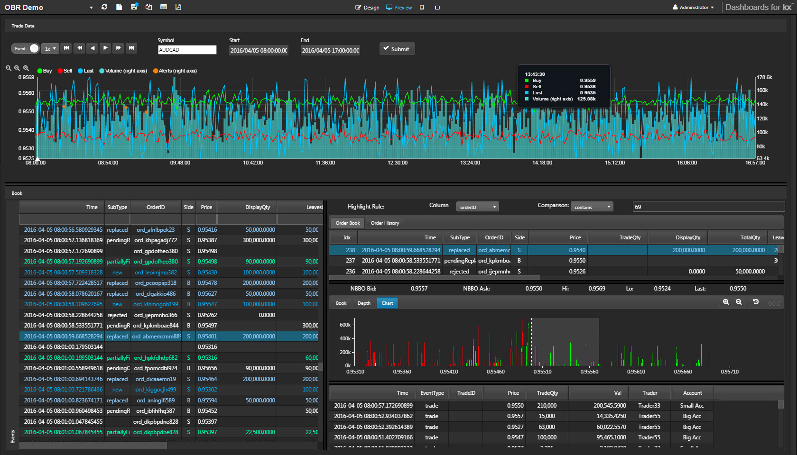
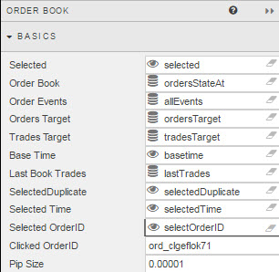
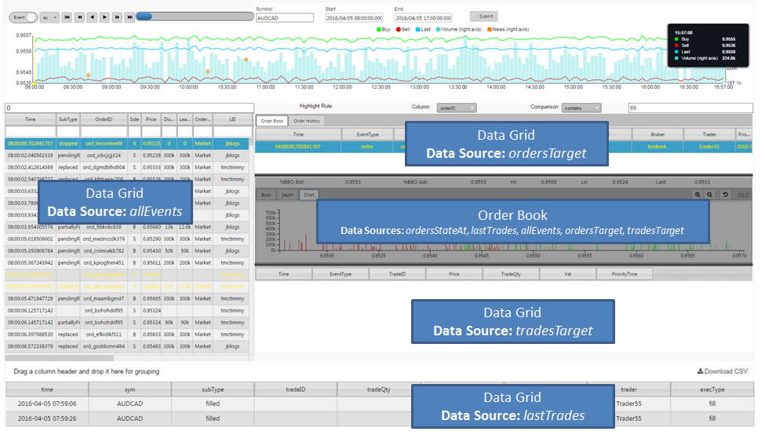
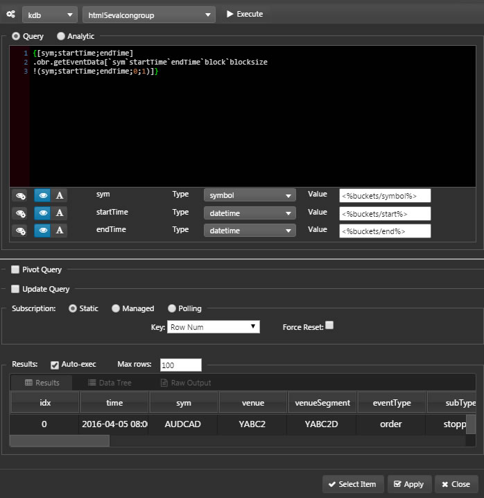
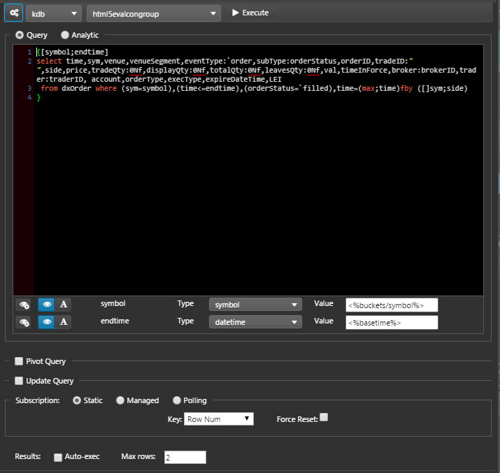
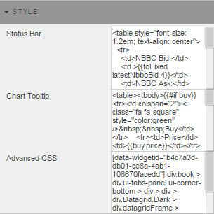

Order Book Replay is a self-contained component used alongside charts and data grids in building surveillance dashboards.

## Basics

Defines Data Sources for use in Order Book

**Selected**

Assign a [view state parameter](introduction#view-state-parameters) for selected parameter.  This variable is often shared with other external components

**Order Book**

 
Define a data source responsible for handling the Order Book. See [Defining a Query](introduction#defining-a-query) and [Analytics](introduction#analytics) for more on data sourcing.

**Order Events**

Define a data source responsible for Order Events. See [Defining a Query](introduction#defining-a-query) and [Analytics](introduction#analytics) for more on data sourcing.

**Orders Target**

Define a data source responsible for Orders targets.  See [Defining a Query](introduction#defining-a-query) and [Analytics](introduction#analytics) for more on data sourcing.

**Trades Target**

Define a data source responsible for Trades Target.  See [Defining a Query](introduction#defining-a-query) and [Analytics](introduction#analytics) for more on data sourcing.

**Base Time**

Assign a [view state parameter](introduction#view-state-parameters) for Base Time

Base Time is not user-defined, but is instead set by each bucket of data loaded into the Events Data Grid.  Base Time is defined from the chart interaction, and is shared for block intervals of data.  
 
Each data bucket stores 3,000 data points, all with the one Base Time. Moving to a new data bucket (of 3,000 data points) resets Base Time. 

!!! Tip "Base Time is used to restrict the amount of server calls to the database on each change of time."

**Last Book Trades**

Define a data source responsible for handling Last Book Trades. See [Defining a Query](introduction#defining-a-query) and [Analytics](introduction#analytics) for more on data sourcing.

**SelectedDuplicate**

Assign a [view state parameter](introduction#view-state-parameters) for SelectedDuplicate

**Selected Time**

Assign a [view state parameter](introduction#view-state-parameters) for SelectedTime

**Selected OrderID**

Assign a [view state parameter](introduction#view-state-parameters) forSelectedOrderID

**Clicked OrderID** 

Stores value of OrderID (or other Events parameter) when User interacts with an Events Blotter - stored in an Data Grid separate to the Order Book Replay component.

**Pip Size**

Sets the pip size to determine the resolution of the chart; e.g. Forex pricing vs Equities

## Chart Highlight Rules

Used to color code bar charts. Best used with real-time streaming or polling data. 

Click on  to include additional highlight rules.

**Condition Source**

The dependent variable from the data source defining the trigger.

**Condition Operator**

Dropdown menu of rule operations, including greater and less than, not equal to, exactly equal to, and text contains alerts

**Condition Value**

What value threshold will trigger the alert. Typically, this is "previous value" but can be numeric or text (depending on the source data)

**Color**

What color the bar will be when the highlight rule is true. 

## Grid Highlight Rules

Used to apply color updates to notify users of changes in Data Grid values for Order Book and Trade History. 

**Name**

The name of the rule

**Condition Source**

The data series on which the trigger is measured

**Condition Operator**

Dropdown menu of rule operations, including greater and less than, not equal to, exactly equal to, and text contains alerts

Trigger | Explanation
--- | ---
search | find Condition Value match; assign [view state parameter](introduction#view-state-parameters) and pair with [Text Input](textinput). 
contains | find all instances with the Condition Value
starts with | find all instancs starting with the Condition Value
ends with | find all instance ending with the Condition Value
== | exact match, e.g. client name
< | less than Condition Value
> | greater than Condition Value
<= | less than or equal to Condition Value
>= | greater than or equal to Condition Value
!= | excludes Condition Value
Fill Left-to-Right | fills cell with color from left-to-right
Fill Right-to-Left | fills cell with color from right-to-left

**Condition Value**

What value threshold will trigger the alert.  Default is _previous value_

**Color**

The text color change when rule is true

**Backround Color**

Background cell color change when rule is true. 

**Border Color**

Cell border color change when rule is true

**Icon**

Select an icon to appear when rule is true

**Icon Color**

Select the color for the icon (if used) when rule is true

## Style

Three sets of CSS controls for Status, Chart and overall component.

### Style

 > Style menu

 > 

See [Format](introduction#format) in Introduction for more.

## Margins

See [Margins](introduction#margins) in Introduction for more.

