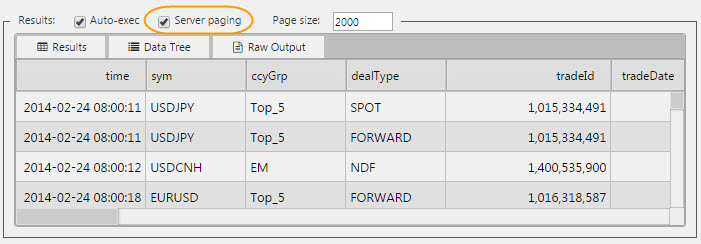
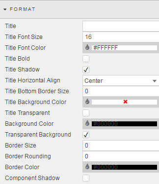

Paging is built into [Data Grids](datagrid) – other components can use the Pager component to control the amount of data displayed. All that’s required is for the Pager component to share the same _Data Source_ as other components requiring paging.

!!! note "Server Paging"
    Ensure _Server Paging_ is checked in the Data Editor of _all_ components requiring paging control; e.g. charts.  

## Basics

_Data Source_

: A data source: 
<i class="fa fa-hand-o-right"></i> [Defining a Query](introduction#defining-a-query) and [Analytics](introduction#analytics)

_Paging Type_

: State of the paging

    Type | Description
    --- | ---
    None | Server Paging switched off. 
    Offset | Starts at page other than page 1 (Page Number:0)
    Page Number | Use Page Number

_Offset/Page Number_

: Starting point for paging

_Page Size_

: Number of rows of data each page is defined by

## Style

1. Click inside _Advanced CSS_ button

    

2. Select the Pager component by first clicking on the  icon in the pop-up dialog, then clicking on the Pager component. 

3. Edit the CSS content

## Format

<i class="fa fa-hand-o-right"></i> [Styling dashboards](style)

## Margins

<i class="fa fa-hand-o-right"></i> [Styling dashboards](style)