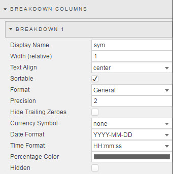
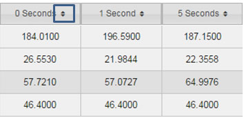
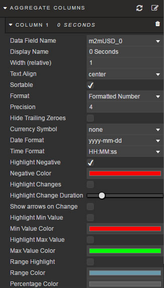
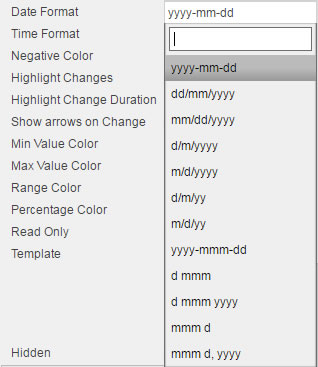

Displays a Pivot/OLAP control data set 
 

_<small>A Pivot Grid with user tools showing</small>_

## Basics

_Data Source_

: [Pivot Query](introduction/#pivot-query): the source data for the grid 

_Focus_

: Used for [linking components](introduction/#linking-components)

Row Selection

: When _Enable Row Selection_ is checked, selecting a Pivot Grid row will assign the _Selected Column_ value to the _Selected_ [View State Parameter](introduction/#view-state-parameters)

    
 

_Show Tools_

: Show user controls: Drilldown, filtering and download

    

_Drilldown_

: When checked, enables Drilldown. 

      
    _<small>Drilling down</small>_

## Breakdown Columns

Defines appearance of columns from the [Pivot Query](introduction/#pivot-query)

 

_Display Name_

: A name for the column

_Width (relative)_

: Column width relative to total width of Pivot Grid. Scale relates to the values of each column; for example, a column of _Width (relative)_ of 20, in a Pivot Grid using column widths of 20, 10, 5, 1 will scale at a column width of 55% (i.e. 20/(20+10+5+1)) 

    Relative columns scale according to the browser size.

_Text Align_

: Dropdown control: Center, Left, Right cell alignment

_Sortable_

: When checked, shows sort controls in column headers:

    

_Format_

:   
_<small>Formatted columns</small>_
  

_Precision_ and _Hide Trailing Zeroes_

: Number of decimal places used to display numeric, and whether to show trailing zeroes

_Currency Symbol_

:   
_<small>Currency columns with prefixed symbols</small>_
 

_Date Format_ and _Time Format_

: Date, Time or DateTime formats
  
      
_<small>Timestamps with DateTime format</small>_

_Percentage Color_

: Color: where _Format_ is _Percentage_ displays a mini bar in the range 0-100% 

      
_<small>Percentage values with mini bars</small>_

!!! tip "View State Parameter"
_Percentage Color_ can be a View State Parameter: roll over the end of input bar until until the eye icon appears, click the icon to assign the view state</aside>.

_Hidden_

: When checked, column will not be displayed to the User

## Aggregate Columns

Aggregate Columns Configuration

Configures the dependent variable columns from the <a href="#pivot-query">Pivot Query</a>

_Data Field Name_

: The Data Field Name is selected from data columns in the **Data Source** query. 

_Display Name_

: The display name in the Pivot Grid column. This is case sensitive.

_Width (relative)_

: Relative measure to total width of Pivot Grid. Scale is contigent on the values of each column; for example, a column of Width (relative) of 20, in a Pivot Grid using column widths of 20,10,5,1 will scale at a column width of 55% (i.e. 20/(20+10+5+1)) 

Relative columns will scale according to the browser size.

_Text Align_

: Alignment of values inside Pivot Grid: left, center, right

_Sortable_

: Check control. When enabled, users clicking on column header will toggle between ascending and descending sort. 

_Format_

: Select formatting for data type in column

Supported formats include: *General, Number, Formatted Number, Smart Number, Date, Time, Datetime, and Percentage*

_Precision_

: Where numeric data is used, Precision sets the number of decimal places used.

_Hide Trailing Zeroes_

: Removes the display of zeroes from end digits after the decimal point.

_Currency Symbol_

: Currencies

 
Adds a currency symbol prefix to column data

_Date Format_

: Combination Date and Time Format
  

  

  
Select date format

  
<aside class="admonition caution">
Ensure <i>Date</i> or <i>DateTime</i> Format is selected
</aside>
  

_Time Format_

: Select time format
  

  
<aside class="admonition caution">
Ensure <i>Time</i> or <i>DateTime</i> Format is selected
</aside>

_Highlight Negative_

: Check control. When enabled, negative values in Pivot Grid will be shown in **Negative Color**

_Negative Color_

: Select from the color palette the font color to use when **Highlight Negative** is enabled.

_Highlight Changes_

: Check control. When enabled, cells will highlight green (for higher than previous value) or red (for lower than previous value). Used for streaming or polling data.

_Highlight Change Duration_

: Move the slider to control how long **Highlight Changes** remains inside the Pivot Grid

_Show arrows on Change_

: Check control. When enabled, up and down arrows will appear when value is greater or less than previous value. Used for streaming or polling data.

_Highlight Min Value_

: Check control When enabled, cell in column with lowest value will be highlighted with color set in **Min Value Color**

_Min Value Color_

: Min Value Color

  
Selection will place a color border highlight around lowest value in column
  

To Remove, again click on the color and select *No Color* from the palette tool.

<aside class="admonition caution">Min Color can be a viewstate parameter. To assign a viewstate parameter, rollover end of input bar until the eye icon appears, click the icon to assign the view state</aside>
  

_Highlight Max Value_

: Check control. When enabled, cell in column with highest value will be highlighted with color set in **Max Value Color**

_Max Value Color_

: Max Value Color

  
Selection will place a color border highlight around highest value in column
  

Click the color bar again and then click *No Color* to remove the Max color setting 

<aside class="admonition caution">Max Color can be a viewstate parameter. To assign a viewstate parameter, rollover end of input bar until the eye icon appears, click the icon to assign the view state</aside>

_Range Highlight_

: Check control. When enabled, values in cell will have a background gradient determined by max/min values. The underlying range gradient is determined by **Range Color**.

_Range Color_

: Range Color

  
Applies a selected colour gradient across all cells in a column. Assigning a color will automatically apply the Range Color. 
  

Click the color bar and then *No Color* to remove the Range color from column data

<aside class="admonition caution">Range Color can be a viewstate parameter. To assign a viewstate parameter, rollover end of input bar until until the eye icon appears, click the icon to assign the view state</aside>

_Percentage Color_

: Percentage Color

Adds a mini-bar in Percentage formatted data. The proportion of the bar filled runs from 0 to 100%

To enable set Format to *Percentage* 

Select a colour to use for the bar 

<aside class="admonition caution">Percentage Color can be a viewstate parameter. To assign a viewstate parameter, rollover end of input bar until the eye icon appears, click the icon to assign the view state</aside>

## Selection and Routing

When _Enable Row Selection_ is checked, maps cols from Data Grid rows to View State Parameters. Each value (cell) in a row has its own View State Parameter.

If only one mapping is required, define it in _Selected Column_ and _Selected Value_. For multiple mappings, use _Selected Row Viewstate Routing_. 

[1] Select the Column of the data you wish to store

[2] Assign a viewstate parameter which will receive and store the selected cell value

<aside class="admonition caution">If more than one value from a grid is to be stored, use Selected Row Viewstate Routing</aside>

### Selected Row Viewstate Routing

: _Selected Value_ and _Selected Value Attribute_ define a single data mapping. _Selected Row Viewstate Routing_ supports multiple mappings.

Where *Selected Column* and *Selected Value* stores just a single value, *Selected Row Viewstate Routing* can store multiple values

Click  to set storage for additional values

## Style

<i class="fa fa-hand-o-right"></i> [Style](style/#component-style) for common style parameters 

## File Export

The content of a Data Grid can be exported using the downloader button/s: 

The filename can be specified, or linked to a View State Parameter and thus defined by the user

