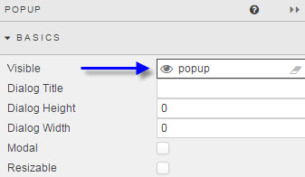

  
_<small>A dashboard with a chart popped up from a button top right</small>_

A Popup displays another component or screen as a ‘pop up’ from the dashboard, typically, when a Button or some other selection control is clicked. 

For the Popup to appear <!-- in Preview/Quickview WTF? --> it must be assigned to a View State Parameter of boolean type, and the View State Parameter bound to a Button or other selection control. When the user clicks the Button, the boolean View State Parameter is set to `true` and the Popup appears. 

Set up a Popup as follows: 

1. Drag a Popup component inside the dashboard

    

2. Click on the Popup component to edit it. Add a single component or a Layout panel with multiple components. Set them up as normal. 

3. In the _Basics_ dialog for the Popup, for the _Visible_ property create a View State Parameter, named e.g. `popup`, of type boolean. 

    

    

    <!-- The size and type of the dialog can be set from the _Basics_ properties. WTF? -->

4. Place on the dashboard a Button to summon the Popup. Change its _View State Mapping_ to set the `popup` View State Parameter to `true`. When the user clicks the Button, the Popup will appear.

    

