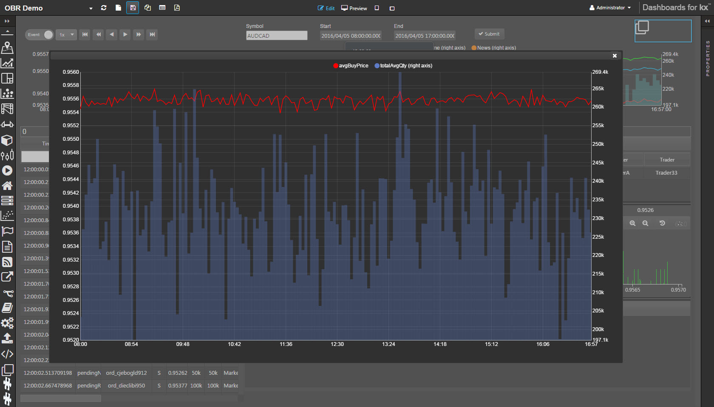
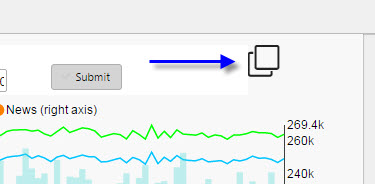
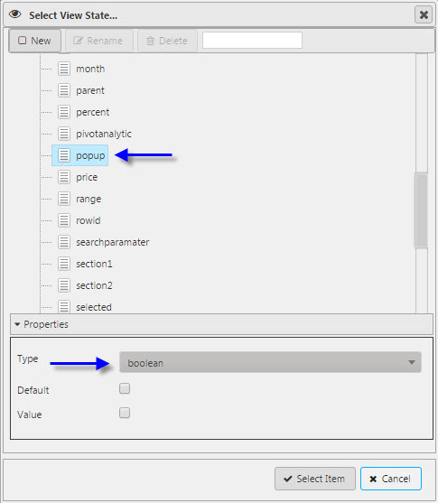

Allows components to be viewed as standalone popups

!!! Warning "For the pop-up to appear in Preview/Quickview it must be assigned to a view state parameter of type boolean, and the view state bound to a button or other selection control. When the button is clicked the boolean view state is set to 'true' and the pop-up appears."

[1] Drag the Pop-up component inside the dashboard

[2] Click on the Pop-up component to open the editor screen; add an individual component or layout panel (+components).  Configure as normal for selected screen.

[3] Close the panel, in the _Basics_ properties for the _Visible_ property,  create a view state parameter (e.g. popup).  Set the _popup_ to type boolean

The size and type of the dialog can be set from the _Basics_ properties.

[4] Add a button to where you want to associate the popup behaviour. This button will trigger the pop-up when clicked. Change the View State Mapping so the _popup_ view state parameter has a value of _true_. When the button is clicked, the popup dialog will appear.

