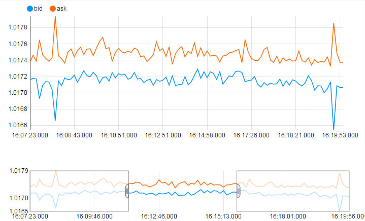
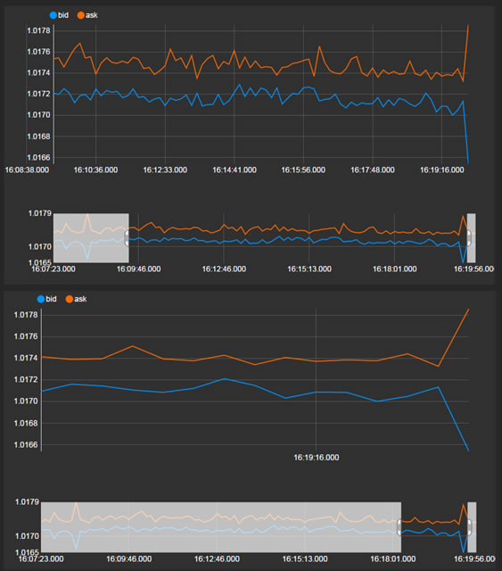
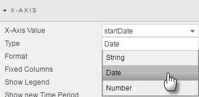
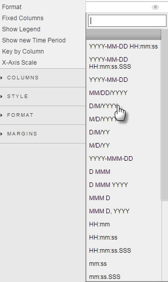
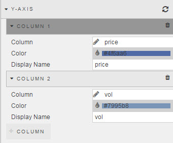
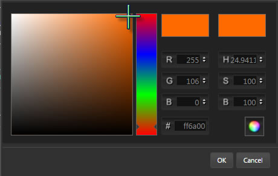
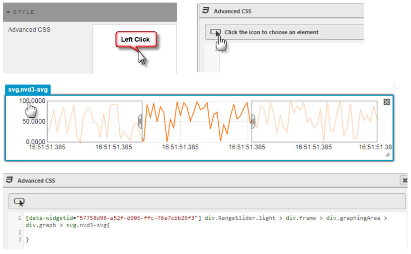
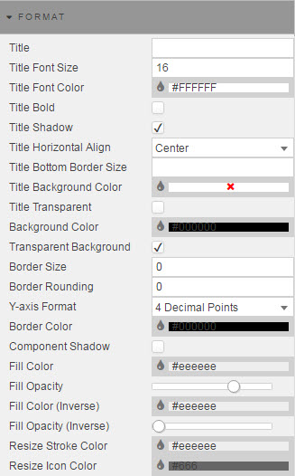
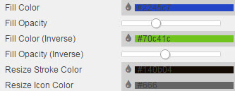

The Range Slider plays a similar function to the <a href="#Breadcrumbs">Breadcrumbs</a> component.  It supports zoom-in navigation for linked charts using sequential x-axis data (e.g. time)

## Basics

 

### Data Source

See [Defining a Query](introduction.md#defining-a-query) and [Analytics](introduction.md#analytics) for more on data sourcing.

### Focus

Used for [linking components](introduction.md#linking-components). Requires a [view state parameter](introduction.md#view-state-parameters).

### Range

Range Slider interaction

Used to link **Range Slider** components to other components with the **Range** Basics property.

[1] Create and assign a <a href="#view-state-parameters">View State Parameter</a>

[2] Share the **View State Parameter** and **Data Source** for components to be linked; e.g. a chart.

[3] Go to Quickview/Preview to interact with chart

**Selected Value**

Set a [view state parameter](introduction.md#view-state-parameters) to store the value selected in the Range Slider.

**Selected Min Value**

Set a [view state parameter](introduction.md#view-state-parameters) to store the minimum value of the selected range.

**Selected Max Value**

Set a [view state parameter](introduction.md#view-state-parameters) to store the maximum value of the selected range.

## X Axis

Configures Range Slider X-Axis

**Axis Value**

Sets which query column variable will be used as the x-axis chart label

**Axis Type**

Sets the data type for the label used for X-Axis Value

<aside class="warning">If x-axis labels look incorrect, try selecting a different <a href="#type">Type</a></aside>

**Axis Format**

Used for when <a href="#axis-type">X-Axis Type</a> is of type <i>Date</i>.

**Axis Scale**

Select no scaling, or use numberic/time scaling depending on selected axis type. 

**Legend Label Tag**

Coming soon

**Use Fixed Num of Ticks**

Toggles control to use **Num of Ticks**

**Show All Ticks**

Displays every charted data point in the x-axis

**Num of Ticks**

The number of ticks to display in the x-axis if **Use Fixed Num of Ticks** is checked

**Axis Rotation**

Rotate x-axis label

## Y-axis

Adds <a href="#data-source">data source</a> variables to Range Slider

**Column**

Dropdown select of <a href="#data-source">data source</a> variable to plot.

To add a new data column, click 

**Color**

Color Palette

Use the colour palette to select bubble color

**Display Name**

The Legend name for the selected data source

## Style

### ChartBarColors

Selects <i>Range Slider</i> line colors when a [pivot query](introduction.md#pivot-query) is used. For non-Pivot data, select line color from the **Y-axis Columns** control.

To add a color, click 

### Advanced CSS

Select to add CSS elements to Line of Range Slider chart

## Format

See [Format](introduction.md#format) in Introduction for more on shared formatting options. 

**Y-axis Format**

Dropdown to select number of decimal places to use for Y-axis

[1] 4 Decimal places
[2] 3 Decimal places
[3] 2 Decimal places
[4] 1 Decimal place
[5] Smart Number
[6] No decimal place

**Component Shadow**

Applies shadow to component.

**Fill Color**

Define background fill color during range select.

**Fill Opacity**

Set opacity of the overlay fill color to the underlying data plotted in the Range Slider.

**Fill Color (Inverse)**

Set fill color inside selected range.

**Fill Opacity (Inverse)**

Set fill opacity inside selected range.

**Resize Stroke Color**

Set color of selected range border

**Resize Icon Color**

Set color of range slider drag bar. 

## Margins

See [Margins](introduction.md#margins) in Introduction for more