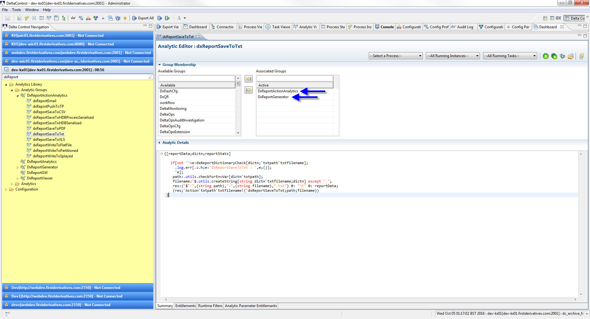
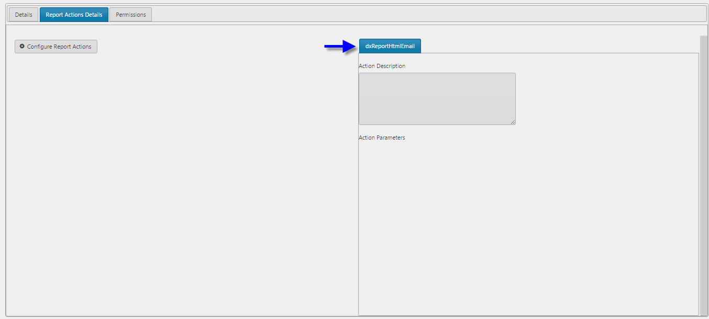
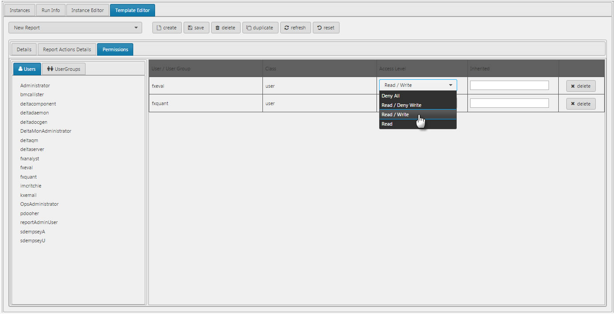
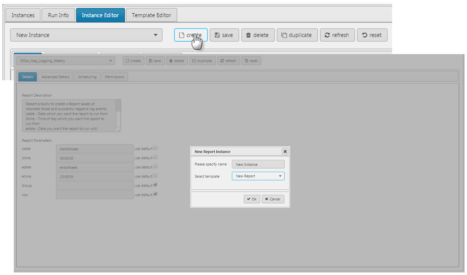
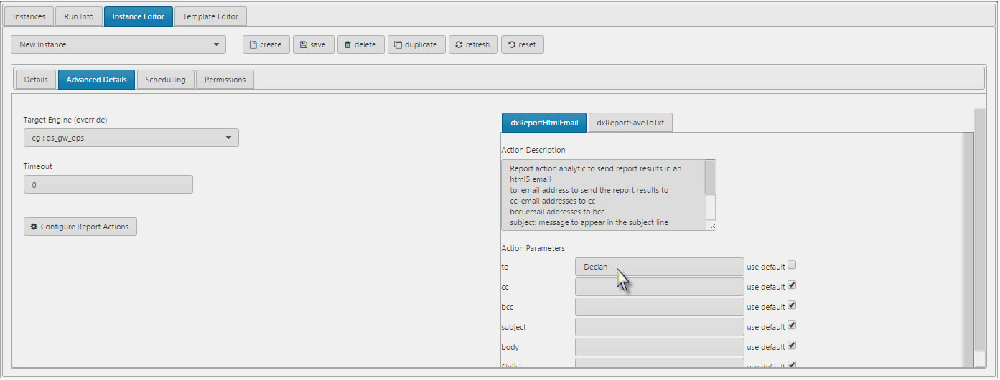

Report Manager is a self-contained component for creating and scheduling reports. 

### Create a report template

1. The structure of the report is created in the Template Editor. Click _Create_, name the report, and save it.

    

1. In the _Details_ tab, set the _Target Engine_ or connection to use for the report. 

    

    !!! tip "Connections"
        Connections cannot be created or edited from the Report Manager. Use the [Connections Manager](introduction#creating-a-connection) in Dashboards.

1. Still in the _Details_ tab, select from the dropdown a _Report Analytic_. This is the query used to pull data to populate the report.  Four default Analytics are offered. 

    
 
    Available Analytic Parameters will update when a _Report Analytic_ is selected but are non-editable. Parameters are edited in the _Instance Editor_, see step 7.

    The description will also update when the _Report Analytic_ is changed.

    !!! Warning "Control for Kx"
        Only Analytics assigned to _DxReportAnalytics_ from Control for Kx will be available as Analytics inside Report Manager.
 
1. Configure what the report is to do: click _Configure Report Actions_ in _Report Actions Details_. This will bring up a menu list of Report Actions.

    

    Drag report actions from the _Available Analytics_ list on the left into the _Selected Analytics_ box on the right.

    

    Selected report actions can then be edited inside the _Instance Editor_:

    

    Remove report actions by dragging them back from _selected Analytics_ into _Available Analytics_.

    !!! Warning "Control for Kx"
        Only Report Actions assigned to `DxReportActionAnalytics` from Control for Kx will be available. Create or remove a report action Analytic using Control for Kx.

1. Grant permissions to read and/or write the report template: in the _Permissions_ tab, drag users from the left to the user group on the right, and set their _Access Level_ permissions.

    

    The list of available users and Access Level permissions is set in Control for Kx.

1. Save the template. 

## Create a report from a template

1. Open _Instance Editor_ and click _Create_. This will use the template to make a new instance of the report.

    

1. In _Details_, the report description and parameters can be changed from the template’s defaults. 

    

1. In _Advanced Details_ other parameters can be customised from the template’s defaults.

    

    _Timeout_ 
    : Milliseconds: the default of zero means no timeout

    _Action Parameters_
    : Recipents of the report: selected from users set by Control for Kx – do not use an email address as a report recipient.

1. Schedule the report:

    

    

1. Grant Permissions to override the template defaults:

    

    !!! tip "Recipients"
        Recipients of a report need not be listed under Permissions.

1. Save the report instance. 

1. Run the report. If scheduled, the report will run at the set time. However, reports can be run directly from the _Instances_ tab: click the _Run_ button.

    

1. Review the status of the report in the _Run Info_ tab. Successful runs are highlighted in green, failures in red.

    

    !!! tip "Filters"
        Filter the report instances with the _Date_, _Report_ and _RunID_ controls. Click _Submit_ to apply a filter. 

## Upload

Dashboards can use the [Upload](upload) component to display an index of reports. 

## Basics

_Download Folder_

: Folder to which Reports will be downloaded

_Read only_

: When checked, reports are read-only

_Filtering_

: `Quick Search` (global search),` Columns Filters`, `Advanced Column Filters` and disabled (`None`). 

## Style

<i class="fa fa-hand-o-right"></i> [Style](style) for common styling parameters

## User controls

<i class="fa fa-hand-o-right"></i> Report Management in Stream for Kx for more on using Report Manager

