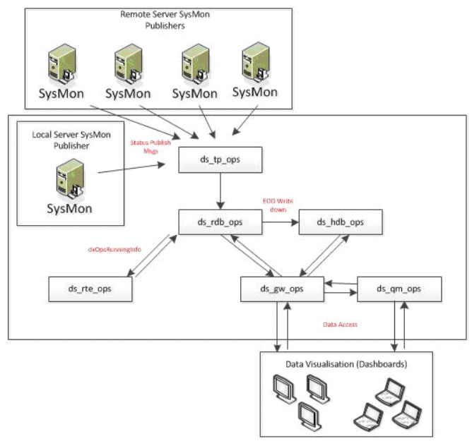
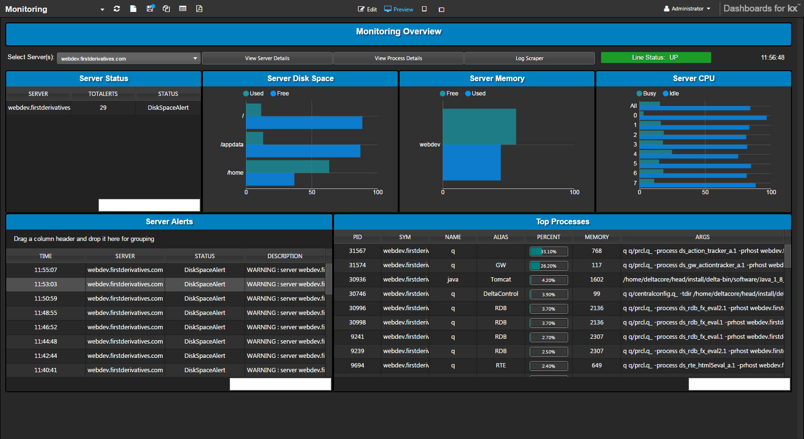
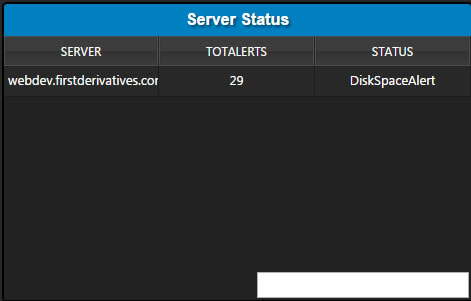
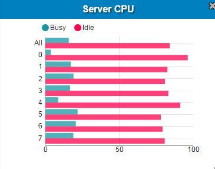
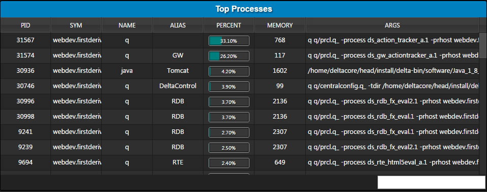
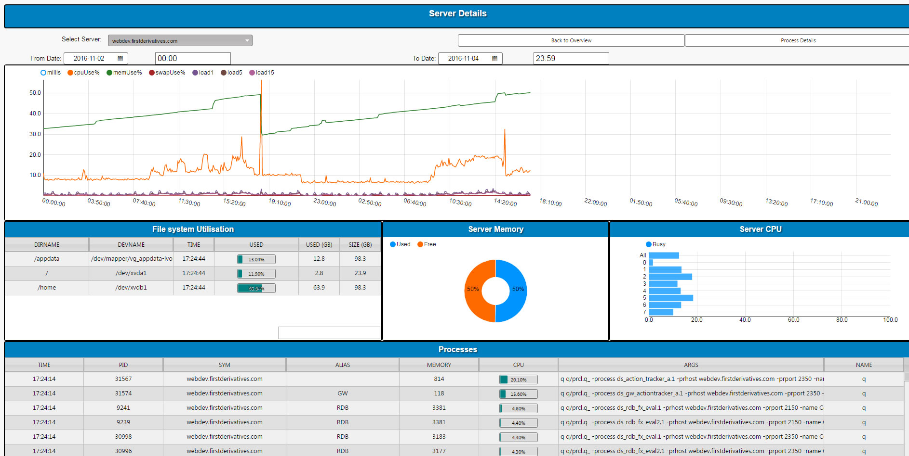
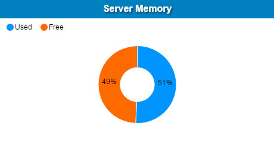
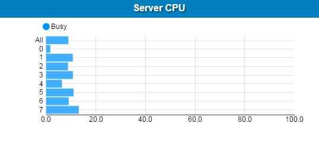
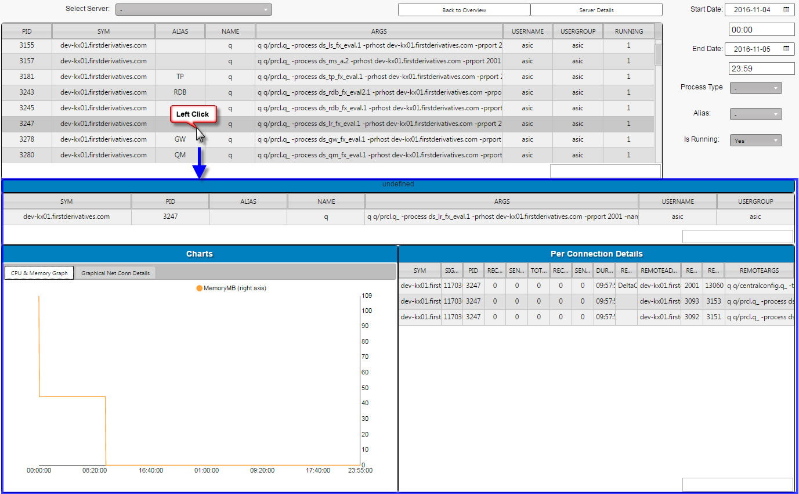
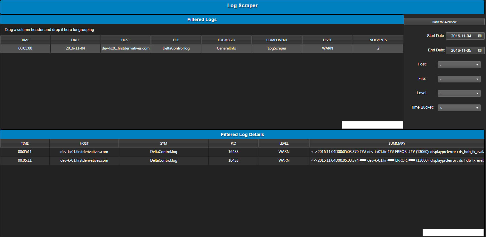

## Monitoring

_Monitoring for Kx_ is an enterprise solution for real-time monitoring, investigation and analysis
of system stability and performance. Specifically aimed at platforms where system
performance and efficiency is critical, _Monitoring for Kx_ provides a sophisticated solution for
capturing data on servers, processes, CPUs, file system, NICs and network signals. These
signals can be analysed in real-time to trigger alerts and display critical information via
powerful dashboards in a versatile and meaningful way. Moreover, using the power of kdb+, it
can incorporate previously-stored data, results and signal information to further enrich its
analysis and monitoring capabilities.

_Monitoring for Kx_ allows you to monitor servers, processes, and network interfaces in real time
and historically. Alerts can be configured to send real-time communication updates on the
status of the monitored servers, thus ensuring no software, hardware or data spikes can
silently bring down your infrastructure.

_Monitoring for Kx_ provides a visual presentation of
the current status of all monitored servers. Each server must have a SysMon Java application
installed and running to collect the server and process stats. 

### Architecture

Sysmon
: Java-based executable: collects server and process information

ds_tp_ops
: Tickerplant process

ds_rdb_ops
: Real-time database: captures all the data from the tickerplant and
stores it in memory; at end of day, writes all its data to the historic database

ds_rte_ops
: Real-time engine process: subscribes to a data source and
consumes data 

ds_hdb_ops
: Historic database process: accesses all the on-disk (historic) data –  generally, data captured prior to the current day

ds_gw_ops
: Gateway process: balances loads and/or joins data across different
processes

ds_qm_ops
: Query manager process: off-loads client GUI load from the front end
by caching it and distributing it to front-end components

!!! note "Coming soon"
    Configuration of Alert Monitoring will be covered in _Monitoring for Kx_ when available. An [existing help document](https://confluence.firstderivatives.com/pages/viewpage.action?title=Delta+Monitoring+User+Guide&spaceKey=DOC) covers the Flex version of _Monitoring for Kx_.

### Servers Overview

In the HTML5 Eval Pack of Dashboards is a Monitoring dashboard to display the monitoring of server alerts and processes.

Select an individual server or server group (for example, *webdev.firstderivatives.com*)

!!! tip "Grouped servers"
    If selecting a server group, the Monitoring Overview page will show overall performance of grouped servers only.  If selecting an individual server, the Monitoring Overview will show the performance of individual partitions where relevant.

The Navigation panel offers jump points to different sections of monitoring.  This will also show the connection status of the Server.

_Server Status_

:   
_<small>Summary of alerts from the selected server</small>_

    If a server group is selected, shows all servers in the group. Alert details in the _Server Alerts_ panel.

_Server Disk Space_

:   
_<small>Free and used space for each directory on the server</small>_

_Server Memory_

: 

_Server CPU_

:   
_<small>CPU utilisation for each core</small>_

    If a Server Group is selected, only the overall CPU usage will be displayed

_Server Alerts_

: 
_<small>Alerts counted in the Server Status display</small>_

_Top Processes_

: 

    _Alias_ shows the identity of the connection. In many cases the connection is a work station to the Tomcat, so the machine name will be viewable. 

<!-- Items | Description
--- | ---
PID | Process ID
SYM | Host name
Name | Process Name
Alias | The identity of the connection. In many cases the connection is a work station to the tomcat, so the machine name will be viewable. 
Percent | CPU usage by Process
Memory | Memory usage (MB) by Process
Args | Description of Process
 -->

### Server Details

  
_<small>Server Details dashboard</small>_

_Time Series_

:   
_<small>CPU, memory, memory swap usage and CPU load for the selected time period</small>_

<!--     Load1, load5, and load15 represent the 1-, 5- and 15-minute server load usage respectively.
 -->

_File System Utilisation_

:   
_<small>Disk-space usage by directory on the server</small>_

_Server Memory_

:   
_<small>Server memory usage and percentage available</small>_

_Server CPU_

:   
_<small>Percentage of server usage across cores of selected server</small>_

_Processes_

:   
_<small>Running processes</small>_

    Includes processes not triggering threshold limits as displayed in Overview page). 

    _Alias_ shows the identity of the connection. In many cases the connection is a work station to the Tomcat, so the machine name will be viewable. 

    Click a row to drill down to more detail.

<!-- Items | Description
--- | ---
Time | The time the snapshot was taken. The frequency of updates in controlled by the Lookback seconds specified in the filters (configured in Monitoring for Kx)
PID | Process ID
SYM | Host name
Alias | The identity of the connection. In many cases the connection is a work station to the tomcat, so the machine name will be viewable.
Memory | Memory usage (MB) by Process
CPU | CPU usage by Process
Args | Description of Process
Name | Process Name
 -->

### Process Details

 

Clicking on a row of the _Processes_ table in _Server Details_ drills down to this display.

!!! tip "Alias"
    _Alias_ shows the identity of the connection. In many cases the connection is a work station to the Tomcat, so the machine name will be viewable. 

<!-- Items | Description
--- | ---
PID | Process ID
SYM | Host name
Alias | The identity of the connection. In many cases the connection is a work station to the tomcat, so the machine name will be viewable.
Name | Process Name
Args | Description of Process
Username | Monitoring Username
Usergroup | Monitoring Usergroup
Running | Is Process running: (1) Yes, (0) No
 -->

Filters on the right help search: 

  
_<small>Filtering for running processes</small>_

Click on a process to see its connection details and charts.

 

  
_<small>Charts show CPU, memory usage, and connection details over time</small>_

<!-- Items | Description
--- | ---
MemoryMB | Memory usage
UsageCPU | % CPU Usage
recvQ | The receive queue size
sendQ | The send queue size

_Per Connection Details_

: The table lists associated connection details for the selected Process

Items | Description
--- | ---
SYM | Host name
PID | Process ID
RecvQ | The receive queue size
SendQ | The send queue size
TotalQ | Absolute value of the combined valuesof the messages sitting on a process send receive queue.
Duration | Length of time connection is active
Remote Alias | This is a combination of fields to identify the connection to the process instance displayed. In many cases the connection is a work station to
the tomcat, so a remote machine name will appear.
Remote Address | The remote address.
Remote Port | The remote port connection.
Remote PID | The remote Process ID.
Remote Args |  Remote process arguments which provide additional details about the running process.

!!! Note
    Not all Processes have Connection Details and this table can be blank.
 -->

### Log Scraper

 

<!--   -->

This screen runs independently of the Server and Process overviews. It requires configuration in Flex. 

Filters on the right of the table help search: results are shown in _Filtered Logs_:

 

<!-- Items | Description
--- | ---
Time | The time the message occurred
Date | The date the message occurred
Host | The host name of the process instance
File | Name of log file
LogMsgID | The message ID
Component | The component where the message was created
Level | The level of logging
No. Events | Number of logged Events
 -->

Selecting an information row from Filtered Logs will display further details in _Filtered Log Details_:

 

<!-- Items | Description
--- | ---
Time | The time the message occurred
Host | The host name of the process instance
SYM | Name of log file
PID | Process ID
Level | The level of logging
Summary | Summary description of selected log.  -->