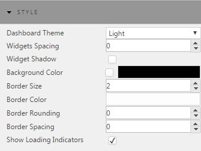
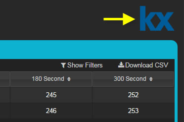
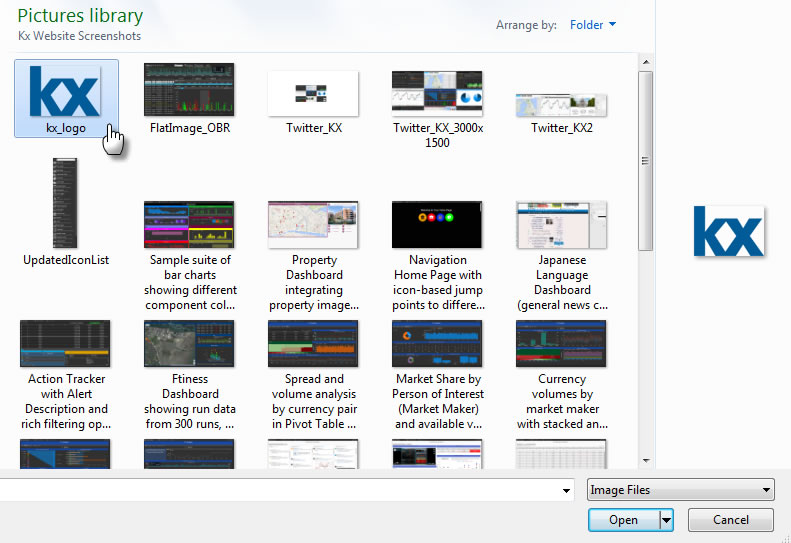
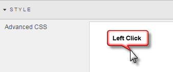
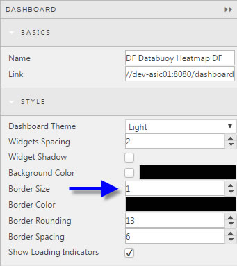
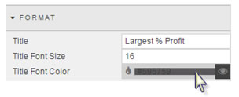
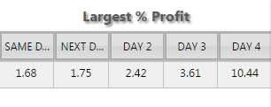
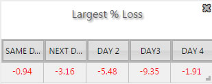

A number of styling and formatting options are available to customize dashboards. 

## Dashboard style

Setting the global style for your dashboard:

  
_Dashboard properties_

Style example: 

### Theme

If the dashboard is to have a light or dark theme it can be defined from the _Style_ property.  The _Style_ menu is also where spacing between the components and the background color of the component is defined. 

!!! tip
    If your dashboard uses streaming, managed or polling data, uncheck 

### Logo

To add a logo to a dashboard, use the [Text Input](textinput) component. 

1. Drag the Text Input component into the dashboard, then select it.   

2. Click inside the _Formatted Text_ box of the _Basics_ properties to open the editor.  

3. Use the menu bar to add an image.  
  
Ensure your logo image uses a transparent background – to be compatible with the background of the dashboard.  

4. Set the height and width of the logo in pixels.  
  
50 pixels is a good height for a logo. The importer will rescale the logo maintaining its aspect ratio if only the image height is set. 
5. Delete the default `insert text here` before adding the logo.
6. If your logo is positioned to the left of the dashboard, change the _Horizontal_ alignment to _Left_. (Vice versa for right-positioned logos.)  

7. Prevent the appearance of unnecessary scroll bars around the logo on browser resize: update _Advanced CSS_ from the _Style_ menu.  

    7.1 Click the CSS icon to activate the selector.  
    

    7.2 Roll over the component until the `div.htmlContent` box is selected:  
    
    
    7.3 Amend the CSS to hide scroll bars: set the `overflow` property to `hidden`. (Remember to add the CSS inside the `{}` brackets.)  
      
    

!!! tip 
    If dashboard styling is used to align and position components, remember to update the _Margins_ setting of the Text Input component to undo any unnecessary changes to the position of the logo.

### Borders

To apply a border to all components, set *Border Size* to a value greater than 1 in the Dashboard _Style_ menu

  
_Thick borders_

  
_Thin borders_

If a border is used (although not required), adding widget spacing will apply a buffer between components.

### Margins

Outer margins
: Control spacing outside of component and component border

Inner margins
: Control spacing between component (rectagular) pane and any utilized border.

!!! tip 
    In the absence of a defined border, changes between inner and outer margins will appear similar.

Added widget spacing is the equivalent of outer margins in the _Margins_ menu of a component

_Border Spacing_ sets the spacing between the elements of the component and the border.
 

_Border Spacing_ is the the equivalent of inner margins in the _Margins_ menu of a component. 

Rounding of borders is possible only if _Border Size_ has a value greater than 1. Use of more rounded borders requires increased border spacing to avoiding edge cutting of the border. 
 
!!! tip "Dashboard and component margins"
    Dashboard margin settings override component margin settings. When styling dashboards, et margins at the dashboard level before setting them for individual components.

### Title 

Controls title positioning relative to the component pane and outer border

Sample title settings | Results
--- | ---
 | 
 | 
 | 

Adjusting _Title Left_ and _Title Right_ will add margin even if the title is center-aligned by _Title Horizontal Align_ in the _Format_ menu.  

## Component style

A component’s _Format_ menu is used to add a title and set individual component colors. 

### Title

Adds a title to the component.

_Title Font Size_
: Defined in pixels

_Title Font Color_
: Click on the color bar to bring up the palette menu  
  

_Title Bold_
: Check if title is to be in bold  

_Title Shadow_
: Check if shadow is to be applied to the title

_Title Horizontal Align_
: Position of the title in component  

_Title Bottom Border Size_
: Defines distance between the title and the content of the component  
  

_Component Color_
: Sets the color of the component; applies to border and title background. Requires an unchecked _Transparent Background_ to enable.  
  

_Transparent Background_
: If checked, will use the dashboard background color. 
If unchecked, will use the _Component Color_.  

_Border Size_, _Rounding_ and _Color_
: The three parameters control border use of a component:  
  
  
It may be necessary to adjust _Inner Top_ and _Inner Bottom_ margins to avoid the rectangular area box of the component from cutting into a rounded border.

_Component Shadow_
: Add shadow level around component edges  

