Styling and formatting parameters for customizing dashboards

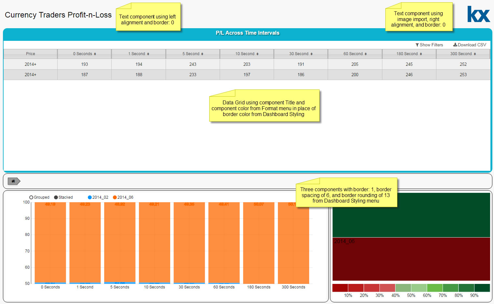  
_A dashboard with five components, variously styled_


## Dashboard style

  
_A dashboard with the Dark theme_

Dashboard-wide style parameters

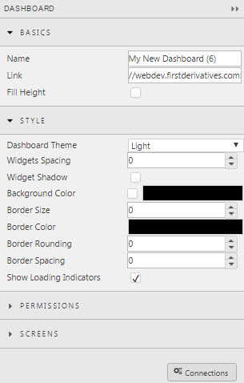 


_Dashboard Theme_

: Light or Dark

_Widgets Spacing_

: Margin in pixels around each component 

_Widget Shadow_

: When checked, applies a drop shadow to each component 


_Border Size_, _Border Color_, and _Border Rounding_

:   
_Thick borders_

    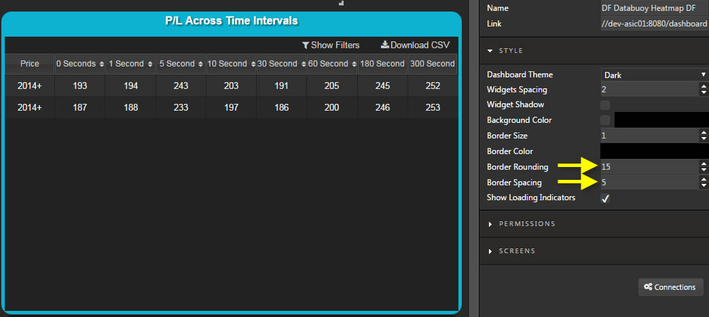  
    _Thin borders_

    To apply a border to all components, set *Border Size* to a value greater than 1 in the Dashboard _Style_ dialog


!!! tip "Show Loading Indicators"
    If your dashboard uses streaming, managed or polling data, uncheck _Show Loading Indicators_.


### Logo


To add a logo to a dashboard, use a [Text Input](textinput) component. 

1. Drag the Text Input component into the dashboard, then select it. 

    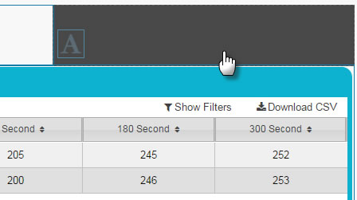

2. Click inside the _Formatted Text_ box of the _Basics_ properties to open the editor. 

    

3. Use the menu bar to add an image. 

     

    Ensure your logo image uses a transparent background – to be compatible with the background of the dashboard. 

    

4. Set the height and width of the logo in pixels. 

    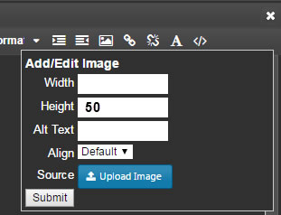  

    50 pixels is a good height for a logo. The importer will rescale the logo maintaining its aspect ratio if only the image height is set. 

5. Delete the default `insert text here` before adding the logo.

6. If your logo is positioned to the left of the dashboard, change the _Horizontal_ alignment to _Left_. (Vice versa for right-positioned logos.) 

    

7. Prevent the appearance of unnecessary scroll bars around the logo on browser resize: update _Advanced CSS_ from the _Style_ menu. 

    

    * Click the CSS icon to activate the selector. 

        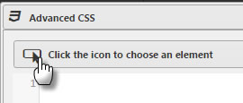

    * Roll over the component until the `div.htmlContent` box is selected: 

        
    
    * Amend the CSS to hide scroll bars: set the `overflow` property to `hidden`. (Remember to add the CSS inside the `{}` brackets.) 

          

        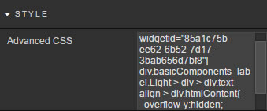

!!! tip 
    If dashboard styling is used to align and position components, remember to update the _Margins_ setting of the Text Input component to undo any unnecessary changes to the position of the logo.


## Component style

Some styling parameters common to many components

### Title 

Controls title positioning relative to the component pane and outer border

Sample title settings | Results
--- | ---
 | 
 | 
 | 

Adjusting _Title Left_ and _Title Right_ will add margin even if the title is center-aligned by _Title Horizontal Align_ in the [_Format_ dialog](#format).  


### Margins

Outer margins

: Spacing in pixels outside of component and component border

Inner margins
: Spacing in pixels between the rectangular component area and any utilized border.

!!! tip 
    In the absence of a defined border, changes between inner and outer margins will appear similar.

Added widget spacing is the equivalent of outer margins in the _Margins_ menu of a component

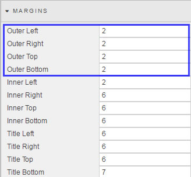

_Border Spacing_ sets the spacing between the elements of the component and the border.
 
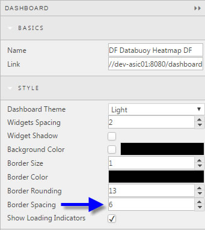

_Border Spacing_ is the the equivalent of inner margins in the _Margins_ menu of a component. 

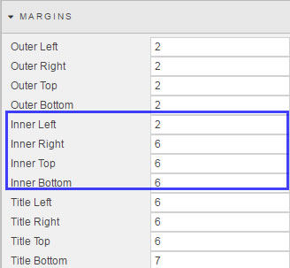

Rounding of borders is possible only if _Border Size_ has a value greater than 1. Use of more rounded borders requires increased border spacing to avoiding edge cutting of the border. 
 
!!! tip "Dashboard and component margins"
    Dashboard margin settings override component margin settings. When styling dashboards, set margins at the dashboard level before setting them for individual components.


### Format

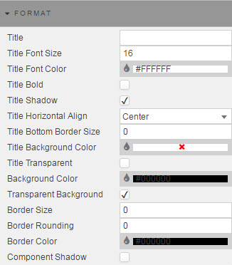

_Title_

: 


_Title Font Size_

: Defined in pixels


_Title Font Color_

: Click on the color bar to bring up the palette menu 

    


_Title Bold_

: 


_Title Shadow_

: When checked, applies shadow to the title


_Title Horizontal Align_

: Horizontal position of the title within component 


_Title Bottom Border Size_

: Pixel distance between the title and the component content

    


Border and background color

: _Component Color_ is the color of the component’s border and title background when _Transparent Background_ is unchecked

     

    


_Border Size_, _Rounding_ and _Color_
: These three parameters control the borders of a component: 

      

      

    !!! tip "Inner margins"
        Adjust _Inner Top_ and _Inner Bottom_ margins if necessary to avoid the rectangular box of the component cutting into a rounded border.


_Component Shadow_

:  
_A Bar Chart with a component shadow_


### ChartBarColors

Color order for a [pivot query](introduction/#pivot-query). In the absence of a pivot query, the assignment of the colors is done in the order of the Data. 


### Advanced CSS

Click inside the Advanced CSS editor. Click the selector icon, then inside the chart component to edit CSS rules.


### Custom tooltip

1. Create View States for items in tooltip

    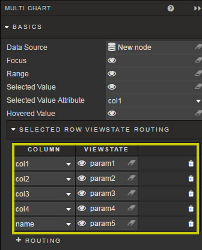

2. Add an HTML tag for View States, using [Handlebars](http://handlebarsjs.com)

    

3. Chartview

    

Tooltips can use View State Parameters which have been mapped to _Data Source_ columns 


In the Configure Tooltip template, add HTML tags for the View State Parameters to display (using Handlebars) 

If viewstate parameter is `param1`, add a table cell with `param1` viewstate to tooltip with the tag:  `{{obj.param1}}`


Tool tip will appear as: 


### Tooltip Helper


Apply Tooltip Helper variable to Tooltip reference


Tooltips use [Handlebars](http://handlebarsjs.com/) so variables can be added dynamically to tooltip. For example:
```js
{{fx}} : {{volume}}
```
could appear as `EUR/USD: 250000`. To format `250000` so it will appear as `$250,000` use Tooltip Helper


_Name_

: Give the function a name: it will be used inside the tooltip. For example:

    

    ```js
    {{fx}} : {{fd volume}}
    ```


_Regex_

: The regular expression used to find the required pattern. In this example: `(\d{3})(?=\d)`


_Value_

: The value to replace the text with. In this case, comma-delimited currency values: `$1,`


