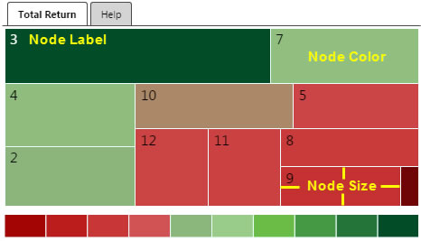
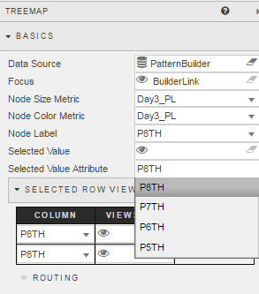
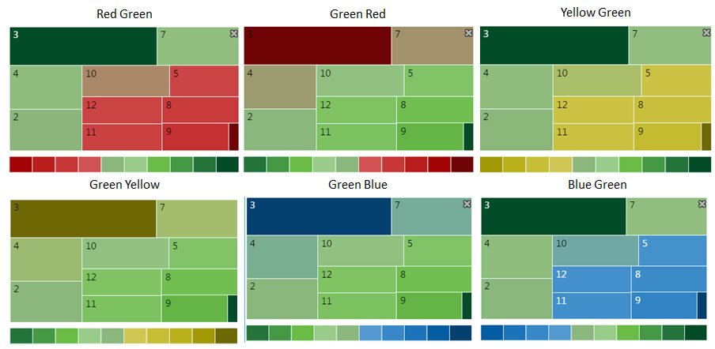
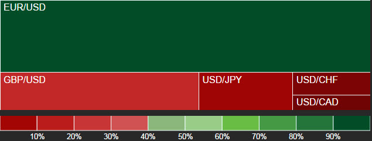
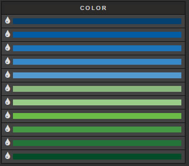
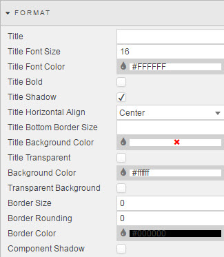

Heat Map control, best used in conjunction with [Pivot Queries](introduction.md#pivot-query)


## Basics


### Data Source

See [Defining a Query](introduction.md#defining-a-query) and [Analytics](introduction.md#analytics) for more on data sourcing.

**Focus**

Used for [Linking Components](introduction.md#linking-components)

**Node Size Metric**

Node Selection


Sets the underlying measure for the Tree Map. Box area size will be determined by this variable. This is selected from the linked **Data Source**

**Node Color Metric**

Defines the variable to use for Tree Map color range.  The <a href="#style">Style</a> menu contains the colour configuration options

**Node Label**

Defines the descriptive label for the Tree Map boxes



**Selected Value**

Assign a [view state parameter](introduction.md#view-state-parameters) to store the *Selected Value Attribute*. 

**Selected Value Attribute**



Map a <a href="#data-source">data source</a> variable to the *Selected Value*.

### Selected Row Viewstate Routing

Where *Selected Column* and *Selected Value* stores just a single value, *Selected Row Viewstate Routing* can store multiple values

Click  to set storage for additional values


## Style


### Tooltip Helper

Tooltip Helper


Apply Tooltip Helper Variable to Tooltip reference


Tooltips use <a href="http://handlebarsjs.com/">Handlebars.js</a> so variables can be added dynamically to tooltip.

For example:
 
```
{{fx}} : {{volume}}
```

could appear as
EUR/USD: 250000

To format "250000" so it will appear as "$250,000" use Tooltip Helper

**Name**

Give the function a name.  This name will be used inside the tooltip.

For example:


```
{{fx}} : {{fd volume}}
```

**Regex**

The regular expression used to find the required pattern

In this example:

```
(\d{3})(?=\d)
```

**Value**

The value to replace the text with. In this case, comma-delimited currency values: 

```
$1,
```

**Color Scheme**

Dropdown select of color options:



**Color Text Override**

Check control to replace default text color with Text Color setting

**Text Color**



Uses selected text color for Heat Map text override.

### ColorScale

Customize *Color Scheme*

**Color**

Tree Map Custom colors.  Can also be configured to use Hex colors.



**Min Text Display**

Slider to adjust minimum Tree Map section size for *Node Label* to appear

### Advanced CSS

Left click inside the Advanced CSS editor. Click the selector icon, then left-click inside the treemap to bring up the relevant CSS code. 

### Custom Tooltip

Defines tooltip rollover information


### Hide Tooltips

Check control to toggle display of Custom Tooltip

### Label Size

Slider to adjust font size for Tree Map *Node Label*

## Format



See [Format](introduction.md#format) in Introduction for more.

**Metric Format**

Sets the decimal display for the Heat Map variable control

**Label Format**

Sets the format of the cell label used by the Heat Map

## Margins

See [Margins](introduction.md#margins) in Introduction for more

