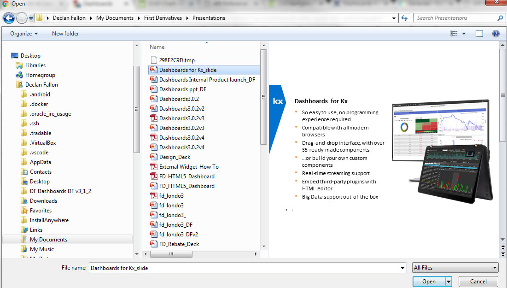
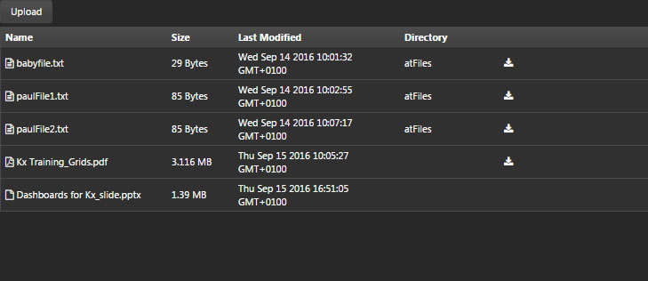
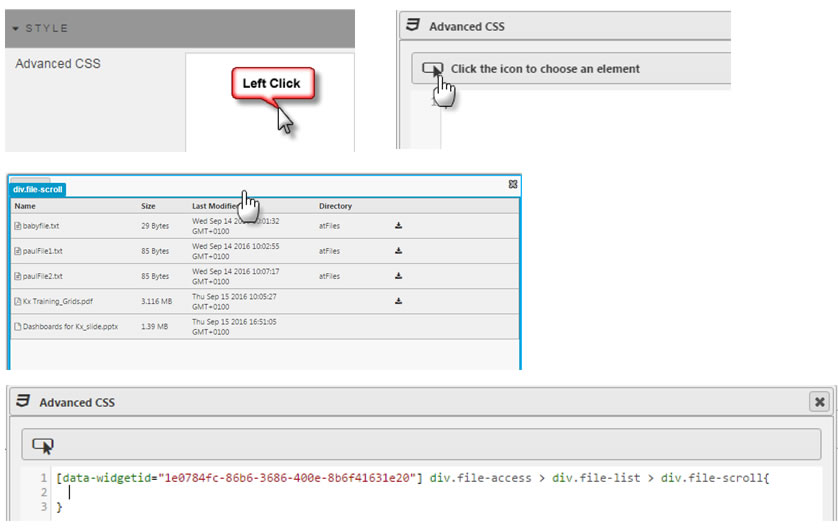

File uploader (and downloader).

Click  to search for a file to upload

File upload will begin

Users can also download files from the dashboard by clicking the download icon

## Basics

Set permissions and upload/download directory

**Valid File Names**

Name or set with [view state parameter](introduction#view-state-parameters).

**Valid File Types**

Choose file type to support for import or set with a [view state parameter](introduction#view-state-parameters).

File extensions or mime types can be specificied, with multiple file types separated by a comma.

Example | Supported Files
--- | ---
.csv, .pdf | supports CSV and PDF files (file extensions)
image/* | supports any image file (mime type)
.csv, .pdf, image/* | accept CSV, PDF files and any image type

If not defined, then all file types are supported.

**Directory**

Assign a [view state parameter](introduction#view-state-parameters). Defines the destination directory for uploaded files (or where files are downloaded from).

**Server**

Dropdown menu. This is the target server (set up in Connection Management, by making a connection with type "daemon" to facilitate transfer between UAT and Production servers).

**Download Enabled**

Allow users download files from the dashboard

**Upload Enabled**

Allow users upload files to a dashboard

## Style

**Display Type**

Icon View

Table View

Dropdown menu. Switches between icon and table view; default is tabulated view

### Advanced CSS

Configure CSS of Upload component

## Margins

See [Margins](introduction/#margins) in Introduction for more

## Format

See [Format](introduction#format) in Introduction for more.

