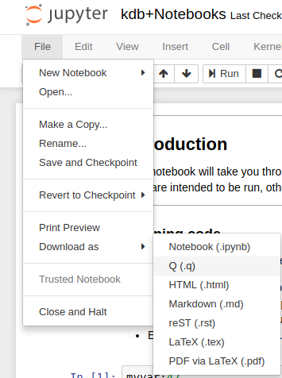

# Frequently-asked questions


## Can I run the kernel remotely?

Yes, see the Jupyter documentation [here](http://jupyter-notebook.readthedocs.io/en/stable/public_server.html). If you are looking to set up a notebook server for multiple users Jupyter recommends [JupyterHub](http://jupyterhub.readthedocs.io/en/latest/index.html)

### Additional setup for JupyterQ under JupyterHub

If you see this error when running the Jupyter console on the server you're installing on:
```
You may need to set LD_LIBRARY_PATH/DYLD_LIBRARY_PATH to your 
python distribution's library directory: $HOME/anaconda3/lib
```
You will need to export the `LD_LIBRARY_PATH` and add this to your configuration file for JupyterHub 
```python
c.Spawner.env_keep.append('LD_LIBRARY_PATH')
```


## How can I save the contents of a notebook to a q script?

To dump the entire contents of the code cells in a notebook to a q script use
_File > Download as > Q (.q)_.


 
To save the contents of individual cells as q scripts use `/%savescript` in a cell.

<i class="fa fa-hand-o-right"></i> [Loading and saving scripts](load-save)

<!-- 
FIXME
==Generating reports use case==
 -->

## Can I mix Python and q code in the same notebook? 

Yes, either with `p)` or `/%python`.

<i class="fa fa-hand-o-right"></i> [Examples](inline-display)


## Is there a Docker image available?

Yes, if you have [Docker](https://www.docker.com/community-edition) installed, you can create a directory called `q` and place your `kc.lic` (or `k4.lic`) and `l64.zip` (version 3.5+) files into a `q` directory and run:
```bash
docker run --rm -v $(pwd):/q:/tmp/q kxxys/jupyterq
```

!!! note "Always Linux"
    Even if you are running Docker on macOS or Windows the version of kdb+ required is 64-bit Linux, and the Docker image is Linux.


