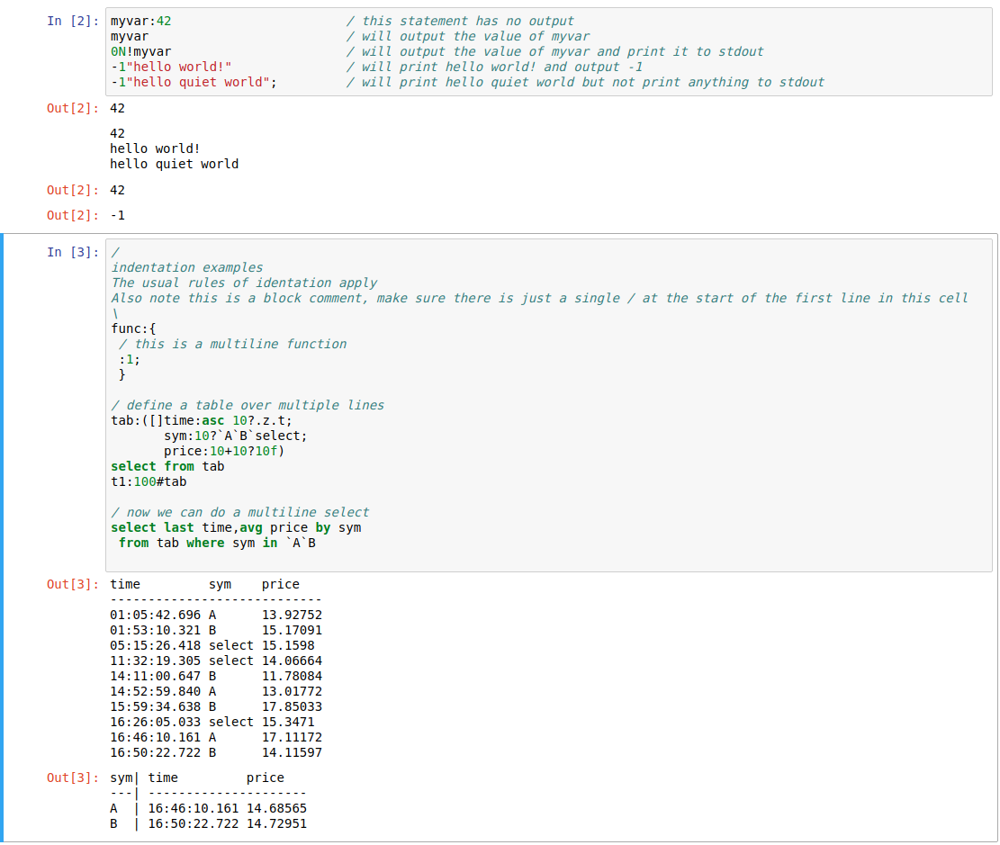

hero: <i class="fa fa-share-alt"></i> Machine learning / Jupyterq

# Running code

The simplest case is running some code and getting a result. Note here:

-   Each line of code which would produce output at a console produces output in the notebook.
-   stderr/stdout are printed separately to the output in the usual way for notebooks. Note that if your print statement, such as `-1"hello world!"`, has an output (here `-1`) then the output will be displayed. You can suppress this with a semicolon at the end of a statement as usual.
-   Execution is script-like, i.e. you can use the normal rules of indentation for functions, if/while blocks, and select/update/delete statements.

## System commands

System commands can be used with the `\` escape character at the start of a line in a code cell.

!!! warning "`\d` does not currently work."