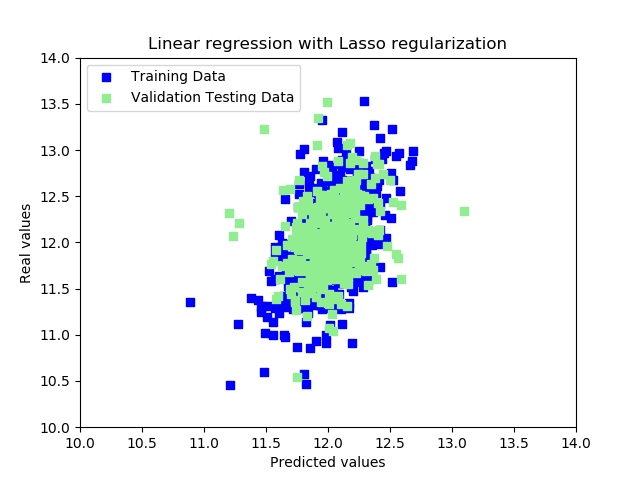

# Analysis using embedPy


This section analyses the data using several Python libraries from
inside the q process: pandas, NumPy, sklearn and Matplotlib.


## Import Python libraries

```q
pd:.p.import`pandas
np:.p.import`numpy
cross_val_score:.p.import[`sklearn.model_selection;`:cross_val_score]
qLassoCV:.p.import[`sklearn.linear_model;`:LassoCV]
```


## Train the LASSO model

Create NumPy arrays of kdb+ data:

```q
arrayTrainX:np[`:array][0^xTrain] 
arrayTrainY:np[`:array][yTrain]
arrayTestX: np[`:array][0^xTest]
arrayTestY: np[`:array][yTest]
```

Use `pykw` to set alphas, maximum iterations, and cross-validation generator.

```q
qLassoCV:qLassoCV[
  `alphas pykw (.0001 .0003 .0006 .001 .003 .006 .01 .03 .06 .1 .3 .6 1); 
  `max_iter pykw 50000; 
  `cv pykw 10; 
  `tol pykw 0.1]
```

Fit linear model using training data, and determine the amount of
penalization chosen by cross-validation (sum of absolute values of
coefficients). This is defined as `alpha`, and is expected to be close to
zero given LASSO’s shrinkage method:

```q
q)qLassoCV[`:fit][arrayTrainX;arrayTrainY]
q)alpha:qLassoCV[`:alpha_]`
q)alpha
0.01
```


## Define the error measure for official scoring: Mean squared error (MSE)

The MSE is commonly used to analyze the performance of statistical
models utilizing linear regression. It measures the accuracy of the
model and is capable of indicating whether removing some explanatory
variables is possible without impairing the model’s predictions. A value
of zero measures perfect accuracy from a model. The MSE will measure the
difference between the values predicted by the model and the values
actually observed. MSE scoring is set in the `qLassoCV` function using
`pykw`, which allows individual keywords to be specified.

```q
crossValScore:.p.import[`sklearn;`:model_selection;`:cross_val_score]
mseCV:{crossValScore[qLassoCV;x;y;`scoring pykw `neg_mean_squared_error]`}
```

The average of the MSE results shows that there are relatively small
error measurements from this model.

```q
q)avg mseCV[np[`:array][0^xTrain];np[`:array][yTrain]]
-0.1498252
```


## Find the most important coefficients

```q
q)impCoef:desc cols[train]!qLassoCV[`:coef_]`
q)count where value[impCoef]=0
284
q)(5#impCoef),-5#impCoef
TotalBsmtSF | 0.05086288
GrLivArea   | 0.02549123
OverallCond | 0.02080637
TotalBath_sq| 0.01637903
PavedDrive  | 0.01415822
LandSlope   | -0.009958406
BsmtFinType2| -0.01045939
KitchenAbvGr| -0.01527232
Street      | -0.01618361
LotShape    | -0.02050625
```

As seen above, LASSO eliminated 284 features, and therefore only used
one-tenth of the features. The most influential coefficients show that
LASSO gives higher weight to the overall size and condition of the
house, as well as some land and street characteristics, which
intuitively makes sense. The total square foot of the basement area
(`TotalBsmtSF`) has a large positive impact on the sale price, which seems
unintuitive, but could be correlated to the overall size of the house.


## Prediction results

```q
lassoTest:qLassoCV[`:predict][arrayTestX]
```

The image `lassopred.png` illustrates the predicted results, plotted on a scatter graph using Matplotlib:

```q
qplt:.p.import[`matplotlib.pyplot];

ptrain:qLassoCV[`:predict][arrayTrainX];
ptest: qLassoCV[`:predict][arrayTestX];

qplt[`:scatter]
  [ptrain`;
   yTrain;
   `c      pykw "blue";
   `marker pykw "s";
   `label  pykw "Training Data"];
qplt[`:scatter];
  [ptest`;
   yTest;
   `c      pykw "lightgreen";
   `marker pykw "s";
   `label  pykw "Validation Testing Data"];

qplt[`:title]"Linear regression with Lasso regularization";
qplt[`:xlabel]"Predicted values";
qplt[`:ylabel]"Real values";
qplt[`:legend]`loc pykw "upper left";

bounds:({floor min x};{ceiling max x})@\:/:raze 
  each((ptrain`;ptest`);(yTrain;yTest));
bounds:4#bounds first idesc{abs x-y}./:bounds;
qplt[`:axis]bounds;

qplt[`:savefig]"lassopred.png";
```




